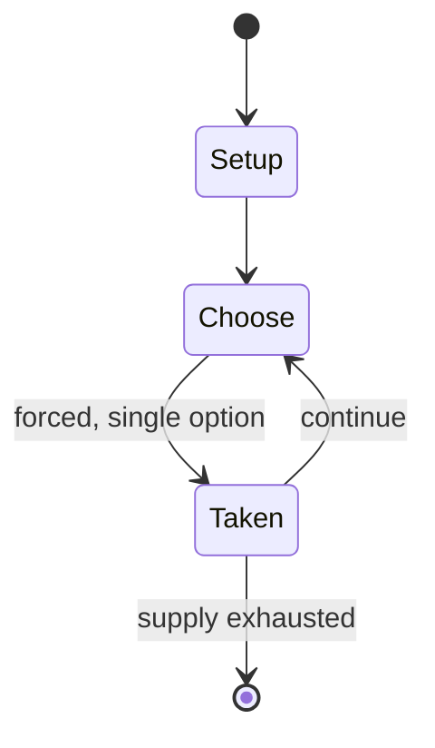

# Luzhanqi

*1927 board game*

`luzhanqi` &nbsp; state: **DEEPENED** &nbsp; method: **heuristic**

## Found layer (recorded, not trusted)

| field | value |
| --- | --- |
| wikidata | Q1634851 |
| wikipedia | Luzhanqi |
| genres (source) | -- |
| instance of (source) | board game |
| country of origin | People's Republic of China |

## Declared layer (orders bench work)

| field | value |
| --- | --- |
| year created | -- |
| epoch | -- |
| region | EAST_ASIA |
| media | BOARD |
| players | 2-4 |
| age band | CHILD |
| exogenous process | NONE |
| loss shape | OPPORTUNITY_ONLY |
| live axes | SPATIAL |
| horizon | VARIABLE |
| scoring shape | -- |
| information | PERFECT |
| interaction | COMPETITIVE |
| turn structure | -- |
| tractability | EXACT_WITH_CUT |
| randomness | NONE |
| luck factor | 0.02 |
| rules complexity | 2.34 |
| strategic depth | 2.4 |
| novelty | 0.7706 |
| solved status | -- |
| strategies | -- |
| algorithms | -- |

## Object model

```
Episode
  players      : 2-4
  turn_structure: ?
  horizon       : VARIABLE
  scoring       : ?

Board          -- spatial substrate; cells carry position and occupancy
Piece          -- movable token owned by a player
Placement      -- position subject to geometric legality
```

## State transition diagram



## Research item -- turn trace

```
# Luzhanqi -- simulated turn events
# generated from the DECLARED vector, not from a rulebook.
# structure: exo=NONE loss=OPPORTUNITY_ONLY horizon=VARIABLE scoring=None axes=SPATIAL

t=0    SETUP        players=2  pot=0  capacity=8
t=1    FORCED       p1 single legal option taken (pot_gain=+2.0)
t=2    SPATIAL      p1 places at (7,1); adjacency legal
t=3    FORCED       p1 single legal option taken (pot_gain=+1.0)
t=4    FORCED       p1 single legal option taken (pot_gain=+1.8)
t=5    ENDTURN      turn passes to p2
t=6    FORCED       p2 single legal option taken (pot_gain=+0.8)
t=7    SPATIAL      p2 places at (6,3); adjacency legal
t=8    FORCED       p2 single legal option taken (pot_gain=+1.1)
t=9    SPATIAL      p2 places at (2,5); adjacency legal
t=10   ENDTURN      turn passes to p1
t=11   FORCED       p1 single legal option taken (pot_gain=+0.9)
t=12   FORCED       p1 single legal option taken (pot_gain=+1.1)
t=13   FORCED       p1 single legal option taken (pot_gain=+1.5)
t=14   SPATIAL      p1 places at (1,0); adjacency legal
t=15   FORCED       p1 single legal option taken (pot_gain=+1.4)
t=16   ENDTURN      turn passes to p2
t=17   FORCED       p2 single legal option taken (pot_gain=+2.0)
t=18   FORCED       p2 single legal option taken (pot_gain=+1.5)
t=19   ENDTURN      turn passes to p1
t=20   FORCED       p1 single legal option taken (pot_gain=+1.1)
t=21   SPATIAL      p1 places at (1,0); adjacency legal
t=22   ENDTURN      turn passes to p2
t=23   FORCED       p2 single legal option taken (pot_gain=+0.9)
t=24   FORCED       p2 single legal option taken (pot_gain=+1.0)
t=25   FORCED       p2 single legal option taken (pot_gain=+1.1)
t=26   FORCED       p2 single legal option taken (pot_gain=+2.0)
t=27   SPATIAL      p2 places at (4,6); adjacency legal
t=28   ENDTURN      turn passes to p1

terminal: VARIABLE
```

## Conditions

| kind | threshold | effect | trigger |
| --- | --- | --- | --- |
| WIN | -- | -- | When a player attacks his opponent's headquarters, he will win the game if he enters the one with the flag; if he picked the other headquarters, then normal attacking rules apply, and if the attacking piece captures the  |
| TERMINATE | -- | -- | Players at opposite ends team up to defend against the other pair; the game ends when both players of a team has their flags captured, or when all sides are unable to defeat each other and thus agree to a draw. |

## Source extract

Chinese military chess (luzhanqi) (Chinese: 陸戰棋; pinyin: lùzhànqí) (lit. “Land Battle Chess”) is
a two-player Chinese board game . There is also a version for four players. It bears many
similarities to dou shou qi, Game of the Generals and the Western board game Stratego. It is a
non-perfect abstract strategy game of partial information, since each player has only limited
knowledge concerning the disposition of the opposing pieces. Because of the Chinese nature of
the game, terms used within the game may vary in translation. Luzhanqi is mainly played by
children as a precursor to games like xiangqi and weiqi, but people of other ages may also enjoy
it as a game of leisure.   == Objective == The aim of the game is to capture the opponent's flag
through penetrating their defenses, while trying to prevent the opponent from capturing the
player's own flag.   == Board ==  The Luzhanqi board is divided into 65 spaces, which are
connected by either roads or railroads to adjacent spaces.  Roads - usually marked as thin lines
on the board. A piece can only travel one space across a road at any time. Railroads – usually
marked as thick lines on the board, a piece can travel any number of sp

<sub>Wikipedia, CC BY-SA. Retained as evidence for the structural
classification above. Every rule inferred from it is HYPOTHESIZED
until audited against a rulebook.</sub>
