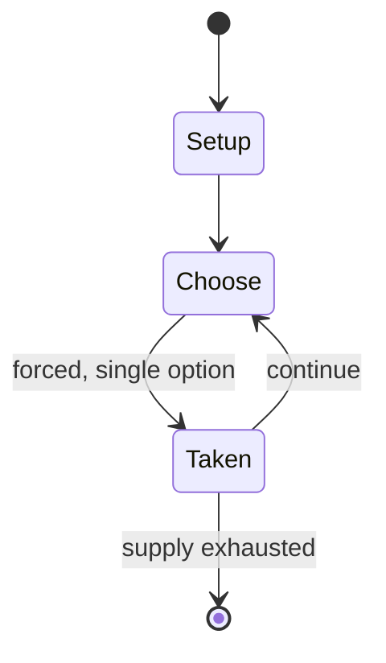

# Mad Libs

*comedy word game*

`mad_libs` &nbsp; state: **DEEPENED** &nbsp; method: **heuristic**

## Found layer (recorded, not trusted)

| field | value |
| --- | --- |
| wikidata | Q1883087 |
| wikipedia | Mad Libs |
| genres (source) | -- |
| instance of (source) | word game |
| country of origin | -- |

## Declared layer (orders bench work)

| field | value |
| --- | --- |
| year created | 1958 |
| epoch | MODERN |
| region | -- |
| media | CARD, WORD |
| players | -- |
| age band | -- |
| exogenous process | -- |
| loss shape | -- |
| live axes | ORDER |
| horizon | -- |
| scoring shape | -- |
| information | -- |
| interaction | SOLITAIRE |
| turn structure | STRICT_TURN |
| tractability | SAMPLING_ONLY |
| randomness | -- |
| luck factor | 0.35 |
| rules complexity | 2.12 |
| strategic depth | 2.0 |
| novelty | 0.5164 |
| solved status | -- |
| strategies | -- |
| algorithms | -- |

## Object model

```
Episode
  players      : ?
  turn_structure: STRICT_TURN
  horizon       : ?
  scoring       : ?

Deck           -- ordered multiset, drawn without replacement
Hand           -- private multiset held by one player
DiscardPile    -- public accumulation of spent cards
Sequence       -- the permutation under the player's control
```

## State transition diagram



## Research item -- turn trace

```
# Mad Libs -- simulated turn events
# generated from the DECLARED vector, not from a rulebook.
# structure: exo=None loss=None horizon=None scoring=None axes=ORDER

t=0    SETUP        players=2  pot=0  capacity=6
t=1    FORCED       p1 single legal option taken (pot_gain=+1.5)
t=2    FORCED       p1 single legal option taken (pot_gain=+0.9)
t=3    FORCED       p1 single legal option taken (pot_gain=+0.7)
t=4    FORCED       p1 single legal option taken (pot_gain=+1.6)
t=5    ENDTURN      turn passes to p2
t=6    FORCED       p2 single legal option taken (pot_gain=+1.5)
t=7    FORCED       p2 single legal option taken (pot_gain=+0.9)
t=8    FORCED       p2 single legal option taken (pot_gain=+1.0)
t=9    ENDTURN      turn passes to p1
t=10   FORCED       p1 single legal option taken (pot_gain=+1.2)
t=11   FORCED       p1 single legal option taken (pot_gain=+1.7)
t=12   FORCED       p1 single legal option taken (pot_gain=+1.9)
t=13   ENDTURN      turn passes to p2
t=14   FORCED       p2 single legal option taken (pot_gain=+1.3)
t=15   FORCED       p2 single legal option taken (pot_gain=+0.6)
t=16   FORCED       p2 single legal option taken (pot_gain=+1.6)
t=17   FORCED       p2 single legal option taken (pot_gain=+1.8)
t=18   FORCED       p2 single legal option taken (pot_gain=+0.6)
t=19   ENDTURN      turn passes to p1
t=20   FORCED       p1 single legal option taken (pot_gain=+1.7)
t=21   FORCED       p1 single legal option taken (pot_gain=+0.9)
t=22   FORCED       p1 single legal option taken (pot_gain=+1.9)
t=23   FORCED       p1 single legal option taken (pot_gain=+1.9)
t=24   ENDTURN      turn passes to p2
t=25   FORCED       p2 single legal option taken (pot_gain=+0.7)
t=26   FORCED       p2 single legal option taken (pot_gain=+0.7)

terminal: VARIABLE
```

## Source extract

Mad Libs is a word game created by Leonard Stern and Roger Price. It consists of one player
prompting others for a list of words to substitute for blanks in a story before reading aloud.
The game is frequently played as a party game or as a pastime. It can be categorized as a
phrasal template game. The game was invented in the United States, and more than 110 million
copies of Mad Libs books have been sold since the series was first published in 1958.   ==
History == Mad Libs was invented in 1953 by Leonard Stern and Roger Price. Stern and Price
created the game, but could not agree on a name for their invention. No name was chosen until
five years later (1958), when Stern and Price were eating Eggs Benedict at a restaurant in New
York City.   While eating, the two overheard an argument at a neighboring table between a talent
agent and an actor. According to Price and Stern, during the overheard argument, the actor said
that he wanted to "ad-lib" an upcoming interview. The agent, who clearly disagreed with the
actor's suggestion, retorted that ad-libbing an interview would be "mad". Stern and Price used
that eavesdropped conversation to create, at length, the name "Mad Libs". In 19

<sub>Wikipedia, CC BY-SA. Retained as evidence for the structural
classification above. Every rule inferred from it is HYPOTHESIZED
until audited against a rulebook.</sub>
