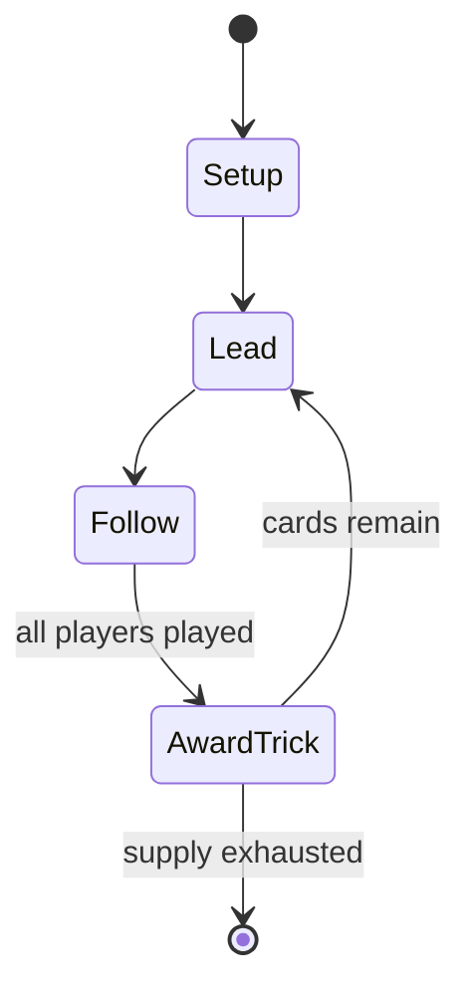

# Madiao

`madiao` &nbsp; state: **DEEPENED** &nbsp; method: **heuristic**

## Found layer (recorded, not trusted)

| field | value |
| --- | --- |
| wikidata | Q3211249 |
| wikipedia | Madiao |
| genres (source) | -- |
| instance of (source) | -- |
| country of origin | -- |

## Declared layer (orders bench work)

| field | value |
| --- | --- |
| year created | -- |
| epoch | -- |
| region | -- |
| media | CARD, TRICK_TAKING |
| players | -- |
| age band | -- |
| exogenous process | -- |
| loss shape | -- |
| live axes | DISCARD |
| horizon | -- |
| scoring shape | SET_COLLECTION_CONVEX |
| information | -- |
| interaction | -- |
| turn structure | TRICK_ROUND |
| tractability | SAMPLING_ONLY |
| randomness | -- |
| luck factor | 0.35 |
| rules complexity | 2.13 |
| strategic depth | 2.25 |
| novelty | 0.5641 |
| solved status | -- |
| strategies | set_collection |
| algorithms | -- |

## Object model

```
Episode
  players      : ?
  turn_structure: TRICK_ROUND
  horizon       : ?
  scoring       : SET_COLLECTION_CONVEX

Deck           -- ordered multiset, drawn without replacement
Hand           -- private multiset held by one player
DiscardPile    -- public accumulation of spent cards
Trick          -- one card per player; a winner is determined
Trump          -- suit that dominates the ordering
DiscardChoice  -- what is given up to satisfy a limit
```

## State transition diagram



## Research item -- turn trace

```
# Madiao -- simulated turn events
# generated from the DECLARED vector, not from a rulebook.
# structure: exo=None loss=None horizon=None scoring=SET_COLLECTION_CONVEX axes=DISCARD

t=0    SETUP        players=2  pot=0  capacity=3
t=1    FORCED       p1 single legal option taken (pot_gain=+1.8)
t=2    FORCED       p1 single legal option taken (pot_gain=+0.9)
t=3    DISCARD      p1 discards to hand limit
t=4    ENDTURN      turn passes to p2
t=5    FORCED       p2 single legal option taken (pot_gain=+1.2)
t=6    FORCED       p2 single legal option taken (pot_gain=+0.8)
t=7    DISCARD      p2 discards to hand limit
t=8    FORCED       p2 single legal option taken (pot_gain=+2.0)
t=9    DISCARD      p2 discards to hand limit
t=10   FORCED       p2 single legal option taken (pot_gain=+0.8)
t=11   FORCED       p2 single legal option taken (pot_gain=+1.1)
t=12   DISCARD      p2 discards to hand limit
t=13   FORCED       p2 single legal option taken (pot_gain=+0.7)
t=14   DISCARD      p2 discards to hand limit
t=15   FORCED       p2 single legal option taken (pot_gain=+1.1)
t=16   DISCARD      p2 discards to hand limit
t=17   ENDTURN      turn passes to p1
t=18   FORCED       p1 single legal option taken (pot_gain=+1.0)
t=19   FORCED       p1 single legal option taken (pot_gain=+1.3)
t=20   ENDTURN      turn passes to p2
t=21   FORCED       p2 single legal option taken (pot_gain=+0.9)
t=22   FORCED       p2 single legal option taken (pot_gain=+1.9)
t=23   DISCARD      p2 discards to hand limit
t=24   FORCED       p2 single legal option taken (pot_gain=+0.8)
t=25   FORCED       p2 single legal option taken (pot_gain=+2.0)
t=26   DISCARD      p2 discards to hand limit

terminal: VARIABLE
```

## Conditions

| kind | threshold | effect | trigger |
| --- | --- | --- | --- |
| BOUNDARY | 5 cards | -- | A player that has at least five cards from any suit can force a redeal. |
| BOUNDARY | 2 tricks | -- | Each player tries to win at least two tricks to avoid paying the banker. |
| BOUNDARY | 3 tricks | -- | Winning at least three tricks: 1 stake |
| TERMINATE | -- | -- | Play ends after everyone has had a chance to be the banker. |

## Source extract

Madiao (simplified Chinese: 马吊; traditional Chinese: 馬弔; pinyin: mǎdiào), also ma diao, ma tiu
or ma tiao, is a late imperial Chinese trick-taking gambling card game, also known as the game
of paper tiger. The deck used was recorded by Lu Rong in the 15th century and the rules later by
Pan Zhiheng and Feng Menglong during the early 17th century. Korean poet Jang Hon (1759-1828)
wrote that the game dates back to the Yuan dynasty (1271-1368). It continued to be popular
during the Qing dynasty until around the mid-19th century. It is played with 40 cards, and four
players. In Chinese, mǎ (马) means "horse" and diao (吊) means "hanged" or "lifted". The name of
the game comes from the fact that three players team against the banker, like a horse raising
one shoe (banker), with the other three remaining hooves on the ground (three players).   ==
Description == A set of madiao consists of 40 cards of four suits:  Cash or coins (纹, wen): 11
cards, from 9 to 1, half cash, and zero cash. This suit is in reverse order with zero cash as
the highest while 9 cash is the lowest. This is a feature found in many of the oldest known
games including ganjifa, tarot, ombre, maw, and tổ tôm. The half cash

<sub>Wikipedia, CC BY-SA. Retained as evidence for the structural
classification above. Every rule inferred from it is HYPOTHESIZED
until audited against a rulebook.</sub>
