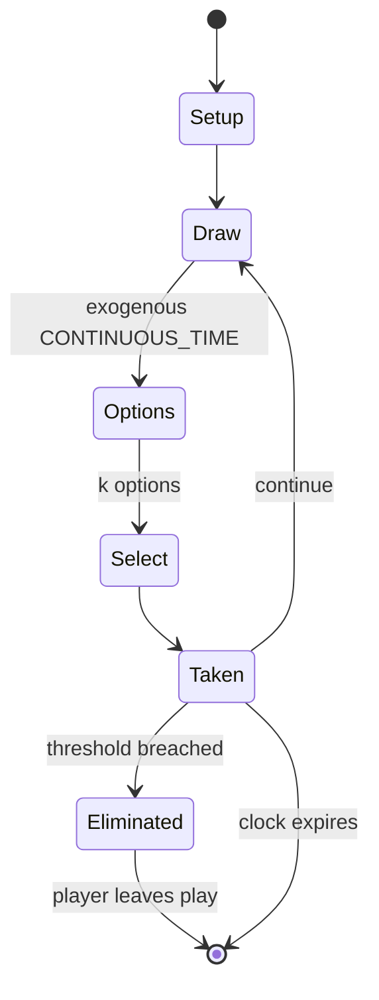

# Mafia (party game)

`mafia_party_game` &nbsp; state: **DEEPENED** &nbsp; method: **heuristic**

## Found layer (recorded, not trusted)

| field | value |
| --- | --- |
| wikidata | Q17265 |
| wikipedia | Mafia (party game) |
| genres (source) | -- |
| instance of (source) | -- |
| country of origin | -- |

## Declared layer (orders bench work)

| field | value |
| --- | --- |
| year created | 1986 |
| epoch | DIGITAL |
| region | -- |
| media | CARD, PARTY, RPG |
| players | -- |
| age band | -- |
| exogenous process | CONTINUOUS_TIME |
| loss shape | ELIMINATION |
| live axes | BLUFF, SELECT |
| horizon | CLOCK_LIMITED |
| scoring shape | SURVIVAL |
| information | SIMULTANEOUS |
| interaction | TRAITOR |
| turn structure | PHASE_STRUCTURED |
| tractability | SAMPLING_ONLY |
| randomness | DICE, HIDDEN_INFO |
| luck factor | 0.63 |
| rules complexity | 5.0 |
| strategic depth | 2.79 |
| novelty | 0.8296 |
| solved status | -- |
| strategies | area_control, bluffing, probability_estimation, sacrifice |
| algorithms | -- |

## Object model

```
Episode
  players      : ?
  turn_structure: PHASE_STRUCTURED
  horizon       : CLOCK_LIMITED
  scoring       : SURVIVAL

Deck           -- ordered multiset, drawn without replacement
Hand           -- private multiset held by one player
DiscardPile    -- public accumulation of spent cards
Character      -- persistent stat block owned by a player
GameMaster     -- adjudicating agent outside the scoring loop
Scenario       -- authored state the players traverse
Belief         -- what an observer is induced to think is true
OptionSet      -- the choices available after an exogenous draw
```

## State transition diagram



## Research item -- turn trace

```
# Mafia (party game) -- simulated turn events
# generated from the DECLARED vector, not from a rulebook.
# structure: exo=CONTINUOUS_TIME loss=ELIMINATION horizon=CLOCK_LIMITED scoring=SURVIVAL axes=BLUFF,SELECT

t=0    SETUP        players=2  pot=0  capacity=7
t=1    DRAW         p1 tick from clock -> outcome #6  (p=0.083)
t=2    SELECT       p1 3 options; take #2  (pot_gain=+1.6, capacity=-1)
t=3    DRAW         p1 tick from clock -> outcome #6  (p=0.066)
t=4    SELECT       p1 1 options; take #1  (pot_gain=+0.7, capacity=-2)
t=5    BLUFF        p1 represents a holding it does not have
t=6    DRAW         p1 tick from clock -> outcome #4  (p=0.218)
t=7    SELECT       p1 3 options; take #2  (pot_gain=+3.0, capacity=-0)
t=8    BLUFF        p1 represents a holding it does not have
t=9    DRAW         p1 tick from clock -> outcome #3  (p=0.240)
t=10   SELECT       p1 4 options; take #3  (pot_gain=+0.9, capacity=-2)
t=11   BLUFF        p1 represents a holding it does not have
t=12   DRAW         p1 tick from clock -> outcome #5  (p=0.126)
t=13   SELECT       p1 4 options; take #3  (pot_gain=+3.3, capacity=-2)
t=14   BLUFF        p1 represents a holding it does not have
t=15   ENDTURN      turn passes to p2
t=16   DRAW         p2 tick from clock -> outcome #6  (p=0.258)
t=17   SELECT       p2 1 options; take #1  (pot_gain=+1.1, capacity=-2)
t=18   DRAW         p2 tick from clock -> outcome #4  (p=0.199)
t=19   SELECT       p2 2 options; take #2  (pot_gain=+2.3, capacity=-2)
t=20   BLUFF        p2 represents a holding it does not have
t=21   DRAW         p2 tick from clock -> outcome #1  (p=0.204)
t=22   SELECT       p2 1 options; take #1  (pot_gain=+1.8, capacity=-2)
t=23   DRAW         p2 tick from clock -> outcome #6  (p=0.255)
t=24   SELECT       p2 3 options; take #3  (pot_gain=+2.7, capacity=-0)
t=25   ENDTURN      turn passes to p1
t=26   DRAW         p1 tick from clock -> outcome #1  (p=0.119)
t=27   SELECT       p1 4 options; take #3  (pot_gain=+0.7, capacity=-0)
t=28   BLUFF        p1 represents a holding it does not have

terminal: CLOCK_LIMITED
```

## Conditions

| kind | threshold | effect | trigger |
| --- | --- | --- | --- |
| ELIMINATE | 1 player | -- | At night, certain players secretly perform special actions; during day, players discuss and vote to eliminate one player. |
| ELIMINATE | -- | -- | The game has two alternating phases: first, a night-phase, during which those with night-killing-powers may covertly kill other players, and second, a day-phase, in which all surviving players debate and vote to eliminat |
| ELIMINATE | -- | -- | The game continues until a faction achieves its win condition; for the village, this usually means eliminating the evil minority, while for the minority, this usually means reaching numerical parity with the village and  |
| ELIMINATE | -- | -- | These phases alternate with each other until all mafiosi have been eliminated or they reach numerical parity with the innocents. |
| ELIMINATE | -- | -- | These specifications avoid tie votes for eliminations and ensure that the game will end dramatically on an elimination rather than anticlimactically with murder as a foregone conclusion. |
| ELIMINATE | -- | -- | At any point, a player may accuse someone of being a mafioso and prompt others to vote to eliminate them. |
| ELIMINATE | -- | eliminated | If over half of the players do so, the accused person is eliminated and night begins. |
| ELIMINATE | -- | -- | Otherwise, the phase continues until an elimination occurs. |
| ELIMINATE | -- | -- | The game designers Salen and Zimmerman have written that the deep emergent social game play in Mafia (combined with the fear of elimination) create ideal conditions for this. |
| ELIMINATE | -- | -- | Until the Rabble Rouser dies there are two eliminations per day. |
| ELIMINATE | -- | -- | Some players have 2 votes (Doublevoter); some players can only cast the final vote to kill a player (Actor); cannot vote to eliminate (Voteless Innocent); must delegate someone else to vote for them (Fool), or require on |
| ELIMINATE | -- | -- | The lawyer selects someone during the night, and if that person tops the elimination vote the next day, saves them (a different lawyer role releases the wills written by players killed up to that point, when she dies). |
| ELIMINATE | -- | -- | For instance, the Mayor or Sheriff can be elected each morning, and gain two elimination votes, or a Judge could moderate discussion in parliamentary fashion (to the advantage of their team). |
| ELIMINATE | -- | -- | The elected President has the sole elimination vote. |
| ELIMINATE | -- | -- | The Cobbler, Villager, or Jester has the objective of convincing the town to kill them, or is required to vote in favor of all proposed eliminations. |
| ELIMINATE | -- | -- | Sometimes, successful elimination of the Village Idiot results in the mafia being able to kill two people that night. |
| ELIMINATE | -- | -- | With the ability to deny a majority at an elimination vote, remaining mafiosi cannot be eliminated unless innocent/neutral killing roles exist. |
| ELIMINATE | -- | -- | Other variants suspend this rule, and only declare the game after every member of one faction has been eliminated: this makes the game easier to explain, and to run. |
| ELIMINATE | -- | -- | Nominees for elimination may be allowed to make a speech in their own defense. |
| ELIMINATE | -- | -- | Voting variants abound, but any elimination usually requires an absolute majority of the electorate, or votes cast. |
| ELIMINATE | -- | -- | So the voting is usually not by secret ballot for multiple candidates with the highest vote count eliminated; it is more usual for the voting to be openly resolved either by: |
| ELIMINATE | -- | -- | An option to eliminate (or not eliminate) one suspect (with a new suspect produced if the last one survives the vote). |
| ELIMINATE | -- | -- | Therefore, not eliminating anyone (even at random) will typically favor the Mafia. |
| ELIMINATE | -- | -- | However, when the number of survivors is even, No Kill may help the Innocents; for example, when three Innocents and one mafioso remain – voting for No elimination gives a 1/3 chance of killing the mafioso the next day,  |

## Source extract

Mafia, also known as Werewolf, is a social deduction game created in 1986 by Dmitry Davidoff,
then a psychology student at Moscow State University. The game models a conflict between two
groups: an informed minority (the mafiosi or the werewolves) and an uninformed majority (the
villagers). At the start of the game, each player is secretly assigned a role affiliated with
one of these teams. The game has two alternating phases: first, a night-phase, during which
those with night-killing-powers may covertly kill other players, and second, a day-phase, in
which all surviving players debate and vote to eliminate a suspect. The game continues until a
faction achieves its win condition; for the village, this usually means eliminating the evil
minority, while for the minority, this usually means reaching numerical parity with the village
and eliminating any rival evil groups.   == History == Dimitry Davidoff (Russian: Дми́трий
Давы́дов, Dmitry Davydov) is generally acknowledged as the game's creator. He dates the first
game of Mafia to spring 1987 at the Psychology Department of Moscow State University, from where
it spread to the classrooms, dorms, and summer camps. Davidoff says that he

<sub>Wikipedia, CC BY-SA. Retained as evidence for the structural
classification above. Every rule inferred from it is HYPOTHESIZED
until audited against a rulebook.</sub>
