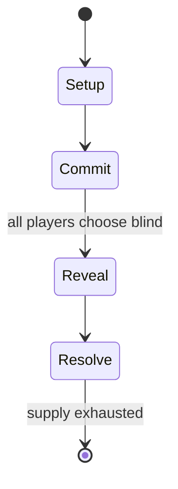

# Magic: The Gathering

*1993 collectible card game*

`magic_the_gathering` &nbsp; state: **DEEPENED** &nbsp; method: **heuristic**

## Found layer (recorded, not trusted)

| field | value |
| --- | --- |
| wikidata | Q207302 |
| wikipedia | Magic: The Gathering |
| genres (source) | fantasy |
| instance of (source) | collectible card game, deck-building game |
| country of origin | United States |

## Declared layer (orders bench work)

| field | value |
| --- | --- |
| year created | 1993 |
| epoch | DIGITAL |
| region | NORTH_AMERICA |
| media | CARD, COLLECTIBLE, RPG |
| players | 2 |
| age band | -- |
| exogenous process | DEPLETING_DECK |
| loss shape | -- |
| live axes | COMMIT_BLIND, DISCARD, SELECT, TRADE |
| horizon | -- |
| scoring shape | -- |
| information | SIMULTANEOUS |
| interaction | COMPETITIVE |
| turn structure | SIMULTANEOUS |
| tractability | SAMPLING_ONLY |
| randomness | DECK_SHUFFLE, SIMULTANEOUS_CHOICE |
| luck factor | 0.48 |
| rules complexity | 5.0 |
| strategic depth | 2.5 |
| novelty | 0.6504 |
| solved status | -- |
| strategies | route_optimisation, spatial_packing |
| algorithms | -- |

## Object model

```
Episode
  players      : 2
  turn_structure: SIMULTANEOUS
  horizon       : ?
  scoring       : ?

Deck           -- ordered multiset, drawn without replacement
Hand           -- private multiset held by one player
DiscardPile    -- public accumulation of spent cards
Character      -- persistent stat block owned by a player
GameMaster     -- adjudicating agent outside the scoring loop
Scenario       -- authored state the players traverse
SealedChoice   -- irrevocable choice made without observation
DiscardChoice  -- what is given up to satisfy a limit
OptionSet      -- the choices available after an exogenous draw
Offer          -- proposed exchange between two agents
```

## State transition diagram



## Research item -- turn trace

```
# Magic: The Gathering -- simulated turn events
# generated from the DECLARED vector, not from a rulebook.
# structure: exo=DEPLETING_DECK loss=None horizon=None scoring=None axes=COMMIT_BLIND,DISCARD,SELECT,TRADE

t=0    SETUP        players=2  pot=0  capacity=8
t=1    DRAW         p1 draw from deck -> outcome #4  (p=0.179)
t=2    SELECT       p1 2 options; take #2  (pot_gain=+1.2, capacity=-2)
t=3    DRAW         p1 draw from deck -> outcome #5  (p=0.078)
t=4    SELECT       p1 2 options; take #2  (pot_gain=+2.8, capacity=-0)
t=5    DRAW         p1 draw from deck -> outcome #5  (p=0.214)
t=6    SELECT       p1 2 options; take #1  (pot_gain=+1.3, capacity=-2)
t=7    TRADE        p1 offers 2:1 exchange to p2
t=8    DRAW         p1 draw from deck -> outcome #3  (p=0.252)
t=9    SELECT       p1 3 options; take #3  (pot_gain=+0.5, capacity=-2)
t=10   DISCARD      p1 discards to hand limit
t=11   DRAW         p1 draw from deck -> outcome #1  (p=0.213)
t=12   SELECT       p1 1 options; take #1  (pot_gain=+2.5, capacity=-2)
t=13   TRADE        p1 offers 2:1 exchange to p2
t=14   DISCARD      p1 discards to hand limit
t=15   DRAW         p1 draw from deck -> outcome #5  (p=0.064)
t=16   SELECT       p1 4 options; take #3  (pot_gain=+0.7, capacity=-1)
t=17   TRADE        p1 offers 2:1 exchange to p2
t=18   DISCARD      p1 discards to hand limit
t=19   DRAW         p1 draw from deck -> outcome #2  (p=0.016)
t=20   SELECT       p1 4 options; take #4  (pot_gain=+2.7, capacity=-0)
t=21   ENDTURN      turn passes to p2
t=22   DRAW         p2 draw from deck -> outcome #6  (p=0.076)
t=23   SELECT       p2 1 options; take #1  (pot_gain=+2.7, capacity=-0)
t=24   TRADE        p2 offers 2:1 exchange to p1
t=25   DRAW         p2 draw from deck -> outcome #6  (p=0.186)
t=26   SELECT       p2 3 options; take #2  (pot_gain=+3.1, capacity=-0)
t=27   TRADE        p2 offers 2:1 exchange to p1

terminal: VARIABLE
```

## Conditions

| kind | threshold | effect | trigger |
| --- | --- | --- | --- |
| ELIMINATE | 8 players | -- | On the final day, the top eight players would compete with each other in a single-elimination format to select the winner. |
| ELIMINATE | 2 sets | -- | This system was revised in 2015, with the Core Set being eliminated and blocks now consisting of two sets, released semiannually. |
| BOUNDARY | 4 cards | -- | In general, this requires a minimum of sixty cards in the deck, and, except for basic land cards and cards that have text superseding this rule, no more than four cards of the same named card. |
| ELIMINATE | -- | -- | With these changes, the system eliminated Nationals, the World Magic Cup, and the Team Series. |
| ELIMINATE | -- | -- | A further revision occurred in 2018, reversing the elimination of the core sets and no longer constraining sets to blocks. |
| ELIMINATE | -- | -- | Jumpstart was designed to make it much easier to get into Magic by eliminating the deck-building but still providing some customization and randomness that comes with card acquisition and deck building. |
| BOUNDARY | -- | -- | Spells consume mana, usually requiring at least one mana of a specific color. |
| BOUNDARY | -- | -- | Their casting cost includes mana from at least two colors plus additional mana from any color. |
| BOUNDARY | -- | -- | Although in earlier sets there used to be multiple serialized cards, Wizards of the Coast has transitioned toward limiting many modern sets to a single "headliner" or ultra-rare serialized card rather than large pools of |

## Source extract

Magic: The Gathering (colloquially known as Magic or MTG) is a collectible, tabletop, and
digital collectible card game created by Richard Garfield. It was released by Wizards of the
Coast in 1993 as the company's first trading card game. From 2008 to 2016, over twenty billion
Magic cards were printed as the game grew in popularity. For the 2022 fiscal year, Hasbro—the
parent company of Wizards of the Coast—announced that Magic had generated $1 billion in annual
revenue. By 2023, Magic had amassed approximately fifty million players worldwide.   Players in
a game of Magic represent dueling wizards called "Planeswalkers". Each card a player draws from
their deck represents a magical spell which can be used to their advantage in battle. Instant
and Sorcery cards represent magical spells a player may cast for a one-time effect, while
Creature, Artifact, Enchantment, Planeswalker, and Battle cards remain on the Battlefield to
provide long-term advantage. Players usually must include resource, or Land cards representing
the amount of mana that is available to cast their spells. Typically, a player defeats their
opponent(s) by reducing their life totals to zero, which is commonly done vi

<sub>Wikipedia, CC BY-SA. Retained as evidence for the structural
classification above. Every rule inferred from it is HYPOTHESIZED
until audited against a rulebook.</sub>
