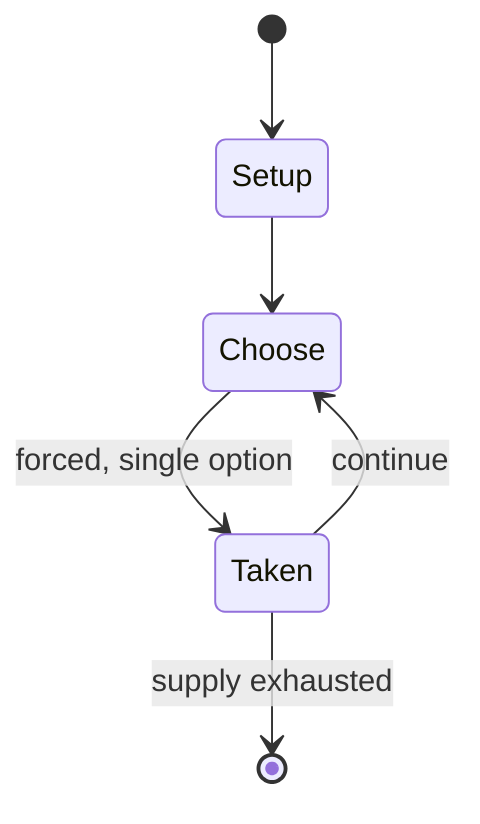

# Maharajah and the Sepoys

*variant of chess*

`maharajah_and_the_sepoys` &nbsp; state: **DEEPENED** &nbsp; method: **heuristic**

## Found layer (recorded, not trusted)

| field | value |
| --- | --- |
| wikidata | Q1038688 |
| wikipedia | Maharajah and the Sepoys |
| genres (source) | -- |
| instance of (source) | chess variant, solved game |
| country of origin | -- |

## Declared layer (orders bench work)

| field | value |
| --- | --- |
| year created | -- |
| epoch | -- |
| region | -- |
| media | - |
| players | -- |
| age band | -- |
| exogenous process | -- |
| loss shape | -- |
| live axes | TRADE |
| horizon | -- |
| scoring shape | WINNER_TAKE_ALL |
| information | -- |
| interaction | COMPETITIVE |
| turn structure | -- |
| tractability | EXACT |
| randomness | DICE |
| luck factor | 0.05 |
| rules complexity | 2.12 |
| strategic depth | 1.4 |
| novelty | 0.8481 |
| solved status | SOLVED_STRONG |
| strategies | -- |
| algorithms | -- |

## Object model

```
Episode
  players      : ?
  turn_structure: ?
  horizon       : ?
  scoring       : WINNER_TAKE_ALL

Offer          -- proposed exchange between two agents
```

## State transition diagram



## Research item -- turn trace

```
# Maharajah and the Sepoys -- simulated turn events
# generated from the DECLARED vector, not from a rulebook.
# structure: exo=None loss=None horizon=None scoring=WINNER_TAKE_ALL axes=TRADE

t=0    SETUP        players=2  pot=0  capacity=4
t=1    FORCED       p1 single legal option taken (pot_gain=+1.0)
t=2    FORCED       p1 single legal option taken (pot_gain=+0.6)
t=3    TRADE        p1 offers 2:1 exchange to p2
t=4    ENDTURN      turn passes to p2
t=5    FORCED       p2 single legal option taken (pot_gain=+0.5)
t=6    TRADE        p2 offers 2:1 exchange to p1
t=7    FORCED       p2 single legal option taken (pot_gain=+1.7)
t=8    ENDTURN      turn passes to p1
t=9    FORCED       p1 single legal option taken (pot_gain=+1.2)
t=10   FORCED       p1 single legal option taken (pot_gain=+0.6)
t=11   FORCED       p1 single legal option taken (pot_gain=+0.7)
t=12   TRADE        p1 offers 2:1 exchange to p2
t=13   ENDTURN      turn passes to p2
t=14   FORCED       p2 single legal option taken (pot_gain=+1.1)
t=15   ENDTURN      turn passes to p1
t=16   FORCED       p1 single legal option taken (pot_gain=+1.5)
t=17   ENDTURN      turn passes to p2
t=18   FORCED       p2 single legal option taken (pot_gain=+1.9)
t=19   ENDTURN      turn passes to p1
t=20   FORCED       p1 single legal option taken (pot_gain=+1.0)
t=21   TRADE        p1 offers 2:1 exchange to p2
t=22   FORCED       p1 single legal option taken (pot_gain=+0.6)
t=23   TRADE        p1 offers 2:1 exchange to p2
t=24   ENDTURN      turn passes to p2
t=25   FORCED       p2 single legal option taken (pot_gain=+1.5)
t=26   FORCED       p2 single legal option taken (pot_gain=+1.6)
t=27   TRADE        p2 offers 2:1 exchange to p1
t=28   ENDTURN      turn passes to p1

terminal: VARIABLE
```

## Conditions

| kind | threshold | effect | trigger |
| --- | --- | --- | --- |
| BOUNDARY | -- | -- | By perfect play, Black always wins in this game, at least on an 8×8 board. |

## Source extract

Maharajah and the Sepoys, originally called Shatranj Diwana Shah and also known as the Mad
King's Game, Maharajah chess, or Sarvatobhadra ("auspicious on all sides"), is a popular chess
variant with different armies for White and Black. It was first played in the 19th century in
India. It is a solved game with a forced win for Black.   == Game rules == Black has a full,
standard chess army ("sepoys") in the usual position. White is limited to a single piece
starting on e1, the maharajah, which can move as either a queen or as a knight on White's turn
(analogous to the amazon fairy chess piece). Black's goal is to checkmate the maharajah, while
White's is to checkmate Black's king. There is no promotion.   == Strategy ==  The asymmetry of
the game pits movement flexibility and agility against greater force in numbers. By perfect
play, Black always wins in this game, at least on an 8×8 board. According to Hans Bodlaender, "A
carefully playing black player should be able to win. However, this is not always easy, and in
many cases, when the white 'Maharaja' breaks through the lines of black, he has good chances to
win." The maharajah can pose a serious threat and even win against a wea

<sub>Wikipedia, CC BY-SA. Retained as evidence for the structural
classification above. Every rule inferred from it is HYPOTHESIZED
until audited against a rulebook.</sub>
