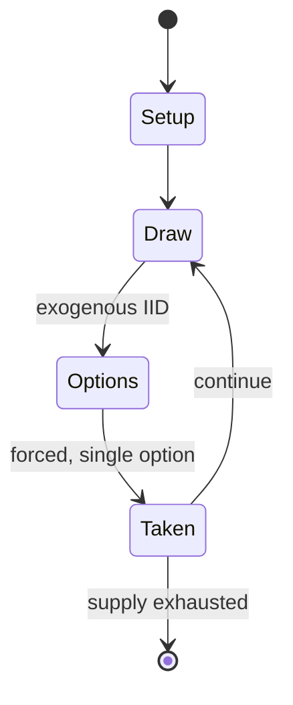

# Mahjong

`mahjong` &nbsp; state: **DEEPENED** &nbsp; method: **heuristic**

## Found layer (recorded, not trusted)

| field | value |
| --- | --- |
| wikidata | Q12263 |
| wikipedia | Mahjong |
| genres (source) | -- |
| instance of (source) | -- |
| country of origin | -- |

## Declared layer (orders bench work)

| field | value |
| --- | --- |
| year created | -- |
| epoch | -- |
| region | -- |
| media | CARD, TILE |
| players | -- |
| age band | -- |
| exogenous process | IID |
| loss shape | -- |
| live axes | DISCARD, ORDER |
| horizon | -- |
| scoring shape | SET_COLLECTION_CONVEX |
| information | -- |
| interaction | SOLITAIRE |
| turn structure | PRIORITY_QUEUE |
| tractability | SAMPLING_ONLY |
| randomness | DECK_SHUFFLE, DICE |
| luck factor | 0.35 |
| rules complexity | 3.7 |
| strategic depth | 2.25 |
| novelty | 0.5066 |
| solved status | -- |
| strategies | set_collection |
| algorithms | -- |

## Object model

```
Episode
  players      : ?
  turn_structure: PRIORITY_QUEUE
  horizon       : ?
  scoring       : SET_COLLECTION_CONVEX

Deck           -- ordered multiset, drawn without replacement
Hand           -- private multiset held by one player
DiscardPile    -- public accumulation of spent cards
TileBag        -- unordered draw source
Layout         -- placed tiles and their adjacencies
DiscardChoice  -- what is given up to satisfy a limit
Sequence       -- the permutation under the player's control
```

## State transition diagram



## Research item -- turn trace

```
# Mahjong -- simulated turn events
# generated from the DECLARED vector, not from a rulebook.
# structure: exo=IID loss=None horizon=None scoring=SET_COLLECTION_CONVEX axes=DISCARD,ORDER

t=0    SETUP        players=2  pot=0  capacity=8
t=1    DRAW         p1 roll from d6 pool -> outcome #4  (p=0.280)
t=2    FORCED       p1 single legal option taken (pot_gain=+1.3)
t=3    DRAW         p1 roll from d6 pool -> outcome #6  (p=0.295)
t=4    FORCED       p1 single legal option taken (pot_gain=+1.5)
t=5    DRAW         p1 roll from d6 pool -> outcome #2  (p=0.035)
t=6    FORCED       p1 single legal option taken (pot_gain=+1.5)
t=7    DRAW         p1 roll from d6 pool -> outcome #4  (p=0.090)
t=8    FORCED       p1 single legal option taken (pot_gain=+1.5)
t=9    DISCARD      p1 discards to hand limit
t=10   ENDTURN      turn passes to p2
t=11   DRAW         p2 roll from d6 pool -> outcome #2  (p=0.182)
t=12   FORCED       p2 single legal option taken (pot_gain=+1.5)
t=13   ENDTURN      turn passes to p1
t=14   DRAW         p1 roll from d6 pool -> outcome #2  (p=0.182)
t=15   FORCED       p1 single legal option taken (pot_gain=+1.6)
t=16   ENDTURN      turn passes to p2
t=17   DRAW         p2 roll from d6 pool -> outcome #3  (p=0.013)
t=18   FORCED       p2 single legal option taken (pot_gain=+1.3)
t=19   DISCARD      p2 discards to hand limit
t=20   DRAW         p2 roll from d6 pool -> outcome #2  (p=0.019)
t=21   FORCED       p2 single legal option taken (pot_gain=+1.1)
t=22   DISCARD      p2 discards to hand limit
t=23   DRAW         p2 roll from d6 pool -> outcome #1  (p=0.170)
t=24   FORCED       p2 single legal option taken (pot_gain=+0.7)
t=25   DISCARD      p2 discards to hand limit
t=26   DRAW         p2 roll from d6 pool -> outcome #1  (p=0.087)
t=27   FORCED       p2 single legal option taken (pot_gain=+0.8)
t=28   ENDTURN      turn passes to p1

terminal: VARIABLE
```

## Conditions

| kind | threshold | effect | trigger |
| --- | --- | --- | --- |
| TERMINATE | -- | -- | Players hold a persistent score across rounds until the game ends. |
| BOUNDARY | -- | -- | In each round at least four hands are played, with each player taking the position of dealer. |
| BOUNDARY | -- | -- | This means that a match may potentially have no limit to the number of hands played (though some players will set a limit of three consecutive hands allowed with the same seat positions and prevailing wind). |
| BOUNDARY | -- | -- | This puts a maximum estimated limit on the game duration and provides some amount of predictability. |
| BOUNDARY | -- | -- | In order to win, a player needs to have at least the minimum faan value agreed in advance (often 3). |
| PENALTY | -- | -- | The penalty depends on the table rules. |
| PENALTY | -- | -- | The player may forfeit points to the other players. |
| PENALTY | -- | -- | Another potential penalty is the player who called out the false win must play the rest of the hand with their tiles face up on the table so other players can see them (open hand). |
| PENALTY | -- | -- | Some methods apply the penalty at the end of the entire game. |
| PENALTY | -- | -- | Again, the table rules dictate the enforcement of the penalty. |

## Source extract

Mahjong is a tile-based game for three to four players. Though regional variations may exclude
certain tiles or add unique ones, it is typically played with a set of 144 tiles based on
Chinese characters and symbols. Players hold one of four "wind" positions referred to as the
East, South, West, and North. Once each player draws a hand of thirteen tiles, in clockwise
order beginning with the "prevailing wind," each player draws a tile, then discards that tile or
another from their hand. Players may call to use another player's discarded tile under certain
conditions. The object of each round is to complete and score a legal hand using a drawn tile or
another player's discarded tile to form four melds (or sets) and a pair (eye.) Players may also
score with special hands that do not follow the typical pattern. Players hold a persistent score
across rounds until the game ends.  Mahjong was developed in the 19th century in China and has
spread throughout the world since the early 20th century. The game and its regional variants are
played throughout the Sinosphere in East and Southeast Asia and have also become popular in
Western countries. The game has been adapted into a widespread f

<sub>Wikipedia, CC BY-SA. Retained as evidence for the structural
classification above. Every rule inferred from it is HYPOTHESIZED
until audited against a rulebook.</sub>
