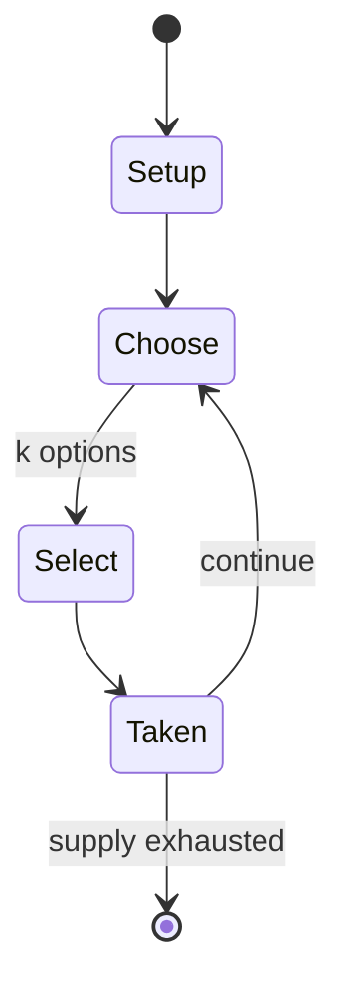

# Maka dai dai shogi

*19x19 grid variant of Japanese chess*

`maka_dai_dai_shogi` &nbsp; state: **DEEPENED** &nbsp; method: **heuristic**

## Found layer (recorded, not trusted)

| field | value |
| --- | --- |
| wikidata | Q6738578 |
| wikipedia | Maka dai dai shogi |
| genres (source) | -- |
| instance of (source) | shogi variant |
| country of origin | Japan |

## Declared layer (orders bench work)

| field | value |
| --- | --- |
| year created | -- |
| epoch | -- |
| region | EAST_ASIA |
| media | MEMORY |
| players | 2 |
| age band | -- |
| exogenous process | NONE |
| loss shape | OPPORTUNITY_ONLY |
| live axes | SELECT, SPATIAL |
| horizon | -- |
| scoring shape | SET_COLLECTION_CONVEX |
| information | PERFECT |
| interaction | SOLITAIRE |
| turn structure | -- |
| tractability | EXACT_WITH_CUT |
| randomness | NONE |
| luck factor | 0.02 |
| rules complexity | 2.69 |
| strategic depth | 3.15 |
| novelty | 0.7608 |
| solved status | -- |
| strategies | memory_recall, set_collection, signalling |
| algorithms | -- |

## Object model

```
Episode
  players      : 2
  turn_structure: ?
  horizon       : ?
  scoring       : SET_COLLECTION_CONVEX

OptionSet      -- the choices available after an exogenous draw
Placement      -- position subject to geometric legality
```

## State transition diagram



## Research item -- turn trace

```
# Maka dai dai shogi -- simulated turn events
# generated from the DECLARED vector, not from a rulebook.
# structure: exo=NONE loss=OPPORTUNITY_ONLY horizon=None scoring=SET_COLLECTION_CONVEX axes=SELECT,SPATIAL

t=0    SETUP        players=2  pot=0  capacity=3
t=1    SELECT       p1 3 options; take #3  (pot_gain=+3.2, capacity=-2)
t=2    SELECT       p1 3 options; take #1  (pot_gain=+2.4, capacity=-2)
t=3    SPATIAL      p1 places at (6,5); adjacency legal
t=4    SELECT       p1 1 options; take #1  (pot_gain=+0.9, capacity=-0)
t=5    SELECT       p1 4 options; take #4  (pot_gain=+0.9, capacity=-2)
t=6    SELECT       p1 1 options; take #1  (pot_gain=+2.0, capacity=-0)
t=7    SPATIAL      p1 places at (1,2); adjacency legal
t=8    SELECT       p1 1 options; take #1  (pot_gain=+2.4, capacity=-2)
t=9    SELECT       p1 4 options; take #3  (pot_gain=+3.2, capacity=-1)
t=10   SELECT       p1 4 options; take #1  (pot_gain=+0.7, capacity=-0)
t=11   SELECT       p1 3 options; take #2  (pot_gain=+2.2, capacity=-2)
t=12   SELECT       p1 2 options; take #1  (pot_gain=+0.6, capacity=-1)
t=13   ENDTURN      turn passes to p2
t=14   SELECT       p2 2 options; take #2  (pot_gain=+2.1, capacity=-0)
t=15   SELECT       p2 1 options; take #1  (pot_gain=+1.8, capacity=-0)
t=16   SELECT       p2 4 options; take #1  (pot_gain=+2.2, capacity=-1)
t=17   SPATIAL      p2 places at (3,1); adjacency legal
t=18   SELECT       p2 1 options; take #1  (pot_gain=+1.5, capacity=-2)
t=19   ENDTURN      turn passes to p1
t=20   SELECT       p1 1 options; take #1  (pot_gain=+0.7, capacity=-0)
t=21   SELECT       p1 3 options; take #1  (pot_gain=+2.5, capacity=-1)
t=22   SPATIAL      p1 places at (4,1); adjacency legal
t=23   SELECT       p1 3 options; take #1  (pot_gain=+1.9, capacity=-2)
t=24   SPATIAL      p1 places at (4,4); adjacency legal
t=25   ENDTURN      turn passes to p2
t=26   SELECT       p2 2 options; take #2  (pot_gain=+3.1, capacity=-1)

terminal: VARIABLE
```

## Conditions

| kind | threshold | effect | trigger |
| --- | --- | --- | --- |
| WIN | -- | -- | If a player's king, emperor or prince is in check and no legal move by that player will get the king, emperor or prince out of check, the checking move is also a mate, and effectively wins the game. |
| WIN | -- | -- | A player who captures the opponent's sole remaining king, emperor, or prince wins the game. |

## Source extract

Maka dai dai shōgi (摩訶大大将棋 or 摩𩹄大大象戯 'ultra-huge chess') is a large board variant of shogi
(Japanese chess).  The game dates back to the 15th century and is based on dai dai shogi and the
earlier dai shogi. The three Edo-era sources are not congruent in their descriptions of the
pieces not found in smaller games. Apart from its size and number of pieces, the major
difference from these smaller games is the "promotion by capture" rule. A more compact modern
proposal for the game is called hishigata shogi. Because of the terse and often incomplete
wording of the historical sources for the large shogi variants, except for chu shogi and to a
lesser extent dai shogi (which were at some points of time the most prestigious forms of shogi
being played), the historical rules of maka dai dai shogi are not clear. Different sources often
significantly differ in the moves attributed to the pieces, and the degree of contradiction
(summarized below with the listing of most known alternative moves) is so great that it is
likely impossible to reconstruct the 'true historical rules' with any degree of certainty, if
there ever was such a thing. It is unclear whether the game was ever played much hist

<sub>Wikipedia, CC BY-SA. Retained as evidence for the structural
classification above. Every rule inferred from it is HYPOTHESIZED
until audited against a rulebook.</sub>
