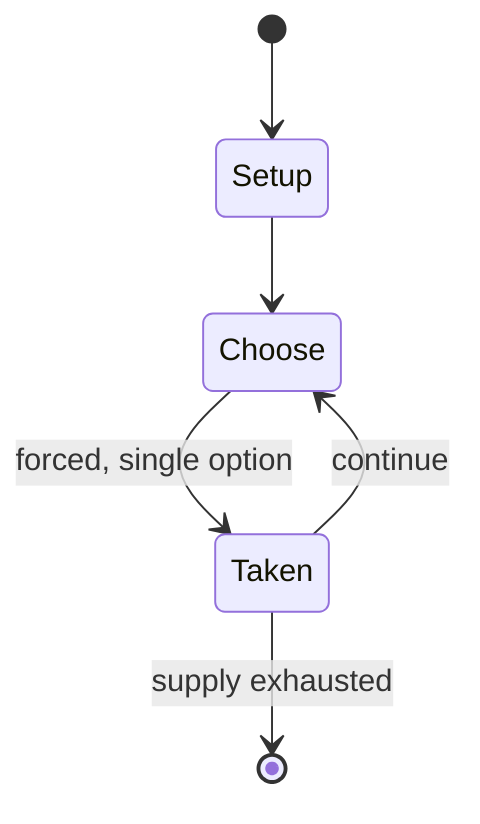

# Makonn

`makonn` &nbsp; state: **DEEPENED** &nbsp; method: **heuristic**

## Found layer (recorded, not trusted)

| field | value |
| --- | --- |
| wikidata | Q16980392 |
| wikipedia | Makonn |
| genres (source) | -- |
| instance of (source) | -- |
| country of origin | -- |

## Declared layer (orders bench work)

| field | value |
| --- | --- |
| year created | -- |
| epoch | -- |
| region | -- |
| media | ABSTRACT, MANCALA |
| players | -- |
| age band | -- |
| exogenous process | -- |
| loss shape | OPPORTUNITY_ONLY |
| live axes | - |
| horizon | -- |
| scoring shape | -- |
| information | -- |
| interaction | -- |
| turn structure | -- |
| tractability | SAMPLING_ONLY |
| randomness | -- |
| luck factor | 0.35 |
| rules complexity | 1.69 |
| strategic depth | 2.0 |
| novelty | 0.4674 |
| solved status | -- |
| strategies | -- |
| algorithms | -- |

## Object model

```
Episode
  players      : ?
  turn_structure: ?
  horizon       : ?
  scoring       : ?

Pits           -- cyclic array of counts
Store          -- player's banked seeds
```

## State transition diagram



## Research item -- turn trace

```
# Makonn -- simulated turn events
# generated from the DECLARED vector, not from a rulebook.
# structure: exo=None loss=OPPORTUNITY_ONLY horizon=None scoring=None axes=-

t=0    SETUP        players=2  pot=0  capacity=3
t=1    FORCED       p1 single legal option taken (pot_gain=+1.7)
t=2    ENDTURN      turn passes to p2
t=3    FORCED       p2 single legal option taken (pot_gain=+0.7)
t=4    FORCED       p2 single legal option taken (pot_gain=+1.0)
t=5    FORCED       p2 single legal option taken (pot_gain=+0.5)
t=6    ENDTURN      turn passes to p1
t=7    FORCED       p1 single legal option taken (pot_gain=+1.3)
t=8    ENDTURN      turn passes to p2
t=9    FORCED       p2 single legal option taken (pot_gain=+0.6)
t=10   FORCED       p2 single legal option taken (pot_gain=+1.4)
t=11   FORCED       p2 single legal option taken (pot_gain=+0.9)
t=12   FORCED       p2 single legal option taken (pot_gain=+1.1)
t=13   FORCED       p2 single legal option taken (pot_gain=+0.5)
t=14   FORCED       p2 single legal option taken (pot_gain=+1.7)
t=15   FORCED       p2 single legal option taken (pot_gain=+1.6)
t=16   ENDTURN      turn passes to p1
t=17   FORCED       p1 single legal option taken (pot_gain=+0.6)
t=18   FORCED       p1 single legal option taken (pot_gain=+2.0)
t=19   ENDTURN      turn passes to p2
t=20   FORCED       p2 single legal option taken (pot_gain=+1.3)
t=21   ENDTURN      turn passes to p1
t=22   FORCED       p1 single legal option taken (pot_gain=+1.9)
t=23   FORCED       p1 single legal option taken (pot_gain=+1.0)
t=24   FORCED       p1 single legal option taken (pot_gain=+1.4)
t=25   FORCED       p1 single legal option taken (pot_gain=+1.7)
t=26   FORCED       p1 single legal option taken (pot_gain=+1.8)

terminal: VARIABLE
```

## Source extract

Makonn is an abstract strategy game from the Seychelles islands off the eastern coast of Africa.
The game is a traditional variant of mancala.  It is played on four rows of ten holes such as a
10 x 4 hole board.  There are variants, and the board design, number of pieces, and rules may
change.  This game was almost forgotten and is played mostly on the outer islands of the
Seychelles.  The rules provided in this article are not complete, and this article attempts only
to provide a general description of the game based on the available sources.   == Game play and
rules == The goal is to capture the most pieces.  The board design and size may vary depending
on the variant played.  Perhaps a more common variant is the 10 x 4 hole board.  It is unknown
how many pieces there are in the game, and whether any of the pieces belong to any of the
players.  Each player controls two rows of holes.  All moves are capturing moves.  A capturing
move is when one piece jumps across another piece.

<sub>Wikipedia, CC BY-SA. Retained as evidence for the structural
classification above. Every rule inferred from it is HYPOTHESIZED
until audited against a rulebook.</sub>
