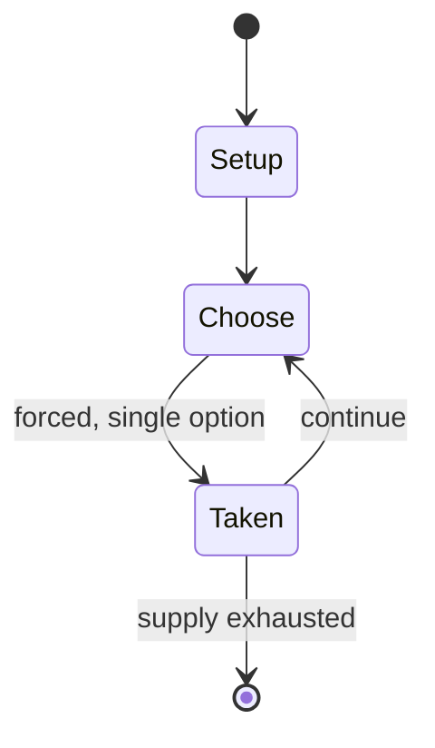

# Mangala

*traditional Turkish mancala game*

`mangala` &nbsp; state: **DEEPENED** &nbsp; method: **heuristic**

## Found layer (recorded, not trusted)

| field | value |
| --- | --- |
| wikidata | Q4817622 |
| wikipedia | Mangala (game) |
| genres (source) | abstract strategy game |
| instance of (source) | board game, mancala, two-player game |
| country of origin | Turkey |

## Declared layer (orders bench work)

| field | value |
| --- | --- |
| year created | -- |
| epoch | -- |
| region | WEST_ASIA |
| media | MANCALA |
| players | 2 |
| age band | -- |
| exogenous process | -- |
| loss shape | -- |
| live axes | - |
| horizon | VARIABLE |
| scoring shape | -- |
| information | -- |
| interaction | COMPETITIVE |
| turn structure | -- |
| tractability | SAMPLING_ONLY |
| randomness | -- |
| luck factor | 0.35 |
| rules complexity | 1.76 |
| strategic depth | 2.0 |
| novelty | 0.5263 |
| solved status | -- |
| strategies | -- |
| algorithms | -- |

## Object model

```
Episode
  players      : 2
  turn_structure: ?
  horizon       : VARIABLE
  scoring       : ?

Pits           -- cyclic array of counts
Store          -- player's banked seeds
```

## State transition diagram



## Research item -- turn trace

```
# Mangala -- simulated turn events
# generated from the DECLARED vector, not from a rulebook.
# structure: exo=None loss=None horizon=VARIABLE scoring=None axes=-

t=0    SETUP        players=2  pot=0  capacity=7
t=1    FORCED       p1 single legal option taken (pot_gain=+1.3)
t=2    FORCED       p1 single legal option taken (pot_gain=+1.8)
t=3    ENDTURN      turn passes to p2
t=4    FORCED       p2 single legal option taken (pot_gain=+1.2)
t=5    FORCED       p2 single legal option taken (pot_gain=+0.8)
t=6    FORCED       p2 single legal option taken (pot_gain=+0.6)
t=7    FORCED       p2 single legal option taken (pot_gain=+0.7)
t=8    FORCED       p2 single legal option taken (pot_gain=+0.5)
t=9    FORCED       p2 single legal option taken (pot_gain=+2.0)
t=10   FORCED       p2 single legal option taken (pot_gain=+1.4)
t=11   ENDTURN      turn passes to p1
t=12   FORCED       p1 single legal option taken (pot_gain=+1.3)
t=13   FORCED       p1 single legal option taken (pot_gain=+1.1)
t=14   ENDTURN      turn passes to p2
t=15   FORCED       p2 single legal option taken (pot_gain=+1.4)
t=16   FORCED       p2 single legal option taken (pot_gain=+1.4)
t=17   ENDTURN      turn passes to p1
t=18   FORCED       p1 single legal option taken (pot_gain=+0.7)
t=19   FORCED       p1 single legal option taken (pot_gain=+2.0)
t=20   FORCED       p1 single legal option taken (pot_gain=+1.0)
t=21   FORCED       p1 single legal option taken (pot_gain=+1.9)
t=22   ENDTURN      turn passes to p2
t=23   FORCED       p2 single legal option taken (pot_gain=+1.3)
t=24   ENDTURN      turn passes to p1
t=25   FORCED       p1 single legal option taken (pot_gain=+1.0)
t=26   FORCED       p1 single legal option taken (pot_gain=+1.7)

terminal: VARIABLE
```

## Conditions

| kind | threshold | effect | trigger |
| --- | --- | --- | --- |
| WIN | -- | -- | The player who captured most pieces wins the game. |
| TERMINATE | -- | -- | The game ends when all the pits are empty. |

## Source extract

Mangala is a traditional Turkish mancala game. It is strictly related to the mancala games Iraqi
Halusa, Palestinian Al-manqala, and Baltic German Bohnenspiel. There is also another game
referred as Mangala played by the Bedouin in Egypt, and Sudan, but it has quite different rules.
The game can be traced in Ottoman miniatures starting from the 16th century. According to the
Turkish ethnologue Metin And, the "mancala" of The Arabian Nights (fifteenth night) could be
directly related to this game. It was first described in 1694 by British orientalist Thomas
Hyde. The game was also referred as Mangola in some later western works. The classic mangala
game is still known in Turkey, but mangala played in Gaziantep, in Southern Anatolia, is more
similar to Syrian mancala La'b Madjnuni (Crazy Game). There are many other mancala variants
played in Anatolia: Pıç in Erzurum, Altıev in Safranbolu, Meneli Taş in Ilgın, etc.   == Rules
== Mangala is played on a 2x6 (or 2x7) mancala board (i.e., 2 rows of 6 or 7 pits). At game
setup, 4 pieces are placed in each pit. At their turn, the player takes all the pieces from one
of their pits and drops them one at a time into the following pits counterc

<sub>Wikipedia, CC BY-SA. Retained as evidence for the structural
classification above. Every rule inferred from it is HYPOTHESIZED
until audited against a rulebook.</sub>
