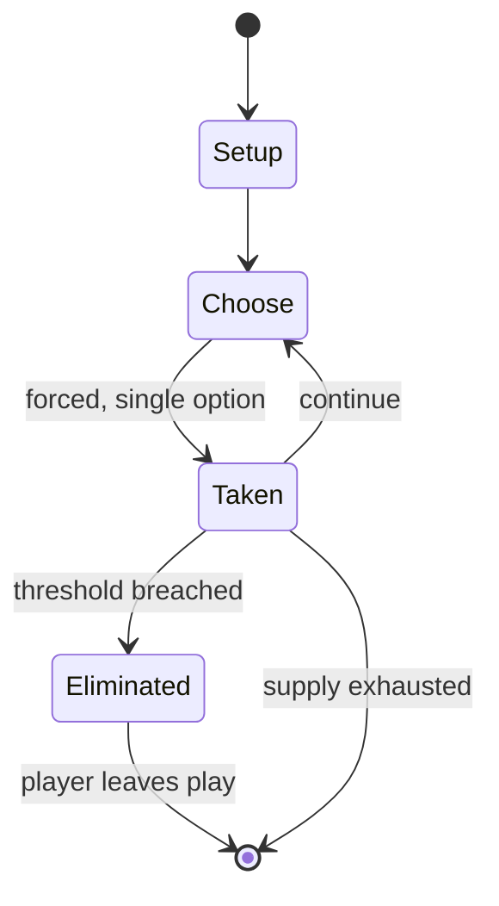

# Marengo: Napoleon in Italy, 14 June 1800

*board wargame*

`marengo_napoleon_in_italy_14_june_1800` &nbsp; state: **DEEPENED** &nbsp; method: **heuristic**

## Found layer (recorded, not trusted)

| field | value |
| --- | --- |
| wikidata | Q112659455 |
| wikipedia | Marengo: Napoleon in Italy, 14 June 1800 |
| genres (source) | -- |
| instance of (source) | board game, wargame |
| country of origin | -- |

## Declared layer (orders bench work)

| field | value |
| --- | --- |
| year created | -- |
| epoch | -- |
| region | -- |
| media | BOARD, WARGAME |
| players | 2 |
| age band | -- |
| exogenous process | -- |
| loss shape | ELIMINATION |
| live axes | SPATIAL |
| horizon | -- |
| scoring shape | SET_COLLECTION_CONVEX |
| information | -- |
| interaction | -- |
| turn structure | STRICT_TURN |
| tractability | SAMPLING_ONLY |
| randomness | DICE |
| luck factor | 0.58 |
| rules complexity | 3.23 |
| strategic depth | 2.37 |
| novelty | 0.6188 |
| solved status | -- |
| strategies | set_collection, spatial_packing |
| algorithms | -- |

## Object model

```
Episode
  players      : 2
  turn_structure: STRICT_TURN
  horizon       : ?
  scoring       : SET_COLLECTION_CONVEX

Board          -- spatial substrate; cells carry position and occupancy
Piece          -- movable token owned by a player
Placement      -- position subject to geometric legality
```

## State transition diagram



## Research item -- turn trace

```
# Marengo: Napoleon in Italy, 14 June 1800 -- simulated turn events
# generated from the DECLARED vector, not from a rulebook.
# structure: exo=None loss=ELIMINATION horizon=None scoring=SET_COLLECTION_CONVEX axes=SPATIAL

t=0    SETUP        players=2  pot=0  capacity=3
t=1    FORCED       p1 single legal option taken (pot_gain=+1.1)
t=2    SPATIAL      p1 places at (0,1); adjacency legal
t=3    ENDTURN      turn passes to p2
t=4    FORCED       p2 single legal option taken (pot_gain=+1.8)
t=5    FORCED       p2 single legal option taken (pot_gain=+1.0)
t=6    ENDTURN      turn passes to p1
t=7    FORCED       p1 single legal option taken (pot_gain=+1.3)
t=8    SPATIAL      p1 places at (0,7); adjacency legal
t=9    FORCED       p1 single legal option taken (pot_gain=+0.6)
t=10   FORCED       p1 single legal option taken (pot_gain=+0.8)
t=11   FORCED       p1 single legal option taken (pot_gain=+1.8)
t=12   SPATIAL      p1 places at (7,6); adjacency legal
t=13   FORCED       p1 single legal option taken (pot_gain=+0.7)
t=14   FORCED       p1 single legal option taken (pot_gain=+1.9)
t=15   FORCED       p1 single legal option taken (pot_gain=+1.9)
t=16   SPATIAL      p1 places at (1,1); adjacency legal
t=17   ENDTURN      turn passes to p2
t=18   FORCED       p2 single legal option taken (pot_gain=+1.2)
t=19   FORCED       p2 single legal option taken (pot_gain=+1.4)
t=20   FORCED       p2 single legal option taken (pot_gain=+0.6)
t=21   ENDTURN      turn passes to p1
t=22   FORCED       p1 single legal option taken (pot_gain=+1.6)
t=23   ENDTURN      turn passes to p2
t=24   FORCED       p2 single legal option taken (pot_gain=+2.0)
t=25   SPATIAL      p2 places at (4,4); adjacency legal
t=26   FORCED       p2 single legal option taken (pot_gain=+1.9)

terminal: VARIABLE
```

## Source extract

Marengo: Napoleon in Italy, 14 June 1800 is a board wargame published by Simulations
Publications Inc. (SPI) in 1975 as one of four games packaged together in the Napoleon at War
"quadrigame" (a game box that contains four separate games using one set of common rules).
Marengo was also released as a separate game the same year. The game simulates the Battle of
Marengo between Austrian and French forces.   == Background == In early 1800, Napoleon
Bonaparte, the First Consul of France, was fighting for his political life and needed a strong
victory in his Italian campaign against Austria. Seeking to besiege an Austrian army defending
Alessandria on 14 June 1800, Bonaparte instead was surprised when Austrian general Michael von
Melas sent his army out of the city on a sortie against the French. For a time, the Austrians
drove the French back and threatened to overcome them, until a French relief force under Louis
Desaix arrived in the afternoon and tilted the balance in favor of the French. Desaix was killed
in the battle.   == Description == Marengo is a two-player wargame in which one player takes the
role of Napoleon, and the other takes the role of Melas. The game lasts for 14 tur

<sub>Wikipedia, CC BY-SA. Retained as evidence for the structural
classification above. Every rule inferred from it is HYPOTHESIZED
until audited against a rulebook.</sub>
