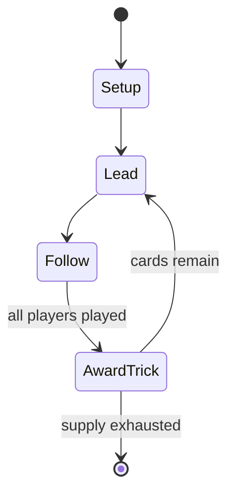

# Mariáš

*card game*

`mari` &nbsp; state: **DEEPENED** &nbsp; method: **heuristic**

## Found layer (recorded, not trusted)

| field | value |
| --- | --- |
| wikidata | Q3564758 |
| wikipedia | Mariáš |
| genres (source) | -- |
| instance of (source) | trick-taking game |
| country of origin | -- |

## Declared layer (orders bench work)

| field | value |
| --- | --- |
| year created | -- |
| epoch | -- |
| region | -- |
| media | CARD, TRICK_TAKING |
| players | 2-4 |
| age band | -- |
| exogenous process | DEPLETING_DECK |
| loss shape | -- |
| live axes | BID, ORDER |
| horizon | -- |
| scoring shape | SET_COLLECTION_CONVEX |
| information | -- |
| interaction | SOLITAIRE |
| turn structure | TRICK_ROUND |
| tractability | EXACT_WITH_CUT |
| randomness | DECK_SHUFFLE |
| luck factor | 0.48 |
| rules complexity | 2.65 |
| strategic depth | 2.5 |
| novelty | 0.7277 |
| solved status | -- |
| strategies | set_collection, spatial_packing |
| algorithms | -- |

## Object model

```
Episode
  players      : 2-4
  turn_structure: TRICK_ROUND
  horizon       : ?
  scoring       : SET_COLLECTION_CONVEX

Deck           -- ordered multiset, drawn without replacement
Hand           -- private multiset held by one player
DiscardPile    -- public accumulation of spent cards
Trick          -- one card per player; a winner is determined
Trump          -- suit that dominates the ordering
Auction        -- priced competition resolving to one winner
Sequence       -- the permutation under the player's control
```

## State transition diagram



## Research item -- turn trace

```
# Mariáš -- simulated turn events
# generated from the DECLARED vector, not from a rulebook.
# structure: exo=DEPLETING_DECK loss=None horizon=None scoring=SET_COLLECTION_CONVEX axes=BID,ORDER

t=0    SETUP        players=2  pot=0  capacity=6
t=1    DRAW         p1 draw from deck -> outcome #5  (p=0.173)
t=2    FORCED       p1 single legal option taken (pot_gain=+0.6)
t=3    BID          p1 sealed bid of 6 against 1 rivals
t=4    DRAW         p1 draw from deck -> outcome #4  (p=0.042)
t=5    FORCED       p1 single legal option taken (pot_gain=+1.6)
t=6    BID          p1 sealed bid of 6 against 1 rivals
t=7    DRAW         p1 draw from deck -> outcome #6  (p=0.044)
t=8    FORCED       p1 single legal option taken (pot_gain=+1.0)
t=9    BID          p1 sealed bid of 5 against 1 rivals
t=10   DRAW         p1 draw from deck -> outcome #6  (p=0.174)
t=11   FORCED       p1 single legal option taken (pot_gain=+0.6)
t=12   ENDTURN      turn passes to p2
t=13   DRAW         p2 draw from deck -> outcome #2  (p=0.171)
t=14   FORCED       p2 single legal option taken (pot_gain=+1.6)
t=15   BID          p2 sealed bid of 6 against 1 rivals
t=16   DRAW         p2 draw from deck -> outcome #2  (p=0.226)
t=17   FORCED       p2 single legal option taken (pot_gain=+1.0)
t=18   ENDTURN      turn passes to p1
t=19   DRAW         p1 draw from deck -> outcome #1  (p=0.091)
t=20   FORCED       p1 single legal option taken (pot_gain=+0.7)
t=21   BID          p1 sealed bid of 1 against 1 rivals
t=22   DRAW         p1 draw from deck -> outcome #4  (p=0.225)
t=23   FORCED       p1 single legal option taken (pot_gain=+1.7)
t=24   BID          p1 sealed bid of 2 against 1 rivals
t=25   DRAW         p1 draw from deck -> outcome #1  (p=0.241)
t=26   FORCED       p1 single legal option taken (pot_gain=+1.7)
t=27   BID          p1 sealed bid of 7 against 1 rivals

terminal: VARIABLE
```

## Conditions

| kind | threshold | effect | trigger |
| --- | --- | --- | --- |
| BOUNDARY | 1 player | -- | Marriage (K+Q in the same suit in one player´s hand) trump suit 40 points, other suits 20, 20, 20 points (100 bonus points, 190 maximum score) |
| BOUNDARY | 1 trick | -- | Provided the melder takes at least one trick during play, this scores 20 points that team. |
| BOUNDARY | 1 trick | -- | Melds are added to the score if the melder took at least one trick. |

## Source extract

Mariáš or Mariasch a three-player, solo trick-taking game of the king–queen family of ace–ten
games, but with a simplified scoring system. It is one of the most popular card games in the
Czech Republic and Slovakia, but is also played in Bavaria in Germany as well as in Austria. The
Hungarian national card game Ulti is an elaboration of Mariáš.   == Variants in former
Czechoslovakia == Lízaný mariáš (Draw Mariage) – trick-and-draw game, two players, very similar
to old German card game, Mariage and Polish Tysiąc (one thousand) Volený mariáš (Called Mariage)
– three players, no drawing, eldest hand determines the trump suit, the other players defend
together in partnership Křížový mariáš (Cross Mariage) – four players, 8 tricks, elder hand sets
up the trump suit and calls (chooses) one trump honour card to be in partnership, two others are
defenders) Licitovaný mariáš (Auction Mariage) – three players, ten tricks bidding phase like in
the contract bridge, the strongest player chooses the contract, the other two players become the
defenders Hvězdicový mariáš (Star Mariage) – five players, six tricks, bidding phase and
contractor calls the trump honour, the other three players become

<sub>Wikipedia, CC BY-SA. Retained as evidence for the structural
classification above. Every rule inferred from it is HYPOTHESIZED
until audited against a rulebook.</sub>
