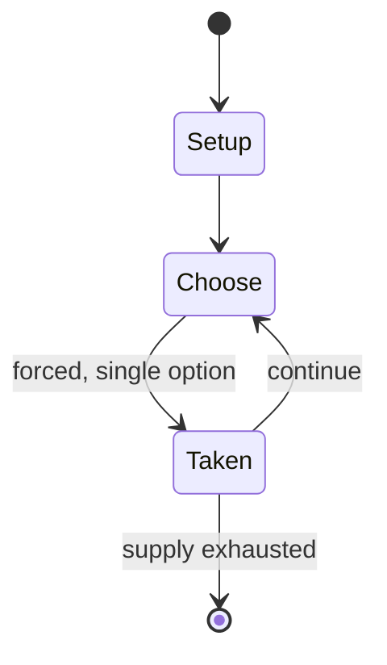

# Mario Takes America

*canceled video game*

`mario_takes_america` &nbsp; state: **DEEPENED** &nbsp; method: **heuristic**

## Found layer (recorded, not trusted)

| field | value |
| --- | --- |
| wikidata | Q21036727 |
| wikipedia | Mario Takes America |
| genres (source) | platformer |
| instance of (source) | abandoned project, vaporware, video game |
| country of origin | Canada |

## Declared layer (orders bench work)

| field | value |
| --- | --- |
| year created | 1992 |
| epoch | DIGITAL |
| region | NORTH_AMERICA |
| media | RPG, VIDEO |
| players | -- |
| age band | -- |
| exogenous process | -- |
| loss shape | -- |
| live axes | - |
| horizon | -- |
| scoring shape | -- |
| information | -- |
| interaction | -- |
| turn structure | -- |
| tractability | SAMPLING_ONLY |
| randomness | -- |
| luck factor | 0.35 |
| rules complexity | 2.97 |
| strategic depth | 2.25 |
| novelty | 0.0914 |
| solved status | -- |
| strategies | area_control |
| algorithms | -- |

## Object model

```
Episode
  players      : ?
  turn_structure: ?
  horizon       : ?
  scoring       : ?

Character      -- persistent stat block owned by a player
GameMaster     -- adjudicating agent outside the scoring loop
Scenario       -- authored state the players traverse
WorldState     -- simulation state advanced by the engine
Avatar         -- player-controlled agent
Clock          -- frame or tick counter
```

## State transition diagram



## Research item -- turn trace

```
# Mario Takes America -- simulated turn events
# generated from the DECLARED vector, not from a rulebook.
# structure: exo=None loss=None horizon=None scoring=None axes=-

t=0    SETUP        players=2  pot=0  capacity=5
t=1    FORCED       p1 single legal option taken (pot_gain=+1.1)
t=2    ENDTURN      turn passes to p2
t=3    FORCED       p2 single legal option taken (pot_gain=+1.7)
t=4    ENDTURN      turn passes to p1
t=5    FORCED       p1 single legal option taken (pot_gain=+0.7)
t=6    FORCED       p1 single legal option taken (pot_gain=+1.5)
t=7    FORCED       p1 single legal option taken (pot_gain=+1.1)
t=8    FORCED       p1 single legal option taken (pot_gain=+1.5)
t=9    FORCED       p1 single legal option taken (pot_gain=+1.7)
t=10   ENDTURN      turn passes to p2
t=11   FORCED       p2 single legal option taken (pot_gain=+1.2)
t=12   FORCED       p2 single legal option taken (pot_gain=+1.9)
t=13   ENDTURN      turn passes to p1
t=14   FORCED       p1 single legal option taken (pot_gain=+1.0)
t=15   FORCED       p1 single legal option taken (pot_gain=+1.3)
t=16   ENDTURN      turn passes to p2
t=17   FORCED       p2 single legal option taken (pot_gain=+1.3)
t=18   FORCED       p2 single legal option taken (pot_gain=+1.5)
t=19   FORCED       p2 single legal option taken (pot_gain=+1.9)
t=20   FORCED       p2 single legal option taken (pot_gain=+1.0)
t=21   FORCED       p2 single legal option taken (pot_gain=+1.9)
t=22   FORCED       p2 single legal option taken (pot_gain=+1.3)
t=23   ENDTURN      turn passes to p1
t=24   FORCED       p1 single legal option taken (pot_gain=+1.2)
t=25   FORCED       p1 single legal option taken (pot_gain=+0.6)
t=26   FORCED       p1 single legal option taken (pot_gain=+0.8)

terminal: VARIABLE
```

## Conditions

| kind | threshold | effect | trigger |
| --- | --- | --- | --- |
| ELIMINATE | -- | -- | The player progresses through the game by eliminating all the viruses on the screen in each level. |

## Source extract

Mario is a Japanese video game series and media franchise created by Japanese game designer
Shigeru Miyamoto for the video game company Nintendo. Starring Mario, the franchise began with
video games but has extended to other forms of media, including a television series, comic
books, a 1993 film, a 2023 film, a 2026 sequel film, and a theme park area. Mario made his first
video game appearance in the arcade game Donkey Kong (1981) and was featured in multiple Donkey
Kong games prior to Mario Bros. (1983), the first game with "Mario" in the title. Mario video
games have been developed by a variety of developers, with the vast majority produced and
published by Nintendo and released exclusively on Nintendo's video game consoles. The flagship
Mario subseries is the Super Mario series of platform games starting with 1985's Super Mario
Bros., which mostly follows Mario's adventures in the fictional world of the Mushroom Kingdom
and typically relies on Mario's jumping ability to allow him to progress through levels. The
franchise has spawned over 200 games of various genres and several subseries, including Mario
Kart, Mario Party, Mario Tennis, Mario Golf, Mario vs. Donkey Kong, Paper Ma

<sub>Wikipedia, CC BY-SA. Retained as evidence for the structural
classification above. Every rule inferred from it is HYPOTHESIZED
until audited against a rulebook.</sub>
