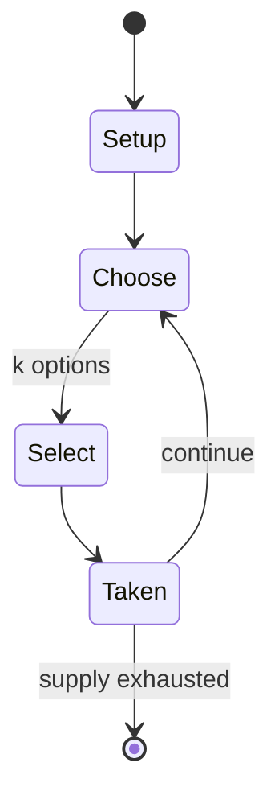

# Masonic Chess

*chess variant*

`masonic_chess` &nbsp; state: **DEEPENED** &nbsp; method: **heuristic**

## Found layer (recorded, not trusted)

| field | value |
| --- | --- |
| wikidata | Q13647396 |
| wikipedia | Masonic chess |
| genres (source) | -- |
| instance of (source) | chess variant |
| country of origin | -- |

## Declared layer (orders bench work)

| field | value |
| --- | --- |
| year created | -- |
| epoch | -- |
| region | -- |
| media | BOARD |
| players | -- |
| age band | -- |
| exogenous process | -- |
| loss shape | -- |
| live axes | SELECT, SPATIAL |
| horizon | -- |
| scoring shape | -- |
| information | -- |
| interaction | -- |
| turn structure | -- |
| tractability | SAMPLING_ONLY |
| randomness | -- |
| luck factor | 0.35 |
| rules complexity | 2.31 |
| strategic depth | 2.25 |
| novelty | 0.0866 |
| solved status | -- |
| strategies | signalling |
| algorithms | -- |

## Object model

```
Episode
  players      : ?
  turn_structure: ?
  horizon       : ?
  scoring       : ?

Board          -- spatial substrate; cells carry position and occupancy
Piece          -- movable token owned by a player
OptionSet      -- the choices available after an exogenous draw
Placement      -- position subject to geometric legality
```

## State transition diagram



## Research item -- turn trace

```
# Masonic Chess -- simulated turn events
# generated from the DECLARED vector, not from a rulebook.
# structure: exo=None loss=None horizon=None scoring=None axes=SELECT,SPATIAL

t=0    SETUP        players=2  pot=0  capacity=8
t=1    SELECT       p1 4 options; take #3  (pot_gain=+1.5, capacity=-0)
t=2    SELECT       p1 4 options; take #2  (pot_gain=+0.7, capacity=-2)
t=3    ENDTURN      turn passes to p2
t=4    SELECT       p2 3 options; take #2  (pot_gain=+2.8, capacity=-1)
t=5    SELECT       p2 3 options; take #3  (pot_gain=+1.3, capacity=-0)
t=6    SELECT       p2 1 options; take #1  (pot_gain=+1.5, capacity=-2)
t=7    SELECT       p2 3 options; take #3  (pot_gain=+2.1, capacity=-2)
t=8    SELECT       p2 3 options; take #2  (pot_gain=+2.9, capacity=-0)
t=9    SELECT       p2 2 options; take #2  (pot_gain=+3.3, capacity=-0)
t=10   SPATIAL      p2 places at (2,3); adjacency legal
t=11   SELECT       p2 1 options; take #1  (pot_gain=+3.0, capacity=-0)
t=12   SELECT       p2 2 options; take #2  (pot_gain=+2.0, capacity=-1)
t=13   SPATIAL      p2 places at (7,7); adjacency legal
t=14   SELECT       p2 2 options; take #2  (pot_gain=+1.1, capacity=-1)
t=15   SELECT       p2 2 options; take #1  (pot_gain=+1.0, capacity=-1)
t=16   SPATIAL      p2 places at (0,6); adjacency legal
t=17   SELECT       p2 2 options; take #1  (pot_gain=+1.7, capacity=-2)
t=18   SELECT       p2 2 options; take #2  (pot_gain=+3.2, capacity=-0)
t=19   SPATIAL      p2 places at (5,0); adjacency legal
t=20   SELECT       p2 2 options; take #1  (pot_gain=+2.8, capacity=-0)
t=21   ENDTURN      turn passes to p1
t=22   SELECT       p1 1 options; take #1  (pot_gain=+1.2, capacity=-0)
t=23   SELECT       p1 2 options; take #2  (pot_gain=+3.0, capacity=-0)
t=24   SELECT       p1 1 options; take #1  (pot_gain=+2.7, capacity=-2)
t=25   ENDTURN      turn passes to p2
t=26   SELECT       p2 2 options; take #1  (pot_gain=+1.9, capacity=-0)

terminal: VARIABLE
```

## Conditions

| kind | threshold | effect | trigger |
| --- | --- | --- | --- |
| BOUNDARY | -- | -- | Masonic bishops, however, are limited to the four diagonal directions to the sides.) As with hex-based boards, three colors are used, so no two adjacent cells are the same color, and gameboard diagonals are highlighted. |

## Source extract

Masonic chess is a chess variant invented by George R. Dekle Sr. in 1983. The game is played on
a modified chessboard whereby even-numbered ranks are indented to the right—resembling masonry
brickwork. The moves of the pieces are adapted to the new geometry; in other respects the game
is the same as chess. Masonic chess was included in World Game Review No. 10 edited by Michael
Keller.   == Board characteristics == The Masonic board cells are slightly rectangular, and
indentation of alternating ranks results in cants (oblique files) 30° from the vertical and
diagonals 30° from the horizontal, the same as hexagon-based chessboards when cell vertices face
the players. (For example, rooks have six directions of movement, and Masonic pawns move and
capture the same as pawns in De Vasa's hexagonal chess. Masonic bishops, however, are limited to
the four diagonal directions to the sides.) As with hex-based boards, three colors are used, so
no two adjacent cells are the same color, and gameboard diagonals are highlighted.   == Game
rules == The diagram shows the starting setup. All normal chess rules apply, including
conventions for castling either kingside or queenside, a pawn's initial

<sub>Wikipedia, CC BY-SA. Retained as evidence for the structural
classification above. Every rule inferred from it is HYPOTHESIZED
until audited against a rulebook.</sub>
