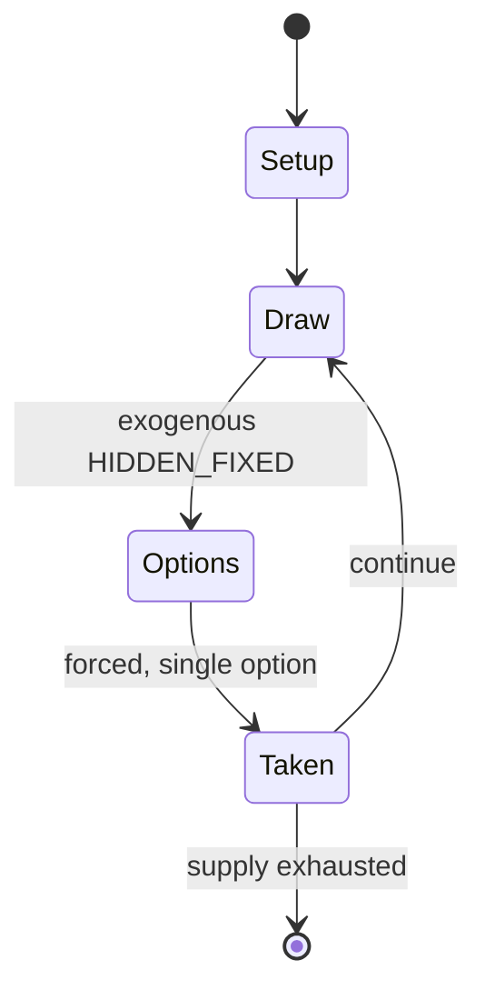

# Mastermind (board game)

`mastermind_board_game` &nbsp; state: **DEEPENED** &nbsp; method: **heuristic**

## Found layer (recorded, not trusted)

| field | value |
| --- | --- |
| wikidata | Q17286 |
| wikipedia | Mastermind (board game) |
| genres (source) | -- |
| instance of (source) | -- |
| country of origin | -- |

## Declared layer (orders bench work)

| field | value |
| --- | --- |
| year created | -- |
| epoch | -- |
| region | -- |
| media | BOARD |
| players | 2 |
| age band | -- |
| exogenous process | HIDDEN_FIXED |
| loss shape | -- |
| live axes | - |
| horizon | -- |
| scoring shape | SET_COLLECTION_CONVEX |
| information | IMPERFECT |
| interaction | SOLITAIRE |
| turn structure | -- |
| tractability | SAMPLING_ONLY |
| randomness | HIDDEN_INFO |
| luck factor | 0.35 |
| rules complexity | 1.87 |
| strategic depth | 2.25 |
| novelty | 0.6806 |
| solved status | -- |
| strategies | deduction |
| algorithms | -- |

## Object model

```
Episode
  players      : 2
  turn_structure: ?
  horizon       : ?
  scoring       : SET_COLLECTION_CONVEX

Board          -- spatial substrate; cells carry position and occupancy
Piece          -- movable token owned by a player
```

## State transition diagram



## Research item -- turn trace

```
# Mastermind (board game) -- simulated turn events
# generated from the DECLARED vector, not from a rulebook.
# structure: exo=HIDDEN_FIXED loss=None horizon=None scoring=SET_COLLECTION_CONVEX axes=-

t=0    SETUP        players=2  pot=0  capacity=7
t=1    DRAW         p1 reveal from fixed layout -> outcome #4  (p=0.082)
t=2    FORCED       p1 single legal option taken (pot_gain=+1.5)
t=3    DRAW         p1 reveal from fixed layout -> outcome #6  (p=0.027)
t=4    FORCED       p1 single legal option taken (pot_gain=+1.8)
t=5    DRAW         p1 reveal from fixed layout -> outcome #2  (p=0.064)
t=6    FORCED       p1 single legal option taken (pot_gain=+1.3)
t=7    ENDTURN      turn passes to p2
t=8    DRAW         p2 reveal from fixed layout -> outcome #6  (p=0.113)
t=9    FORCED       p2 single legal option taken (pot_gain=+1.6)
t=10   DRAW         p2 reveal from fixed layout -> outcome #2  (p=0.299)
t=11   FORCED       p2 single legal option taken (pot_gain=+0.9)
t=12   DRAW         p2 reveal from fixed layout -> outcome #5  (p=0.122)
t=13   FORCED       p2 single legal option taken (pot_gain=+0.7)
t=14   DRAW         p2 reveal from fixed layout -> outcome #6  (p=0.230)
t=15   FORCED       p2 single legal option taken (pot_gain=+0.9)
t=16   ENDTURN      turn passes to p1
t=17   DRAW         p1 reveal from fixed layout -> outcome #1  (p=0.122)
t=18   FORCED       p1 single legal option taken (pot_gain=+1.6)
t=19   ENDTURN      turn passes to p2
t=20   DRAW         p2 reveal from fixed layout -> outcome #3  (p=0.147)
t=21   FORCED       p2 single legal option taken (pot_gain=+1.8)
t=22   DRAW         p2 reveal from fixed layout -> outcome #4  (p=0.170)
t=23   FORCED       p2 single legal option taken (pot_gain=+1.6)
t=24   DRAW         p2 reveal from fixed layout -> outcome #1  (p=0.287)
t=25   FORCED       p2 single legal option taken (pot_gain=+0.6)
t=26   ENDTURN      turn passes to p1

terminal: VARIABLE
```

## Conditions

| kind | threshold | effect | trigger |
| --- | --- | --- | --- |
| BOUNDARY | -- | -- | The score of a guess is pessimistically defined to be the worst (maximum) of all its response scores. |

## Source extract

Mastermind or Master Mind (Hebrew: בול פגיעה, romanized: bul pgi'a) is a code-breaking game for
two players invented in Israel. It resembles an earlier pencil and paper game called Bulls and
Cows that may date back a century.   == History ==  Mastermind was invented in 1970 by Mordecai
Meirowitz, an Israeli postmaster and telecommunications expert. After presenting the idea  to
major toy companies and showing it at the Nuremberg International Toy Fair, it was picked up by
a plastics company, Invicta Plastics, based near Leicester, England. Invicta purchased all the
rights to the game, and the founder, Edward Jones-Fenleigh, refined the game further. It was
released in 1971–72. The game is based on a paper and pencil game called Bulls and Cows. A
computer adaptation was run in the 1960s on Cambridge University’s Titan computer system, where
it was called "MOO". This version was written by Frank King. Other versions were written for the
TSS/8 time-sharing system by J.S. Felton, for Unix by Ken Thompson, and for the Multics system
at MIT by Jerrold Grochow. Since 1971, the rights to Mastermind have been held by Invicta
Plastics.  (Invicta always called the game Master Mind.) They orig

<sub>Wikipedia, CC BY-SA. Retained as evidence for the structural
classification above. Every rule inferred from it is HYPOTHESIZED
until audited against a rulebook.</sub>
