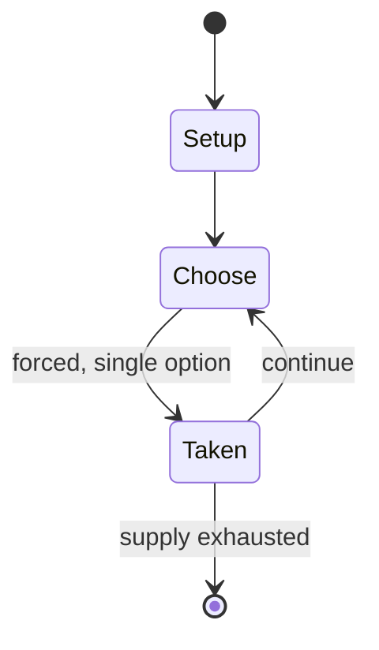

# Match Attax

*collecting card game*

`match_attax` &nbsp; state: **DEEPENED** &nbsp; method: **heuristic**

## Found layer (recorded, not trusted)

| field | value |
| --- | --- |
| wikidata | Q1908098 |
| wikipedia | Match Attax |
| genres (source) | -- |
| instance of (source) | collectible card game |
| country of origin | -- |

## Declared layer (orders bench work)

| field | value |
| --- | --- |
| year created | 2008 |
| epoch | CONTEMPORARY |
| region | -- |
| media | CARD, COLLECTIBLE |
| players | -- |
| age band | -- |
| exogenous process | -- |
| loss shape | -- |
| live axes | TRADE |
| horizon | -- |
| scoring shape | SET_COLLECTION_CONVEX |
| information | -- |
| interaction | NEGOTIATION |
| turn structure | -- |
| tractability | INTRACTABLE |
| randomness | -- |
| luck factor | 0.35 |
| rules complexity | 3.55 |
| strategic depth | 2.25 |
| novelty | 0.8783 |
| solved status | -- |
| strategies | set_collection |
| algorithms | -- |

## Object model

```
Episode
  players      : ?
  turn_structure: ?
  horizon       : ?
  scoring       : SET_COLLECTION_CONVEX

Deck           -- ordered multiset, drawn without replacement
Hand           -- private multiset held by one player
DiscardPile    -- public accumulation of spent cards
Offer          -- proposed exchange between two agents
```

## State transition diagram



## Research item -- turn trace

```
# Match Attax -- simulated turn events
# generated from the DECLARED vector, not from a rulebook.
# structure: exo=None loss=None horizon=None scoring=SET_COLLECTION_CONVEX axes=TRADE

t=0    SETUP        players=2  pot=0  capacity=5
t=1    FORCED       p1 single legal option taken (pot_gain=+0.6)
t=2    FORCED       p1 single legal option taken (pot_gain=+1.0)
t=3    TRADE        p1 offers 2:1 exchange to p2
t=4    FORCED       p1 single legal option taken (pot_gain=+1.2)
t=5    TRADE        p1 offers 2:1 exchange to p2
t=6    ENDTURN      turn passes to p2
t=7    FORCED       p2 single legal option taken (pot_gain=+1.8)
t=8    TRADE        p2 offers 2:1 exchange to p1
t=9    FORCED       p2 single legal option taken (pot_gain=+1.3)
t=10   FORCED       p2 single legal option taken (pot_gain=+1.2)
t=11   TRADE        p2 offers 2:1 exchange to p1
t=12   FORCED       p2 single legal option taken (pot_gain=+1.2)
t=13   FORCED       p2 single legal option taken (pot_gain=+1.5)
t=14   TRADE        p2 offers 2:1 exchange to p1
t=15   FORCED       p2 single legal option taken (pot_gain=+1.4)
t=16   FORCED       p2 single legal option taken (pot_gain=+1.6)
t=17   FORCED       p2 single legal option taken (pot_gain=+1.8)
t=18   TRADE        p2 offers 2:1 exchange to p1
t=19   FORCED       p2 single legal option taken (pot_gain=+1.4)
t=20   ENDTURN      turn passes to p1
t=21   FORCED       p1 single legal option taken (pot_gain=+0.9)
t=22   FORCED       p1 single legal option taken (pot_gain=+1.6)
t=23   ENDTURN      turn passes to p2
t=24   FORCED       p2 single legal option taken (pot_gain=+2.0)
t=25   TRADE        p2 offers 2:1 exchange to p1
t=26   FORCED       p2 single legal option taken (pot_gain=+1.0)

terminal: VARIABLE
```

## Conditions

| kind | threshold | effect | trigger |
| --- | --- | --- | --- |
| BOUNDARY | -- | -- | It is currently scheduled to go through at least 2025. |

## Source extract

The Topps Company, Inc. is an American company that manufactures trading cards and other
collectables. Formerly based in New York City, Topps is best known as a producer of baseball and
other sports- and non-sports-themed trading cards. Topps also produces cards under the brand
names Allen & Ginter and Bowman. In the 2010s, Topps was the only baseball card manufacturer
with a license with Major League Baseball. After Topps lost the license to Fanatics, Inc. in
2022, Fanatics acquired Topps.   == Company history ==   === Beginnings and consolidation ===
Topps was founded in 1938 by four brothers, Abram, Ira, Philip and Joseph Shorin. The roots of
Topps can be traced to American Leaf. Ira, Philip, and Joseph decided to focus on a new product
while taking advantage of the company's existing distribution channels. To do this, they
relaunched the company as Topps, with the name meant to indicate that it would be "tops" in its
field. The chosen field was the manufacture of chewing gum. At the time, chewing gum was still a
relative novelty sold in individual pieces. Topps' most successful early product was Bazooka
bubble gum, which was packaged with a small comic on the wrapper. Starting

<sub>Wikipedia, CC BY-SA. Retained as evidence for the structural
classification above. Every rule inferred from it is HYPOTHESIZED
until audited against a rulebook.</sub>
