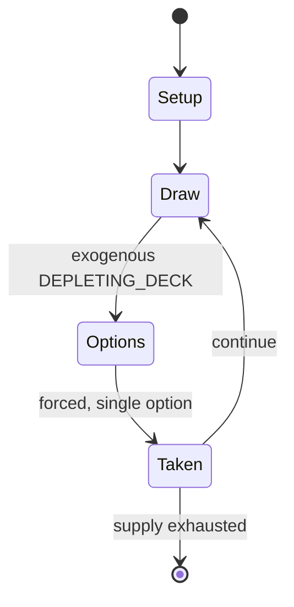

# Mauscheln

`mauscheln` &nbsp; state: **DEEPENED** &nbsp; method: **heuristic**

## Found layer (recorded, not trusted)

| field | value |
| --- | --- |
| wikidata | Q12327833 |
| wikipedia | Mauscheln |
| genres (source) | -- |
| instance of (source) | -- |
| country of origin | -- |

## Declared layer (orders bench work)

| field | value |
| --- | --- |
| year created | -- |
| epoch | -- |
| region | -- |
| media | CARD |
| players | 3-5 |
| age band | -- |
| exogenous process | DEPLETING_DECK |
| loss shape | -- |
| live axes | BID |
| horizon | -- |
| scoring shape | -- |
| information | -- |
| interaction | -- |
| turn structure | STRICT_TURN |
| tractability | EXACT_WITH_CUT |
| randomness | DICE |
| luck factor | 0.58 |
| rules complexity | 2.25 |
| strategic depth | 2.12 |
| novelty | 0.7207 |
| solved status | -- |
| strategies | spatial_packing |
| algorithms | -- |

## Object model

```
Episode
  players      : 3-5
  turn_structure: STRICT_TURN
  horizon       : ?
  scoring       : ?

Deck           -- ordered multiset, drawn without replacement
Hand           -- private multiset held by one player
DiscardPile    -- public accumulation of spent cards
Auction        -- priced competition resolving to one winner
```

## State transition diagram



## Research item -- turn trace

```
# Mauscheln -- simulated turn events
# generated from the DECLARED vector, not from a rulebook.
# structure: exo=DEPLETING_DECK loss=None horizon=None scoring=None axes=BID

t=0    SETUP        players=3  pot=0  capacity=4
t=1    DRAW         p1 draw from deck -> outcome #3  (p=0.248)
t=2    FORCED       p1 single legal option taken (pot_gain=+0.9)
t=3    DRAW         p1 draw from deck -> outcome #2  (p=0.109)
t=4    FORCED       p1 single legal option taken (pot_gain=+1.8)
t=5    BID          p1 sealed bid of 2 against 2 rivals
t=6    DRAW         p1 draw from deck -> outcome #3  (p=0.270)
t=7    FORCED       p1 single legal option taken (pot_gain=+1.9)
t=8    DRAW         p1 draw from deck -> outcome #3  (p=0.220)
t=9    FORCED       p1 single legal option taken (pot_gain=+0.8)
t=10   DRAW         p1 draw from deck -> outcome #3  (p=0.207)
t=11   FORCED       p1 single legal option taken (pot_gain=+0.9)
t=12   BID          p1 sealed bid of 7 against 2 rivals
t=13   DRAW         p1 draw from deck -> outcome #3  (p=0.058)
t=14   FORCED       p1 single legal option taken (pot_gain=+1.9)
t=15   DRAW         p1 draw from deck -> outcome #4  (p=0.142)
t=16   FORCED       p1 single legal option taken (pot_gain=+1.9)
t=17   ENDTURN      turn passes to p2
t=18   DRAW         p2 draw from deck -> outcome #2  (p=0.073)
t=19   FORCED       p2 single legal option taken (pot_gain=+1.6)
t=20   DRAW         p2 draw from deck -> outcome #5  (p=0.287)
t=21   FORCED       p2 single legal option taken (pot_gain=+1.9)
t=22   DRAW         p2 draw from deck -> outcome #2  (p=0.255)
t=23   FORCED       p2 single legal option taken (pot_gain=+1.5)
t=24   BID          p2 sealed bid of 9 against 2 rivals
t=25   DRAW         p2 draw from deck -> outcome #2  (p=0.145)
t=26   FORCED       p2 single legal option taken (pot_gain=+1.3)
t=27   ENDTURN      turn passes to p3

terminal: VARIABLE
```

## Conditions

| kind | threshold | effect | trigger |
| --- | --- | --- | --- |
| BOUNDARY | 2 tricks | -- | In doing so, he undertakes to win at least two tricks. |
| BOUNDARY | 2 tricks | -- | He takes over the game and has to take at least 2 tricks. |
| BOUNDARY | -- | -- | If at least one other player joins in, all active players, in order, may exchange up to 4 hand cards with the talon, throwing their discards face down onto a 'bonfire' (Scheiterhaufen). |
| PENALTY | -- | -- | It may incur a penalty payment if lost to the Ace. |

## Source extract

Mauscheln, also Maus or Vierblatt, is a gambling card game that resembles Tippen, which is
commonly played in Germany and the countries of the old Austro-Hungarian Empire.   == Background
==   === Origin of the name === The name Mauscheln means something like "(secretive) talk".
According to Meyers Konversationslexikon of 1885 to 1892 the word Mauschel is derived from the
Hebrew word moscheh "Moses", in Ashkenazi Hebrew Mausche, Mousche, and was a nickname for Jews;
in Old German mauscheln means something like "speak with a Jewish accent" or haggle". The word
first surfaced in the 17th century. Today mauscheln is a synonym for "scheme", "wheel and deal",
"wangle" or "diddle". Other names for the game include Anschlagen (in Tyrol and Lower Austria),
Polish Bank (Polnische Bank, not to be confused with another game of this name) or Panczok, also
Kratzen, or Frische Vier (in Lower Austria, Styria and Burgenland) or Frische Viere (in South
Bohemia in the early 20th century). It also used to be known as Angehen. The 3-card game,
Dreiblatt or Tippen, is very similar to Mauscheln.   === History === Mauscheln was clearly
current in the early 19th century because it is banned in the Austro-

<sub>Wikipedia, CC BY-SA. Retained as evidence for the structural
classification above. Every rule inferred from it is HYPOTHESIZED
until audited against a rulebook.</sub>
