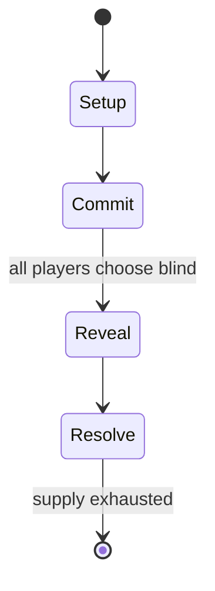

# MechWar '77

*board wargame*

`mechwar_77` &nbsp; state: **DEEPENED** &nbsp; method: **heuristic**

## Found layer (recorded, not trusted)

| field | value |
| --- | --- |
| wikidata | Q112666199 |
| wikipedia | MechWar '77 |
| genres (source) | -- |
| instance of (source) | board game, wargame |
| country of origin | -- |

## Declared layer (orders bench work)

| field | value |
| --- | --- |
| year created | -- |
| epoch | -- |
| region | -- |
| media | BOARD, WARGAME |
| players | 2 |
| age band | -- |
| exogenous process | OPPONENT_GENERATED |
| loss shape | -- |
| live axes | COMMIT_BLIND, SPATIAL |
| horizon | -- |
| scoring shape | -- |
| information | SIMULTANEOUS |
| interaction | COMPETITIVE |
| turn structure | SIMULTANEOUS |
| tractability | SAMPLING_ONLY |
| randomness | DICE |
| luck factor | 0.58 |
| rules complexity | 3.52 |
| strategic depth | 2.12 |
| novelty | 0.6953 |
| solved status | -- |
| strategies | spatial_packing |
| algorithms | -- |

## Object model

```
Episode
  players      : 2
  turn_structure: SIMULTANEOUS
  horizon       : ?
  scoring       : ?

Board          -- spatial substrate; cells carry position and occupancy
Piece          -- movable token owned by a player
SealedChoice   -- irrevocable choice made without observation
Placement      -- position subject to geometric legality
```

## State transition diagram



## Research item -- turn trace

```
# MechWar '77 -- simulated turn events
# generated from the DECLARED vector, not from a rulebook.
# structure: exo=OPPONENT_GENERATED loss=None horizon=None scoring=None axes=COMMIT_BLIND,SPATIAL

t=0    SETUP        players=2  pot=0  capacity=6
t=1    DRAW         p1 observe from opponent move -> outcome #3  (p=0.141)
t=2    FORCED       p1 single legal option taken (pot_gain=+1.4)
t=3    DRAW         p1 observe from opponent move -> outcome #3  (p=0.121)
t=4    FORCED       p1 single legal option taken (pot_gain=+0.7)
t=5    DRAW         p1 observe from opponent move -> outcome #5  (p=0.200)
t=6    FORCED       p1 single legal option taken (pot_gain=+0.8)
t=7    DRAW         p1 observe from opponent move -> outcome #3  (p=0.066)
t=8    FORCED       p1 single legal option taken (pot_gain=+0.8)
t=9    ENDTURN      turn passes to p2
t=10   DRAW         p2 observe from opponent move -> outcome #2  (p=0.078)
t=11   FORCED       p2 single legal option taken (pot_gain=+1.0)
t=12   DRAW         p2 observe from opponent move -> outcome #5  (p=0.144)
t=13   FORCED       p2 single legal option taken (pot_gain=+1.3)
t=14   SPATIAL      p2 places at (2,3); adjacency legal
t=15   ENDTURN      turn passes to p1
t=16   DRAW         p1 observe from opponent move -> outcome #2  (p=0.202)
t=17   FORCED       p1 single legal option taken (pot_gain=+1.0)
t=18   ENDTURN      turn passes to p2
t=19   DRAW         p2 observe from opponent move -> outcome #1  (p=0.179)
t=20   FORCED       p2 single legal option taken (pot_gain=+0.6)
t=21   ENDTURN      turn passes to p1
t=22   DRAW         p1 observe from opponent move -> outcome #5  (p=0.006)
t=23   FORCED       p1 single legal option taken (pot_gain=+1.3)
t=24   DRAW         p1 observe from opponent move -> outcome #5  (p=0.182)
t=25   FORCED       p1 single legal option taken (pot_gain=+1.1)
t=26   DRAW         p1 observe from opponent move -> outcome #1  (p=0.218)
t=27   FORCED       p1 single legal option taken (pot_gain=+1.2)

terminal: VARIABLE
```

## Source extract

MechWar '77, subtitled "Tactical Armored Combat in the 1970s", is a board wargame published by
Simulations Publications Inc. (SPI) in 1975 that simulates hypothetical tank combat in the
mid-1970s between various adversaries, using the same rules system as the previously published
Panzer '44.   == Description == MechWar '77 is a two-player wargame that comes with a variety of
hypothetical scenarios set in the 1970s. Most of the scenarios pit NATO against the Warsaw Pact
in West Germany between the east and west arms of the Main River, but one scenario is set in the
Yom Kippur War, and one features a border clash between the Soviet Union and China. Players are
encouraged to create their own scenarios, and for that purpose, British and West German units
are included among the die-cut counters. In addition, the playing map is interchangeable with
that used in Panzer '44.   === Components === The "flatpack" edition includes:  paper hex grid
map scaled at 200 m (220 yd) per hex 400 die-cut counters rulebook sheet of charts one small
six-sided die In the "Designer's Edition", packaged in a larger bookshelf box, the map was
mounted.   === Gameplay === MechWar '77 uses the same game system

<sub>Wikipedia, CC BY-SA. Retained as evidence for the structural
classification above. Every rule inferred from it is HYPOTHESIZED
until audited against a rulebook.</sub>
