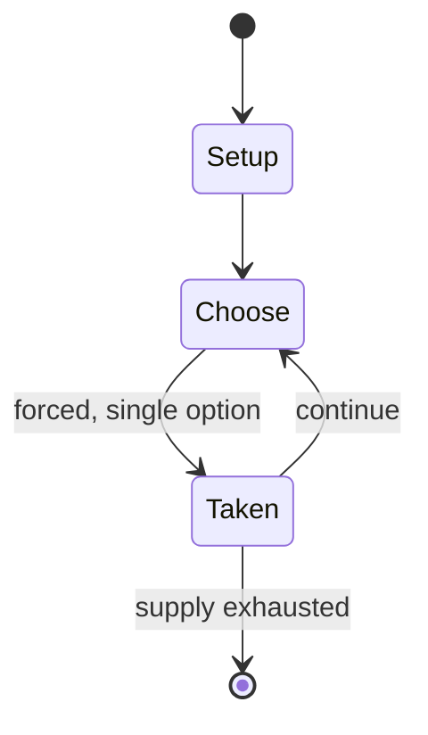

# Medieval Madness

*1997 Williams pinball machine*

`medieval_madness` &nbsp; state: **DEEPENED** &nbsp; method: **heuristic**

## Found layer (recorded, not trusted)

| field | value |
| --- | --- |
| wikidata | Q1393920 |
| wikipedia | Medieval Madness |
| genres (source) | pinball video game |
| instance of (source) | pinball machine game, video game |
| country of origin | -- |

## Declared layer (orders bench work)

| field | value |
| --- | --- |
| year created | 1997 |
| epoch | DIGITAL |
| region | -- |
| media | VIDEO |
| players | -- |
| age band | -- |
| exogenous process | -- |
| loss shape | -- |
| live axes | - |
| horizon | -- |
| scoring shape | NONLINEAR |
| information | -- |
| interaction | -- |
| turn structure | PHASE_STRUCTURED |
| tractability | SAMPLING_ONLY |
| randomness | -- |
| luck factor | 0.35 |
| rules complexity | 2.67 |
| strategic depth | 2.0 |
| novelty | 0.651 |
| solved status | -- |
| strategies | -- |
| algorithms | -- |

## Object model

```
Episode
  players      : ?
  turn_structure: PHASE_STRUCTURED
  horizon       : ?
  scoring       : NONLINEAR

WorldState     -- simulation state advanced by the engine
Avatar         -- player-controlled agent
Clock          -- frame or tick counter
```

## State transition diagram



## Research item -- turn trace

```
# Medieval Madness -- simulated turn events
# generated from the DECLARED vector, not from a rulebook.
# structure: exo=None loss=None horizon=None scoring=NONLINEAR axes=-

t=0    SETUP        players=2  pot=0  capacity=7
t=1    FORCED       p1 single legal option taken (pot_gain=+0.7)
t=2    FORCED       p1 single legal option taken (pot_gain=+0.8)
t=3    FORCED       p1 single legal option taken (pot_gain=+1.4)
t=4    ENDTURN      turn passes to p2
t=5    FORCED       p2 single legal option taken (pot_gain=+1.2)
t=6    ENDTURN      turn passes to p1
t=7    FORCED       p1 single legal option taken (pot_gain=+0.5)
t=8    ENDTURN      turn passes to p2
t=9    FORCED       p2 single legal option taken (pot_gain=+1.7)
t=10   FORCED       p2 single legal option taken (pot_gain=+1.2)
t=11   FORCED       p2 single legal option taken (pot_gain=+0.6)
t=12   FORCED       p2 single legal option taken (pot_gain=+0.9)
t=13   ENDTURN      turn passes to p1
t=14   FORCED       p1 single legal option taken (pot_gain=+0.5)
t=15   FORCED       p1 single legal option taken (pot_gain=+1.5)
t=16   FORCED       p1 single legal option taken (pot_gain=+1.0)
t=17   ENDTURN      turn passes to p2
t=18   FORCED       p2 single legal option taken (pot_gain=+1.0)
t=19   FORCED       p2 single legal option taken (pot_gain=+1.2)
t=20   FORCED       p2 single legal option taken (pot_gain=+1.0)
t=21   FORCED       p2 single legal option taken (pot_gain=+2.0)
t=22   FORCED       p2 single legal option taken (pot_gain=+0.7)
t=23   FORCED       p2 single legal option taken (pot_gain=+0.5)
t=24   FORCED       p2 single legal option taken (pot_gain=+0.7)
t=25   ENDTURN      turn passes to p1
t=26   FORCED       p1 single legal option taken (pot_gain=+0.7)
t=27   ENDTURN      turn passes to p2

terminal: VARIABLE
```

## Conditions

| kind | threshold | effect | trigger |
| --- | --- | --- | --- |
| BOUNDARY | -- | -- | Collecting at least one can start the Multiball by shooting into "Merlin's Magic": In this phase, all the jackpot ramps are lit and the player can score Jackpots by shooting the lit ramps. |
| BOUNDARY | -- | -- | The bonus multiplier is increased from completing the two upper rollovers, and has a maximum multiplier of 255. |

## Source extract

Medieval Madness is a Williams pinball machine released in June 1997. Designed by Brian Eddy and
programmed by Lyman Sheats, it had a production run of 4,016 units. Many casual players consider
it the greatest pinball game. Various remake versions were released from 2015 onwards by Chicago
Gaming under license from Planetary Pinball who hold the rights for manufacturing Williams
pinball machines and parts. There were hopes at Williams that this would help to resurrect the
pinball industry as voiced by Steve Kordek, with the advertising flyer proclaiming "Behold the
Renaissance of Pinball".   == Design and layout == The centerpiece of the playfield is an
animated castle with a solenoid-controlled portcullis and motorized drawbridge. The mechanical
design for the castle was finished the night before the deadline for the completed design of the
game; although George Gomez was not part of the design team, he volunteered some of his time and
assisted Brian Eddy. One of the game's primary objectives is to "destroy" six castles by hitting
the castle's entryway with the pinball. A specific number of hits will lower the drawbridge,
exposing the portcullis; additional hits will cause the por

<sub>Wikipedia, CC BY-SA. Retained as evidence for the structural
classification above. Every rule inferred from it is HYPOTHESIZED
until audited against a rulebook.</sub>
