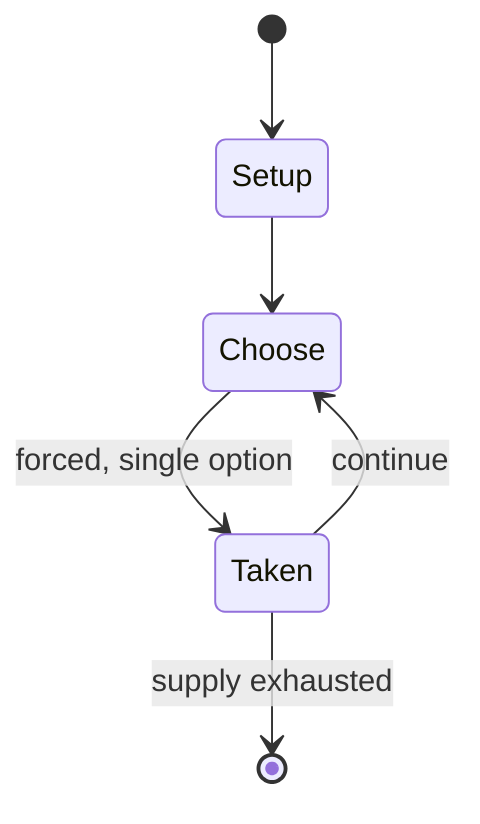

# Mega-Mania

*board game*

`mega_mania` &nbsp; state: **DEEPENED** &nbsp; method: **heuristic**

## Found layer (recorded, not trusted)

| field | value |
| --- | --- |
| wikidata | Q102227157 |
| wikipedia | Mega-Mania |
| genres (source) | -- |
| instance of (source) | board game |
| country of origin | -- |

## Declared layer (orders bench work)

| field | value |
| --- | --- |
| year created | 1987 |
| epoch | DIGITAL |
| region | -- |
| media | BOARD |
| players | -- |
| age band | -- |
| exogenous process | -- |
| loss shape | -- |
| live axes | - |
| horizon | -- |
| scoring shape | -- |
| information | -- |
| interaction | COMPETITIVE |
| turn structure | -- |
| tractability | SAMPLING_ONLY |
| randomness | -- |
| luck factor | 0.35 |
| rules complexity | 2.08 |
| strategic depth | 2.25 |
| novelty | 0.3479 |
| solved status | -- |
| strategies | coalition_forming |
| algorithms | -- |

## Object model

```
Episode
  players      : ?
  turn_structure: ?
  horizon       : ?
  scoring       : ?

Board          -- spatial substrate; cells carry position and occupancy
Piece          -- movable token owned by a player
```

## State transition diagram



## Research item -- turn trace

```
# Mega-Mania -- simulated turn events
# generated from the DECLARED vector, not from a rulebook.
# structure: exo=None loss=None horizon=None scoring=None axes=-

t=0    SETUP        players=2  pot=0  capacity=4
t=1    FORCED       p1 single legal option taken (pot_gain=+2.0)
t=2    FORCED       p1 single legal option taken (pot_gain=+1.4)
t=3    FORCED       p1 single legal option taken (pot_gain=+0.8)
t=4    FORCED       p1 single legal option taken (pot_gain=+1.7)
t=5    FORCED       p1 single legal option taken (pot_gain=+1.2)
t=6    FORCED       p1 single legal option taken (pot_gain=+1.7)
t=7    ENDTURN      turn passes to p2
t=8    FORCED       p2 single legal option taken (pot_gain=+0.7)
t=9    FORCED       p2 single legal option taken (pot_gain=+0.6)
t=10   FORCED       p2 single legal option taken (pot_gain=+0.8)
t=11   FORCED       p2 single legal option taken (pot_gain=+1.1)
t=12   ENDTURN      turn passes to p1
t=13   FORCED       p1 single legal option taken (pot_gain=+1.9)
t=14   FORCED       p1 single legal option taken (pot_gain=+0.7)
t=15   ENDTURN      turn passes to p2
t=16   FORCED       p2 single legal option taken (pot_gain=+0.9)
t=17   FORCED       p2 single legal option taken (pot_gain=+1.1)
t=18   FORCED       p2 single legal option taken (pot_gain=+0.6)
t=19   FORCED       p2 single legal option taken (pot_gain=+1.8)
t=20   FORCED       p2 single legal option taken (pot_gain=+1.9)
t=21   FORCED       p2 single legal option taken (pot_gain=+0.5)
t=22   ENDTURN      turn passes to p1
t=23   FORCED       p1 single legal option taken (pot_gain=+1.2)
t=24   FORCED       p1 single legal option taken (pot_gain=+1.1)
t=25   FORCED       p1 single legal option taken (pot_gain=+1.9)
t=26   FORCED       p1 single legal option taken (pot_gain=+1.9)

terminal: VARIABLE
```

## Source extract

Mega-Mania is a board game published by Games Workshop in 1987 as an expansion for Block Mania
based on the Judge Dredd comics.    == Gameplay == Based on the two-player game Block Mania set
in the Judge Dredd universe, Mega-Mania is an expansion that includes two additional blocks,
allowing play for up to four players. In the game, residents of different city blocks must cause
as much harm as possible to each other before the Judges arrive to restore order. Weapons
include spray paint, guns, flamethrowers and heavy lasers. The winner is the player whose block
is the least damaged at the end of the game. Designer Richard Halliwell in White Dwarf #93
stated that "Mega-mania [...] points up the fascinating possibilities of the endgame as the
players gang up against the overall leader and possible victory can change hands several times
over quite a small number of turns."   == Publication history == Games Workshop published the
two-player combat game Block Mania in 1987.  This was quickly followed the same year by the
expansion Mega-Mania, designed by Richard Halliwell, with artwork by Dave Andrews, Chris Baker,
Colin Dixon, and Brett Ewins. A further expansion with more rules and til

<sub>Wikipedia, CC BY-SA. Retained as evidence for the structural
classification above. Every rule inferred from it is HYPOTHESIZED
until audited against a rulebook.</sub>
