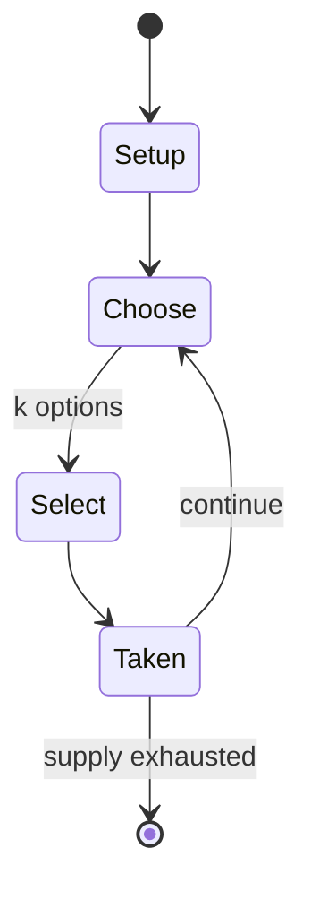

# Mehen (game)

`mehen_game` &nbsp; state: **DEEPENED** &nbsp; method: **heuristic**

## Found layer (recorded, not trusted)

| field | value |
| --- | --- |
| wikidata | Q1099570 |
| wikipedia | Mehen (game) |
| genres (source) | -- |
| instance of (source) | -- |
| country of origin | -- |

## Declared layer (orders bench work)

| field | value |
| --- | --- |
| year created | 2024 |
| epoch | CONTEMPORARY |
| region | -- |
| media | BOARD |
| players | -- |
| age band | -- |
| exogenous process | -- |
| loss shape | -- |
| live axes | SELECT |
| horizon | -- |
| scoring shape | SET_COLLECTION_CONVEX |
| information | -- |
| interaction | SOLITAIRE |
| turn structure | -- |
| tractability | SAMPLING_ONLY |
| randomness | HIDDEN_INFO |
| luck factor | 0.35 |
| rules complexity | 1.84 |
| strategic depth | 2.25 |
| novelty | 0.5066 |
| solved status | -- |
| strategies | set_collection |
| algorithms | -- |

## Object model

```
Episode
  players      : ?
  turn_structure: ?
  horizon       : ?
  scoring       : SET_COLLECTION_CONVEX

Board          -- spatial substrate; cells carry position and occupancy
Piece          -- movable token owned by a player
OptionSet      -- the choices available after an exogenous draw
```

## State transition diagram



## Research item -- turn trace

```
# Mehen (game) -- simulated turn events
# generated from the DECLARED vector, not from a rulebook.
# structure: exo=None loss=None horizon=None scoring=SET_COLLECTION_CONVEX axes=SELECT

t=0    SETUP        players=2  pot=0  capacity=6
t=1    SELECT       p1 3 options; take #1  (pot_gain=+3.3, capacity=-0)
t=2    SELECT       p1 1 options; take #1  (pot_gain=+1.9, capacity=-0)
t=3    SELECT       p1 2 options; take #2  (pot_gain=+2.8, capacity=-1)
t=4    SELECT       p1 1 options; take #1  (pot_gain=+1.6, capacity=-1)
t=5    ENDTURN      turn passes to p2
t=6    SELECT       p2 1 options; take #1  (pot_gain=+2.3, capacity=-1)
t=7    ENDTURN      turn passes to p1
t=8    SELECT       p1 3 options; take #3  (pot_gain=+2.3, capacity=-2)
t=9    SELECT       p1 4 options; take #3  (pot_gain=+1.4, capacity=-1)
t=10   SELECT       p1 2 options; take #1  (pot_gain=+3.5, capacity=-1)
t=11   SELECT       p1 4 options; take #1  (pot_gain=+0.9, capacity=-0)
t=12   SELECT       p1 2 options; take #2  (pot_gain=+0.8, capacity=-2)
t=13   SELECT       p1 1 options; take #1  (pot_gain=+1.4, capacity=-0)
t=14   SELECT       p1 2 options; take #2  (pot_gain=+0.8, capacity=-0)
t=15   SELECT       p1 4 options; take #2  (pot_gain=+1.3, capacity=-2)
t=16   ENDTURN      turn passes to p2
t=17   SELECT       p2 1 options; take #1  (pot_gain=+3.2, capacity=-1)
t=18   SELECT       p2 2 options; take #1  (pot_gain=+2.3, capacity=-1)
t=19   SELECT       p2 3 options; take #2  (pot_gain=+2.0, capacity=-2)
t=20   ENDTURN      turn passes to p1
t=21   SELECT       p1 1 options; take #1  (pot_gain=+3.4, capacity=-0)
t=22   SELECT       p1 3 options; take #3  (pot_gain=+2.9, capacity=-0)
t=23   ENDTURN      turn passes to p2
t=24   SELECT       p2 4 options; take #1  (pot_gain=+2.6, capacity=-2)
t=25   SELECT       p2 1 options; take #1  (pot_gain=+1.7, capacity=-0)
t=26   SELECT       p2 4 options; take #4  (pot_gain=+2.2, capacity=-1)

terminal: VARIABLE
```

## Source extract

Mehen is a board game which was played in ancient Egypt. The game was named in reference to
Mehen, a snake deity in ancient Egyptian religion.   == History == Evidence of the game of Mehen
is found from the Predynastic period dating from approximately 3000 BC and continues until the
end of the Old Kingdom, around 2300 BC. Aside from physical boards, which mostly date to the
Predynastic and Archaic periods, a Mehen board also appears in a picture in the tomb of Hesy-Ra,
and its name first appears in the tomb of Rahotep. Other scenes dating to the Fifth Dynasty of
Egypt and Sixth Dynasty of Egypt show people playing the game. No scenes or boards date to the
Middle Kingdom of Egypt or The New Kingdom of Egypt, and so it appears that the game was no
longer played in Egypt after the Old Kingdom. It is, however, depicted in two tombs circa 700
BC, because the tomb decorations are copied from Old Kingdom originals. Mehen also appears to
have been played outside of Egypt. It appears alongside other boards displaying the game of
senet at Bab 'edh Dhra and in Cyprus. In Cyprus, it sometimes appears on the opposite side of
the same stone as senet, and those from Sotira Kaminoudhia, dating to

<sub>Wikipedia, CC BY-SA. Retained as evidence for the structural
classification above. Every rule inferred from it is HYPOTHESIZED
until audited against a rulebook.</sub>
