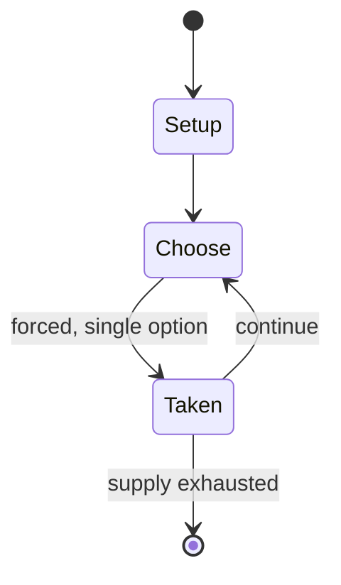

# MetaZoo

*trading card game*

`metazoo` &nbsp; state: **DEEPENED** &nbsp; method: **heuristic**

## Found layer (recorded, not trusted)

| field | value |
| --- | --- |
| wikidata | Q123808040 |
| wikipedia | MetaZoo |
| genres (source) | -- |
| instance of (source) | collectible card game |
| country of origin | -- |

## Declared layer (orders bench work)

| field | value |
| --- | --- |
| year created | -- |
| epoch | -- |
| region | -- |
| media | CARD, COLLECTIBLE |
| players | -- |
| age band | -- |
| exogenous process | -- |
| loss shape | -- |
| live axes | TRADE |
| horizon | -- |
| scoring shape | LINEAR_ACCUMULATION |
| information | -- |
| interaction | COMPETITIVE |
| turn structure | -- |
| tractability | SAMPLING_ONLY |
| randomness | -- |
| luck factor | 0.35 |
| rules complexity | 2.08 |
| strategic depth | 2.0 |
| novelty | 0.537 |
| solved status | -- |
| strategies | -- |
| algorithms | -- |

## Object model

```
Episode
  players      : ?
  turn_structure: ?
  horizon       : ?
  scoring       : LINEAR_ACCUMULATION

Deck           -- ordered multiset, drawn without replacement
Hand           -- private multiset held by one player
DiscardPile    -- public accumulation of spent cards
Offer          -- proposed exchange between two agents
```

## State transition diagram



## Research item -- turn trace

```
# MetaZoo -- simulated turn events
# generated from the DECLARED vector, not from a rulebook.
# structure: exo=None loss=None horizon=None scoring=LINEAR_ACCUMULATION axes=TRADE

t=0    SETUP        players=2  pot=0  capacity=5
t=1    FORCED       p1 single legal option taken (pot_gain=+0.8)
t=2    ENDTURN      turn passes to p2
t=3    FORCED       p2 single legal option taken (pot_gain=+1.6)
t=4    FORCED       p2 single legal option taken (pot_gain=+1.3)
t=5    FORCED       p2 single legal option taken (pot_gain=+1.8)
t=6    FORCED       p2 single legal option taken (pot_gain=+0.5)
t=7    ENDTURN      turn passes to p1
t=8    FORCED       p1 single legal option taken (pot_gain=+1.6)
t=9    TRADE        p1 offers 2:1 exchange to p2
t=10   FORCED       p1 single legal option taken (pot_gain=+1.6)
t=11   ENDTURN      turn passes to p2
t=12   FORCED       p2 single legal option taken (pot_gain=+1.8)
t=13   TRADE        p2 offers 2:1 exchange to p1
t=14   FORCED       p2 single legal option taken (pot_gain=+0.6)
t=15   FORCED       p2 single legal option taken (pot_gain=+0.8)
t=16   FORCED       p2 single legal option taken (pot_gain=+1.1)
t=17   TRADE        p2 offers 2:1 exchange to p1
t=18   FORCED       p2 single legal option taken (pot_gain=+1.9)
t=19   ENDTURN      turn passes to p1
t=20   FORCED       p1 single legal option taken (pot_gain=+1.1)
t=21   FORCED       p1 single legal option taken (pot_gain=+1.9)
t=22   FORCED       p1 single legal option taken (pot_gain=+2.0)
t=23   TRADE        p1 offers 2:1 exchange to p2
t=24   FORCED       p1 single legal option taken (pot_gain=+1.6)
t=25   FORCED       p1 single legal option taken (pot_gain=+1.5)
t=26   FORCED       p1 single legal option taken (pot_gain=+0.7)
t=27   ENDTURN      turn passes to p2

terminal: VARIABLE
```

## Source extract

MetaZoo is a tabletop collectible card game currently owned by MetaTwo Enterprises and developed
by GameQbator Labs, following the 2024 bankruptcy of its original publisher, MetaZoo Games LLC.
The game is based on cryptozoology, folklore, and the paranormal, centering around creatures
known as "Beasties", which are inspired by cryptids and other figures from mythology such as
Bigfoot, Mothman, and other fearsome critters. Following its $2 million acquisition, MetaZoo was
successfully relaunched in 2025 by a veteran development team featuring Magic: The Gathering
creator Richard Garfield and former Pokémon executives. The card game also previously featured a
Hello Kitty-themed crossover with Sanrio.   == History ==   === Kickstarter and Original Run
(2020–2024) === After a successful crowdfunding campaign during the COVID-19 pandemic that
raised $18,249 through Kickstarter, MetaZoo was first officially launched with the release of
MetaZoo: Cryptid Nation, the first full set of the game. In 2021, DJ and music producer Steve
Aoki became a full equity partner and a designated cofounder, while Game Kastle and Hobby Games
Distribution, Inc. founder Shaw Mead was named COO of the company.

<sub>Wikipedia, CC BY-SA. Retained as evidence for the structural
classification above. Every rule inferred from it is HYPOTHESIZED
until audited against a rulebook.</sub>
