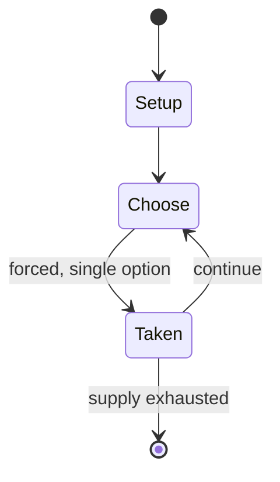

# Meurimueng-rimueng-do

`meurimueng_rimueng_do` &nbsp; state: **DEEPENED** &nbsp; method: **heuristic**

## Found layer (recorded, not trusted)

| field | value |
| --- | --- |
| wikidata | Q13358015 |
| wikipedia | Meurimueng-rimueng-do |
| genres (source) | -- |
| instance of (source) | abstract strategy game |
| country of origin | -- |

## Declared layer (orders bench work)

| field | value |
| --- | --- |
| year created | -- |
| epoch | -- |
| region | -- |
| media | ABSTRACT, BOARD |
| players | -- |
| age band | -- |
| exogenous process | -- |
| loss shape | -- |
| live axes | SPATIAL |
| horizon | -- |
| scoring shape | NONLINEAR |
| information | -- |
| interaction | COMPETITIVE |
| turn structure | -- |
| tractability | SAMPLING_ONLY |
| randomness | -- |
| luck factor | 0.35 |
| rules complexity | 2.14 |
| strategic depth | 2.0 |
| novelty | 0.5514 |
| solved status | -- |
| strategies | -- |
| algorithms | -- |

## Object model

```
Episode
  players      : ?
  turn_structure: ?
  horizon       : ?
  scoring       : NONLINEAR

Board          -- spatial substrate; cells carry position and occupancy
Piece          -- movable token owned by a player
Placement      -- position subject to geometric legality
```

## State transition diagram



## Research item -- turn trace

```
# Meurimueng-rimueng-do -- simulated turn events
# generated from the DECLARED vector, not from a rulebook.
# structure: exo=None loss=None horizon=None scoring=NONLINEAR axes=SPATIAL

t=0    SETUP        players=2  pot=0  capacity=6
t=1    FORCED       p1 single legal option taken (pot_gain=+1.8)
t=2    FORCED       p1 single legal option taken (pot_gain=+0.6)
t=3    SPATIAL      p1 places at (6,5); adjacency legal
t=4    FORCED       p1 single legal option taken (pot_gain=+1.9)
t=5    FORCED       p1 single legal option taken (pot_gain=+1.0)
t=6    FORCED       p1 single legal option taken (pot_gain=+0.9)
t=7    SPATIAL      p1 places at (7,7); adjacency legal
t=8    ENDTURN      turn passes to p2
t=9    FORCED       p2 single legal option taken (pot_gain=+1.6)
t=10   FORCED       p2 single legal option taken (pot_gain=+1.2)
t=11   FORCED       p2 single legal option taken (pot_gain=+1.7)
t=12   SPATIAL      p2 places at (2,7); adjacency legal
t=13   FORCED       p2 single legal option taken (pot_gain=+1.3)
t=14   SPATIAL      p2 places at (0,3); adjacency legal
t=15   ENDTURN      turn passes to p1
t=16   FORCED       p1 single legal option taken (pot_gain=+2.0)
t=17   SPATIAL      p1 places at (4,1); adjacency legal
t=18   ENDTURN      turn passes to p2
t=19   FORCED       p2 single legal option taken (pot_gain=+1.6)
t=20   ENDTURN      turn passes to p1
t=21   FORCED       p1 single legal option taken (pot_gain=+1.5)
t=22   FORCED       p1 single legal option taken (pot_gain=+0.5)
t=23   FORCED       p1 single legal option taken (pot_gain=+0.9)
t=24   FORCED       p1 single legal option taken (pot_gain=+1.8)
t=25   SPATIAL      p1 places at (7,1); adjacency legal
t=26   ENDTURN      turn passes to p2

terminal: VARIABLE
```

## Source extract

Meurimueng-rimueng-do is a two-player abstract strategy board game from Sumatra, Indonesia.  It
is played by the Acehnese.  The game was published in the book entitled "The Achehnese" by
Hurgronje, O'Sullivan, and Wilkinson in 1906 and described on page 204.  The game is a hunt game
similar to Pulijudam and Demala diviyan keliya.  They use the same triangular board.  Therefore,
meurimueng-rimueng-do is specifically a leopard hunt game (or leopard game).  In this game, 5
leopards are going up against 15 sheep.  The sheep attempt to surround and trap the 5 leopards
while the leopards attempt to avoid this fate by capturing enough of the sheep. Meurimueng-
rimueng-do should not be confused with another Sumatran game with a very similar name,
meurimueng-rimueng peuet ploh as they are unrelated.  The former is a leopard game, whereas the
latter is related to Alquerque.  Both games, however, are played by the Acehnese. While
Meurimueng-rimueng-do is usually described as a leopard game, the leopards are sometimes known
as tigers instead.   == Setup == The board is a triangular pattern with a rectangular cross-
section forming 23 intersection points.  It is the same board used for the games

<sub>Wikipedia, CC BY-SA. Retained as evidence for the structural
classification above. Every rule inferred from it is HYPOTHESIZED
until audited against a rulebook.</sub>
