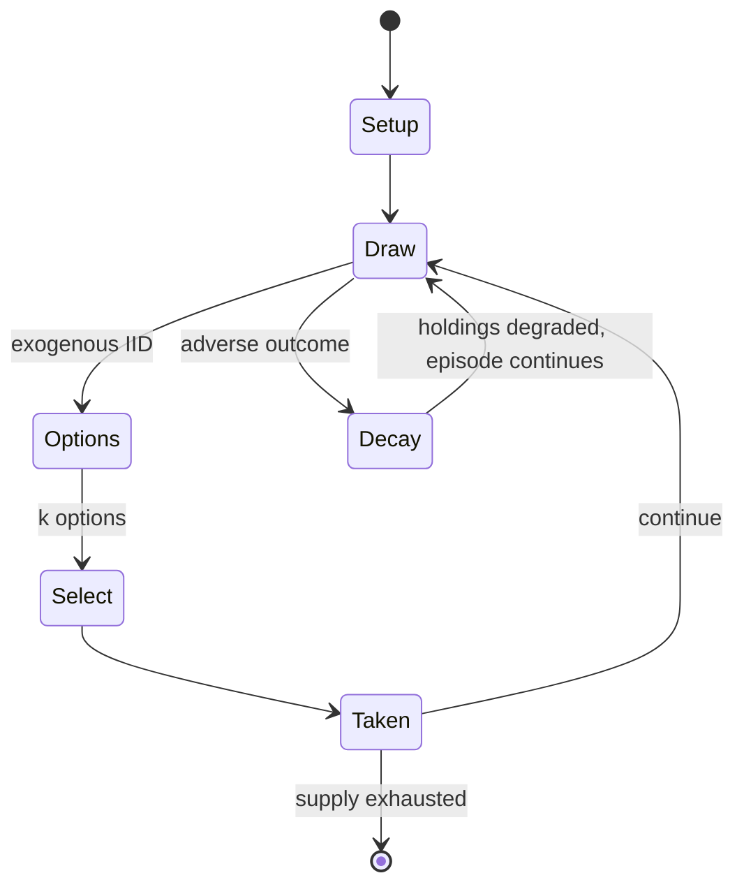

# Mia

*dice game*

`mia` &nbsp; state: **DEEPENED** &nbsp; method: **heuristic**

## Found layer (recorded, not trusted)

| field | value |
| --- | --- |
| wikidata | Q1640788 |
| wikipedia | Mia (game) |
| genres (source) | -- |
| instance of (source) | dice game |
| country of origin | -- |

## Declared layer (orders bench work)

| field | value |
| --- | --- |
| year created | -- |
| epoch | -- |
| region | -- |
| media | DICE |
| players | -- |
| age band | -- |
| exogenous process | IID |
| loss shape | PARTIAL_DECAY |
| live axes | BLUFF, SELECT |
| horizon | -- |
| scoring shape | -- |
| information | IMPERFECT |
| interaction | -- |
| turn structure | STRICT_TURN |
| tractability | EXACT_WITH_CUT |
| randomness | DICE |
| luck factor | 0.58 |
| rules complexity | 2.77 |
| strategic depth | 2.37 |
| novelty | 0.7374 |
| solved status | -- |
| strategies | bluffing, probability_estimation |
| algorithms | -- |

## Object model

```
Episode
  players      : ?
  turn_structure: STRICT_TURN
  horizon       : ?
  scoring       : ?

DicePool       -- n dice, each an iid categorical draw
Roll           -- realised outcome of a pool
Belief         -- what an observer is induced to think is true
OptionSet      -- the choices available after an exogenous draw
```

## State transition diagram



## Research item -- turn trace

```
# Mia -- simulated turn events
# generated from the DECLARED vector, not from a rulebook.
# structure: exo=IID loss=PARTIAL_DECAY horizon=None scoring=None axes=BLUFF,SELECT

t=0    SETUP        players=2  pot=0  capacity=3
t=1    DRAW         p1 roll from d6 pool -> outcome #5  (p=0.122)
t=2    SELECT       p1 1 options; take #1  (pot_gain=+1.3, capacity=-2)
t=3    BLUFF        p1 represents a holding it does not have
t=4    DRAW         p1 roll from d6 pool -> outcome #1  (p=0.250)
t=5    SELECT       p1 2 options; take #2  (pot_gain=+0.9, capacity=-0)
t=6    BLUFF        p1 represents a holding it does not have
t=7    ENDTURN      turn passes to p2
t=8    DRAW         p2 roll from d6 pool -> outcome #4  (p=0.170)
t=9    SELECT       p2 2 options; take #2  (pot_gain=+1.2, capacity=-1)
t=10   DRAW         p2 roll from d6 pool -> outcome #2  (p=0.053)
t=11   SELECT       p2 2 options; take #2  (pot_gain=+1.9, capacity=-0)
t=12   DRAW         p2 roll from d6 pool -> outcome #3  (p=0.035)
t=13   SELECT       p2 4 options; take #1  (pot_gain=+1.0, capacity=-0)
t=14   BLUFF        p2 represents a holding it does not have
t=15   DRAW         p2 roll from d6 pool -> outcome #1  (p=0.274)
t=16   SELECT       p2 4 options; take #1  (pot_gain=+2.5, capacity=-0)
t=17   BLUFF        p2 represents a holding it does not have
t=18   DRAW         p2 roll from d6 pool -> outcome #3  (p=0.025)
t=19   SELECT       p2 4 options; take #3  (pot_gain=+2.2, capacity=-1)
t=20   BLUFF        p2 represents a holding it does not have
t=21   DRAW         p2 roll from d6 pool -> outcome #6  (p=0.050)
t=22   SELECT       p2 2 options; take #1  (pot_gain=+1.6, capacity=-2)
t=23   BLUFF        p2 represents a holding it does not have
t=24   DRAW         p2 roll from d6 pool -> outcome #3  (p=0.290)
t=25   SELECT       p2 3 options; take #1  (pot_gain=+1.0, capacity=-0)
t=26   DRAW         p2 roll from d6 pool -> outcome #4  (p=0.075)
t=27   SELECT       p2 1 options; take #1  (pot_gain=+0.8, capacity=-0)

terminal: VARIABLE
```

## Conditions

| kind | threshold | effect | trigger |
| --- | --- | --- | --- |
| PENALTY | 2 lives | -- | The penalty whenever Mia is involved may be doubled so that one loses two lives instead of one. |
| TERMINATE | -- | -- | This process continues with the next player until the round ends. |
| TERMINATE | -- | -- | Note that each player must always announce a value greater than the previous value announced, unless they are passed a Mia in which case the round ends with the next player. |
| LOSE | -- | -- | The first player to lose all of their lives loses the game. |
| BOUNDARY | -- | -- | The requirement that one must announce more than the previous player can be relaxed so that one just has to announce at least the same, but then, the option of passing on the dice without looking would be banned. |
| PENALTY | -- | -- | Typically Mia is accompanied by a 'stiff' penalty also, for example, a whole drink. |

## Source extract

Mia is a simple dice game with a strong emphasis on bluffing and detecting bluff related to
Liar's dice.   == Equipment == Two dice and either a flat bottomed container with a lid or a
dice cup are needed.  This game is played by three or more players.   == Play == All players
start with six lives. Usually each player use a separate die to keep track of their lives,
counting down from 6 to 1 as they lose lives. The players roll a single die to determine who
goes first. To start a round, the first player (Player A) rolls the dice and checks their throw
while keeping the value concealed from the other players in or under the container. That player
must end their turn by announcing a value according to one of three choices:  Lie and announce a
greater value than what was rolled. Tell the truth and announce the actual value of what has
been rolled. Lie and announce a lesser value than what was rolled. There is no required minimum
value for the announcement following the first roll of the round. The action then passes to the
next player (Player B), usually in a clockwise fashion (i.e., the player to the left), who now
must choose one of two options:   Player B believes the passer and ro

<sub>Wikipedia, CC BY-SA. Retained as evidence for the structural
classification above. Every rule inferred from it is HYPOTHESIZED
until audited against a rulebook.</sub>
