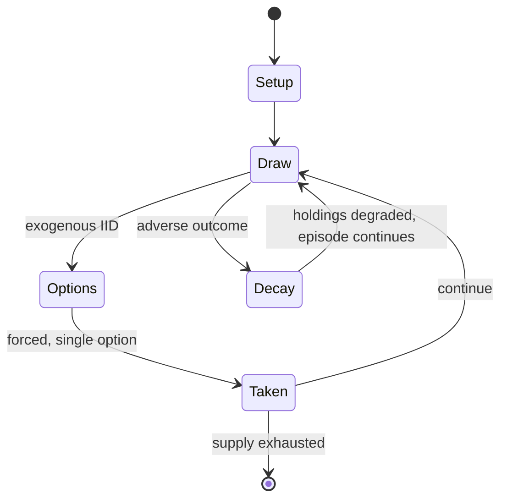

# MicroMacro: Crime City

*2020 board game*

`micromacro_crime_city` &nbsp; state: **DEEPENED** &nbsp; method: **heuristic**

## Found layer (recorded, not trusted)

| field | value |
| --- | --- |
| wikidata | Q106955476 |
| wikipedia | MicroMacro: Crime City |
| genres (source) | -- |
| instance of (source) | cooperative board game |
| country of origin | Germany |

## Declared layer (orders bench work)

| field | value |
| --- | --- |
| year created | 2020 |
| epoch | CONTEMPORARY |
| region | EUROPE_WEST |
| media | BOARD |
| players | 1-4 |
| age band | -- |
| exogenous process | IID |
| loss shape | PARTIAL_DECAY |
| live axes | COMMIT_BLIND |
| horizon | -- |
| scoring shape | SET_COLLECTION_CONVEX |
| information | IMPERFECT |
| interaction | COOPERATIVE |
| turn structure | -- |
| tractability | SAMPLING_ONLY |
| randomness | HIDDEN_INFO |
| luck factor | 0.35 |
| rules complexity | 1.72 |
| strategic depth | 2.25 |
| novelty | 0.6973 |
| solved status | -- |
| strategies | deduction |
| algorithms | -- |

## Object model

```
Episode
  players      : 1-4
  turn_structure: ?
  horizon       : ?
  scoring       : SET_COLLECTION_CONVEX

Board          -- spatial substrate; cells carry position and occupancy
Piece          -- movable token owned by a player
SealedChoice   -- irrevocable choice made without observation
```

## State transition diagram



## Research item -- turn trace

```
# MicroMacro: Crime City -- simulated turn events
# generated from the DECLARED vector, not from a rulebook.
# structure: exo=IID loss=PARTIAL_DECAY horizon=None scoring=SET_COLLECTION_CONVEX axes=COMMIT_BLIND

t=0    SETUP        players=1  pot=0  capacity=7
t=1    DRAW         p1 roll from d6 pool -> outcome #4  (p=0.242)
t=2    FORCED       p1 single legal option taken (pot_gain=+1.8)
t=3    ENDTURN      turn passes to p1
t=4    DRAW         p1 roll from d6 pool -> outcome #4  (p=0.070)
t=5    FORCED       p1 single legal option taken (pot_gain=+1.5)
t=6    DRAW         p1 roll from d6 pool -> outcome #2  (p=0.232)
t=7    FORCED       p1 single legal option taken (pot_gain=+1.8)
t=8    ENDTURN      turn passes to p1
t=9    DRAW         p1 roll from d6 pool -> outcome #2  (p=0.192)
t=10   FORCED       p1 single legal option taken (pot_gain=+0.7)
t=11   ENDTURN      turn passes to p1
t=12   DRAW         p1 roll from d6 pool -> outcome #3  (p=0.179)
t=13   FORCED       p1 single legal option taken (pot_gain=+0.9)
t=14   DRAW         p1 roll from d6 pool -> outcome #2  (p=0.281)
t=15   FORCED       p1 single legal option taken (pot_gain=+1.0)
t=16   DRAW         p1 roll from d6 pool -> outcome #4  (p=0.030)
t=17   FORCED       p1 single legal option taken (pot_gain=+1.6)
t=18   DRAW         p1 roll from d6 pool -> outcome #4  (p=0.015)
t=19   FORCED       p1 single legal option taken (pot_gain=+1.7)
t=20   ENDTURN      turn passes to p1
t=21   DRAW         p1 roll from d6 pool -> outcome #1  (p=0.241)
t=22   FORCED       p1 single legal option taken (pot_gain=+0.6)
t=23   ENDTURN      turn passes to p1
t=24   DRAW         p1 roll from d6 pool -> outcome #5  (p=0.023)
t=25   FORCED       p1 single legal option taken (pot_gain=+0.9)
t=26   DRAW         p1 roll from d6 pool -> outcome #6  (p=0.201)
t=27   FORCED       p1 single legal option taken (pot_gain=+1.6)

terminal: VARIABLE
```

## Source extract

MicroMacro: Crime City is a cooperative tabletop crime-solving hidden object game designed by
Johannes Sich and published in 2020 by Edition Spielwiese. The game received positive reviews
and won the Spiel des Jahres in 2021. Three sequels released after the game's success, like
MicroMacro: Crime City – Full House in August 2021.   == Gameplay == The team of players unfolds
a poster-sized map about 45 by 30 inches (114 cm × 76 cm) with an illustrated urban area
depicting characters performing ordinary daily tasks such as eating, working, or attending
events. However, other characters engage in criminal activities, ranging from petty theft to
murder, and it is the goal of the players acting as detectives or private investigators to solve
those crimes. The victim of the crime is depicted, but the crime is not. Each crime is
associated with a case that consists of a deck of 5–12 cards with clues, the first of which
describes the scene of the crime and victim. Each of the 16 cases have a difficulty rating
ranging from one to five stars, and all clues for a case are labeled with a unique icon
representing that case. These clues lead to different parts of the map, tracking the victim and

<sub>Wikipedia, CC BY-SA. Retained as evidence for the structural
classification above. Every rule inferred from it is HYPOTHESIZED
until audited against a rulebook.</sub>
