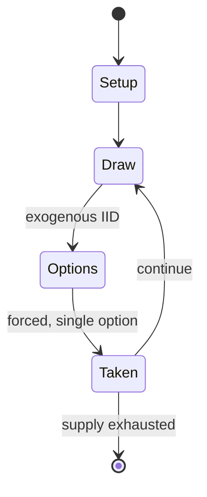

# Midnight

*dice game*

`midnight` &nbsp; state: **DEEPENED** &nbsp; method: **heuristic**

## Found layer (recorded, not trusted)

| field | value |
| --- | --- |
| wikidata | Q16915646 |
| wikipedia | Midnight (game) |
| genres (source) | -- |
| instance of (source) | dice game |
| country of origin | -- |

## Declared layer (orders bench work)

| field | value |
| --- | --- |
| year created | -- |
| epoch | -- |
| region | -- |
| media | DICE |
| players | -- |
| age band | -- |
| exogenous process | IID |
| loss shape | -- |
| live axes | - |
| horizon | -- |
| scoring shape | -- |
| information | -- |
| interaction | SOLITAIRE |
| turn structure | -- |
| tractability | EXACT_WITH_CUT |
| randomness | DICE |
| luck factor | 0.58 |
| rules complexity | 1.88 |
| strategic depth | 2.12 |
| novelty | 0.6401 |
| solved status | -- |
| strategies | probability_estimation |
| algorithms | -- |

## Object model

```
Episode
  players      : ?
  turn_structure: ?
  horizon       : ?
  scoring       : ?

DicePool       -- n dice, each an iid categorical draw
Roll           -- realised outcome of a pool
```

## State transition diagram



## Research item -- turn trace

```
# Midnight -- simulated turn events
# generated from the DECLARED vector, not from a rulebook.
# structure: exo=IID loss=None horizon=None scoring=None axes=-

t=0    SETUP        players=2  pot=0  capacity=6
t=1    DRAW         p1 roll from d6 pool -> outcome #1  (p=0.142)
t=2    FORCED       p1 single legal option taken (pot_gain=+1.4)
t=3    DRAW         p1 roll from d6 pool -> outcome #6  (p=0.175)
t=4    FORCED       p1 single legal option taken (pot_gain=+1.8)
t=5    DRAW         p1 roll from d6 pool -> outcome #2  (p=0.041)
t=6    FORCED       p1 single legal option taken (pot_gain=+0.7)
t=7    ENDTURN      turn passes to p2
t=8    DRAW         p2 roll from d6 pool -> outcome #6  (p=0.123)
t=9    FORCED       p2 single legal option taken (pot_gain=+1.4)
t=10   DRAW         p2 roll from d6 pool -> outcome #5  (p=0.076)
t=11   FORCED       p2 single legal option taken (pot_gain=+1.6)
t=12   DRAW         p2 roll from d6 pool -> outcome #4  (p=0.291)
t=13   FORCED       p2 single legal option taken (pot_gain=+0.7)
t=14   DRAW         p2 roll from d6 pool -> outcome #1  (p=0.146)
t=15   FORCED       p2 single legal option taken (pot_gain=+0.9)
t=16   ENDTURN      turn passes to p1
t=17   DRAW         p1 roll from d6 pool -> outcome #2  (p=0.275)
t=18   FORCED       p1 single legal option taken (pot_gain=+0.7)
t=19   DRAW         p1 roll from d6 pool -> outcome #2  (p=0.016)
t=20   FORCED       p1 single legal option taken (pot_gain=+2.0)
t=21   DRAW         p1 roll from d6 pool -> outcome #2  (p=0.090)
t=22   FORCED       p1 single legal option taken (pot_gain=+1.4)
t=23   DRAW         p1 roll from d6 pool -> outcome #4  (p=0.133)
t=24   FORCED       p1 single legal option taken (pot_gain=+1.2)
t=25   DRAW         p1 roll from d6 pool -> outcome #1  (p=0.005)
t=26   FORCED       p1 single legal option taken (pot_gain=+0.9)

terminal: VARIABLE
```

## Conditions

| kind | threshold | effect | trigger |
| --- | --- | --- | --- |
| BOUNDARY | -- | -- | All six dice are rolled; the player must "keep" at least one. |
| BOUNDARY | -- | -- | The maximum score is 24 (6+6+6+6) The procedure is repeated for the remaining players. |
| BOUNDARY | -- | -- | Since 21 is the maximum number of throws possible, this strategy must maximise the chance of scoring. |
| BOUNDARY | -- | -- | gives the chance of scoring as approximately 95.7%, the maximum possible. |
| BOUNDARY | -- | -- | The formula can be used to calculate the maximum probability of scoring when the player has less than six dice. |

## Source extract

Midnight (or 1-4-24) is a dice game played with six dice.   == Rules == One player rolls at a
time. All six dice are rolled; the player must "keep" at least one. Any that the player doesn't
keep are rerolled. This procedure is then repeated until there are no more dice to roll. Once
kept, dice cannot be rerolled. Players must have kept a one and a four, or they do not score. If
they have a one and four, the other dice are totaled to give the player's score. The maximum
score is 24 (6+6+6+6) The procedure is repeated for the remaining players. The player with the
highest four-dice total wins. If two or more players tie for the highest total, any money bet is
added to the next game.   == Example game == Dice shown in blue are those rolled that turn.  The
player scores 20 (6+3+5+6).   == Variant game == A variant version, called 2-4-24, in which the
player must keep a two and a four to score, rather than a one and a four, is sometimes played.
== Strategy ==   === Maximum probability of scoring === It is possible to calculate the
probability of scoring if that is the player's sole objective. This would, for instance, be the
case if the player was the last to throw and the other playe

<sub>Wikipedia, CC BY-SA. Retained as evidence for the structural
classification above. Every rule inferred from it is HYPOTHESIZED
until audited against a rulebook.</sub>
