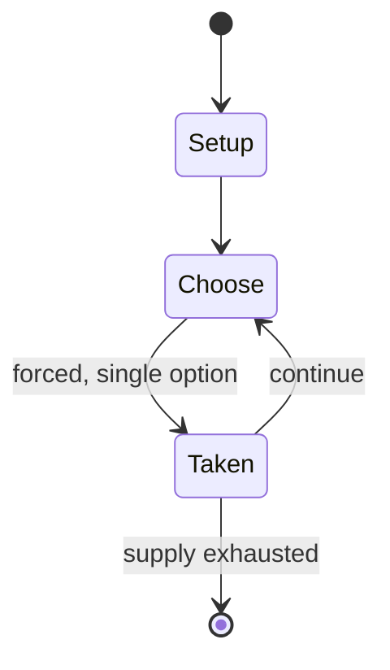

# Midway (1964 game)

`midway_1964_game` &nbsp; state: **DEEPENED** &nbsp; method: **heuristic**

## Found layer (recorded, not trusted)

| field | value |
| --- | --- |
| wikidata | Q17010144 |
| wikipedia | Midway (1964 game) |
| genres (source) | -- |
| instance of (source) | -- |
| country of origin | -- |

## Declared layer (orders bench work)

| field | value |
| --- | --- |
| year created | 1964 |
| epoch | MODERN |
| region | -- |
| media | WARGAME |
| players | -- |
| age band | -- |
| exogenous process | -- |
| loss shape | -- |
| live axes | SPATIAL |
| horizon | -- |
| scoring shape | -- |
| information | -- |
| interaction | COMPETITIVE |
| turn structure | PHASE_STRUCTURED |
| tractability | SAMPLING_ONLY |
| randomness | -- |
| luck factor | -- |
| rules complexity | 3.97 |
| strategic depth | 2.0 |
| novelty | 0.5217 |
| solved status | -- |
| strategies | -- |
| algorithms | -- |

## Object model

```
Episode
  players      : ?
  turn_structure: PHASE_STRUCTURED
  horizon       : ?
  scoring       : ?

Placement      -- position subject to geometric legality
```

## State transition diagram



## Research item -- turn trace

```
# Midway (1964 game) -- simulated turn events
# generated from the DECLARED vector, not from a rulebook.
# structure: exo=None loss=None horizon=None scoring=None axes=SPATIAL

t=0    SETUP        players=2  pot=0  capacity=8
t=1    FORCED       p1 single legal option taken (pot_gain=+0.6)
t=2    SPATIAL      p1 places at (7,5); adjacency legal
t=3    FORCED       p1 single legal option taken (pot_gain=+1.8)
t=4    SPATIAL      p1 places at (2,5); adjacency legal
t=5    ENDTURN      turn passes to p2
t=6    FORCED       p2 single legal option taken (pot_gain=+1.7)
t=7    SPATIAL      p2 places at (3,4); adjacency legal
t=8    FORCED       p2 single legal option taken (pot_gain=+1.0)
t=9    ENDTURN      turn passes to p1
t=10   FORCED       p1 single legal option taken (pot_gain=+0.5)
t=11   SPATIAL      p1 places at (3,4); adjacency legal
t=12   FORCED       p1 single legal option taken (pot_gain=+0.6)
t=13   FORCED       p1 single legal option taken (pot_gain=+0.8)
t=14   SPATIAL      p1 places at (1,1); adjacency legal
t=15   FORCED       p1 single legal option taken (pot_gain=+0.9)
t=16   SPATIAL      p1 places at (7,4); adjacency legal
t=17   FORCED       p1 single legal option taken (pot_gain=+0.5)
t=18   FORCED       p1 single legal option taken (pot_gain=+0.8)
t=19   FORCED       p1 single legal option taken (pot_gain=+0.5)
t=20   ENDTURN      turn passes to p2
t=21   FORCED       p2 single legal option taken (pot_gain=+1.5)
t=22   FORCED       p2 single legal option taken (pot_gain=+0.7)
t=23   SPATIAL      p2 places at (4,2); adjacency legal
t=24   FORCED       p2 single legal option taken (pot_gain=+1.1)
t=25   FORCED       p2 single legal option taken (pot_gain=+1.0)
t=26   FORCED       p2 single legal option taken (pot_gain=+1.3)

terminal: VARIABLE
```

## Conditions

| kind | threshold | effect | trigger |
| --- | --- | --- | --- |
| WIN | -- | -- | The player with the most victory points is the winner. |
| PENALTY | -- | -- | They used as a technical consultant C. |

## Source extract

Midway is a board wargame published by Avalon Hill in 1964 that simulates the Battle of Midway
during World War II.   == Background == Six months after the attack on Pearl Harbor, Japan
looked to extend its defensive perimeter by attacking and occupying the U.S. base on Midway
Atoll. To do this, the Japanese navy sent a strong fleet of four aircraft carriers, two
battleships and a variety of smaller craft, hoping to lure the American fleet into a trap.
Unbeknownst to the Japanese, cryptographers had broken their fleet code and knew about the
attack. Both forces sent aircraft to scout for the enemy fleet's position, but it was American
airplanes that found the Japanese fleet first. In a series of devastating torpedo and dive bomb
attacks, American airplanes sunk all four aircraft carriers and a heavy cruiser, suffering a
loss of one aircraft carrier themselves. It was a pivotal battle in the Pacific war, causing
losses Japan would not be able to replace, and giving momentum and confidence to the Americans.
== Description == Midway is a board wargame for 2 players (or more than 2 players divided into
teams) that simulates the battle at the individual ship and squadron level. Initia

<sub>Wikipedia, CC BY-SA. Retained as evidence for the structural
classification above. Every rule inferred from it is HYPOTHESIZED
until audited against a rulebook.</sub>
