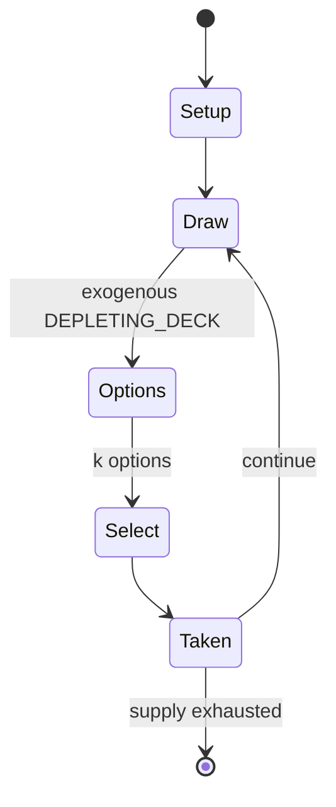

# Mille Bornes

`mille_bornes` &nbsp; state: **DEEPENED** &nbsp; method: **heuristic**

## Found layer (recorded, not trusted)

| field | value |
| --- | --- |
| wikidata | Q17263 |
| wikipedia | Mille Bornes |
| genres (source) | -- |
| instance of (source) | -- |
| country of origin | -- |

## Declared layer (orders bench work)

| field | value |
| --- | --- |
| year created | -- |
| epoch | -- |
| region | -- |
| media | CARD |
| players | -- |
| age band | -- |
| exogenous process | DEPLETING_DECK |
| loss shape | -- |
| live axes | DISCARD, SELECT |
| horizon | -- |
| scoring shape | RACE_POSITION |
| information | -- |
| interaction | COMPETITIVE |
| turn structure | -- |
| tractability | EXACT_WITH_CUT |
| randomness | DECK_SHUFFLE |
| luck factor | 0.48 |
| rules complexity | 2.53 |
| strategic depth | 2.25 |
| novelty | 0.738 |
| solved status | -- |
| strategies | tableau_building |
| algorithms | -- |

## Object model

```
Episode
  players      : ?
  turn_structure: ?
  horizon       : ?
  scoring       : RACE_POSITION

Deck           -- ordered multiset, drawn without replacement
Hand           -- private multiset held by one player
DiscardPile    -- public accumulation of spent cards
DiscardChoice  -- what is given up to satisfy a limit
OptionSet      -- the choices available after an exogenous draw
```

## State transition diagram



## Research item -- turn trace

```
# Mille Bornes -- simulated turn events
# generated from the DECLARED vector, not from a rulebook.
# structure: exo=DEPLETING_DECK loss=None horizon=None scoring=RACE_POSITION axes=DISCARD,SELECT

t=0    SETUP        players=2  pot=0  capacity=3
t=1    DRAW         p1 draw from deck -> outcome #2  (p=0.242)
t=2    SELECT       p1 1 options; take #1  (pot_gain=+1.5, capacity=-2)
t=3    DISCARD      p1 discards to hand limit
t=4    DRAW         p1 draw from deck -> outcome #5  (p=0.289)
t=5    SELECT       p1 2 options; take #2  (pot_gain=+1.8, capacity=-1)
t=6    DRAW         p1 draw from deck -> outcome #3  (p=0.263)
t=7    SELECT       p1 2 options; take #2  (pot_gain=+1.6, capacity=-2)
t=8    DRAW         p1 draw from deck -> outcome #6  (p=0.159)
t=9    SELECT       p1 3 options; take #1  (pot_gain=+2.9, capacity=-2)
t=10   DISCARD      p1 discards to hand limit
t=11   DRAW         p1 draw from deck -> outcome #6  (p=0.064)
t=12   SELECT       p1 2 options; take #2  (pot_gain=+3.4, capacity=-2)
t=13   DRAW         p1 draw from deck -> outcome #4  (p=0.199)
t=14   SELECT       p1 1 options; take #1  (pot_gain=+2.6, capacity=-1)
t=15   DISCARD      p1 discards to hand limit
t=16   DRAW         p1 draw from deck -> outcome #6  (p=0.239)
t=17   SELECT       p1 3 options; take #2  (pot_gain=+2.2, capacity=-1)
t=18   DISCARD      p1 discards to hand limit
t=19   ENDTURN      turn passes to p2
t=20   DRAW         p2 draw from deck -> outcome #2  (p=0.209)
t=21   SELECT       p2 2 options; take #2  (pot_gain=+0.8, capacity=-1)
t=22   ENDTURN      turn passes to p1
t=23   DRAW         p1 draw from deck -> outcome #4  (p=0.221)
t=24   SELECT       p1 3 options; take #2  (pot_gain=+3.4, capacity=-1)
t=25   DISCARD      p1 discards to hand limit
t=26   DRAW         p1 draw from deck -> outcome #4  (p=0.073)
t=27   SELECT       p1 2 options; take #2  (pot_gain=+0.8, capacity=-0)

terminal: VARIABLE
```

## Conditions

| kind | threshold | effect | trigger |
| --- | --- | --- | --- |
| BOUNDARY | 600 points | -- | In a 2-player game, the maximum score that can be made in one hand is 4,600 points.In a standard 4-player/2-team game there is no extension, so the maximum score is 4,400. |
| WIN | -- | -- | For two- or three-player games the goal is shortened to 700, with an option for the first player to complete that distance to declare an extension to 1000 miles. |
| WIN | -- | -- | In the latter case, the first player to reach 700 km may either claim victory and end the hand immediately, or call for an Extension that increases the target to 1000 km. |
| WIN | -- | -- | If both sides go over 5,000 during the same hand, the higher point total wins the game. |
| TERMINATE | -- | -- | Once every player runs out of cards in their hand with a depleted draw pile, play ends. |
| BOUNDARY | -- | -- | No more than two 200 km distance cards may be played per player in a single hand. |
| BOUNDARY | -- | -- | The total distance cannot exceed the target value needed to win the hand. |
| BOUNDARY | -- | -- | No more than two 200 km cards may be played by any player or team in a single hand. |

## Source extract

Mille Bornes (; French for a thousand milestones, referring to the distance markers on many
French roads) is a French designer card game. Mille Bornes is listed in the GAMES Magazine Hall
of Fame.   == History ==  The game was created in 1954 by Edmond Dujardin as 1000 Bornes. It is
almost identical to the earlier American automotive card game Touring, designed by William
Janson Roche in 1906. One additional feature is the coup-fourré ("counter-thrust"), whereby
bonus points are earned by holding back a safety card (such as the puncture-proof tire) until an
opponent plays the corresponding hazard card (in this case, the flat tire). The game's name is
derived from the approximate length of the RN 7 (a national route) connecting Paris with the
Italian border. Dujardin moved to Arcachon southwest of Bordeaux on the Atlantic coast of France
in 1947, where he and his family began producing the game in the basement of his house at No.
63, Boulevard de la Plage. The box for the original 1954 edition carries the strapline la
Canasta de la Route ("Canasta of the Road"), highlighting its similarity to Canasta. The cards
are illustrated and hand-lettered by Joseph Le Callennec, a graphic desi

<sub>Wikipedia, CC BY-SA. Retained as evidence for the structural
classification above. Every rule inferred from it is HYPOTHESIZED
until audited against a rulebook.</sub>
