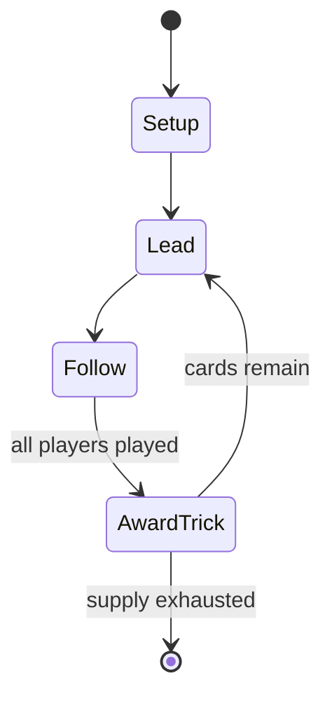

# minchiate

*early 16th century card game, originating in Florence, Italy*

`minchiate` &nbsp; state: **DEEPENED** &nbsp; method: **heuristic**

## Found layer (recorded, not trusted)

| field | value |
| --- | --- |
| wikidata | Q1936271 |
| wikipedia | Minchiate |
| genres (source) | -- |
| instance of (source) | playing card, tarot card game |
| country of origin | -- |

## Declared layer (orders bench work)

| field | value |
| --- | --- |
| year created | 1676 |
| epoch | EARLY_MODERN |
| region | -- |
| media | CARD |
| players | -- |
| age band | -- |
| exogenous process | -- |
| loss shape | OPPORTUNITY_ONLY |
| live axes | TRADE |
| horizon | -- |
| scoring shape | SET_COLLECTION_CONVEX |
| information | -- |
| interaction | COMPETITIVE |
| turn structure | TRICK_ROUND |
| tractability | SAMPLING_ONLY |
| randomness | -- |
| luck factor | 0.35 |
| rules complexity | 2.1 |
| strategic depth | 2.25 |
| novelty | 0.6115 |
| solved status | -- |
| strategies | set_collection |
| algorithms | -- |

## Object model

```
Episode
  players      : ?
  turn_structure: TRICK_ROUND
  horizon       : ?
  scoring       : SET_COLLECTION_CONVEX

Deck           -- ordered multiset, drawn without replacement
Hand           -- private multiset held by one player
DiscardPile    -- public accumulation of spent cards
Offer          -- proposed exchange between two agents
```

## State transition diagram



## Research item -- turn trace

```
# minchiate -- simulated turn events
# generated from the DECLARED vector, not from a rulebook.
# structure: exo=None loss=OPPORTUNITY_ONLY horizon=None scoring=SET_COLLECTION_CONVEX axes=TRADE

t=0    SETUP        players=2  pot=0  capacity=8
t=1    FORCED       p1 single legal option taken (pot_gain=+0.5)
t=2    TRADE        p1 offers 2:1 exchange to p2
t=3    FORCED       p1 single legal option taken (pot_gain=+1.3)
t=4    ENDTURN      turn passes to p2
t=5    FORCED       p2 single legal option taken (pot_gain=+1.5)
t=6    FORCED       p2 single legal option taken (pot_gain=+1.9)
t=7    TRADE        p2 offers 2:1 exchange to p1
t=8    ENDTURN      turn passes to p1
t=9    FORCED       p1 single legal option taken (pot_gain=+1.4)
t=10   TRADE        p1 offers 2:1 exchange to p2
t=11   FORCED       p1 single legal option taken (pot_gain=+1.6)
t=12   FORCED       p1 single legal option taken (pot_gain=+2.0)
t=13   TRADE        p1 offers 2:1 exchange to p2
t=14   FORCED       p1 single legal option taken (pot_gain=+0.6)
t=15   TRADE        p1 offers 2:1 exchange to p2
t=16   FORCED       p1 single legal option taken (pot_gain=+0.6)
t=17   FORCED       p1 single legal option taken (pot_gain=+1.6)
t=18   TRADE        p1 offers 2:1 exchange to p2
t=19   FORCED       p1 single legal option taken (pot_gain=+1.8)
t=20   FORCED       p1 single legal option taken (pot_gain=+1.3)
t=21   FORCED       p1 single legal option taken (pot_gain=+1.6)
t=22   FORCED       p1 single legal option taken (pot_gain=+0.8)
t=23   ENDTURN      turn passes to p2
t=24   FORCED       p2 single legal option taken (pot_gain=+0.6)
t=25   FORCED       p2 single legal option taken (pot_gain=+1.3)
t=26   FORCED       p2 single legal option taken (pot_gain=+1.3)
t=27   TRADE        p2 offers 2:1 exchange to p1
t=28   ENDTURN      turn passes to p1

terminal: VARIABLE
```

## Source extract

Minchiate, also known as Germini or Tarocchi fiorentini (Florentine tarot), is an early 16th-
century card game, originating in Florence, Italy. It is no longer widely played. The term can
also refer to the special deck of 97 playing cards used in the game. The deck is similar to the
conventional tarot cards, but contains an expanded suit of trumps.  The game was similar to but
more complex than tarocchi. The minchiate represents a Florentine variant on the original game.
== History == Florence is one of the contenders for the birthplace of tarot. The earliest
reference to tarot cards, then known as trionfi, is dated to 1440 when a notary in Florence
recorded the transfer of two decks to Sigismondo Pandolfo Malatesta. The word minchiate comes
from a dialect word meaning "nonsense" or "trifle", derived from mencla, the vulgar form of
mentula, a Latin word for "phallus". The word minchione is attested in Italian as meaning
"fool", and minchionare means "to laugh at" someone.  The intended meaning may be "the game of
the fool", considering that the card "The Fool", also called "The Excuse", features prominently
in the game play of all tarot games. In tarocchini, sminchiate is a signa

<sub>Wikipedia, CC BY-SA. Retained as evidence for the structural
classification above. Every rule inferred from it is HYPOTHESIZED
until audited against a rulebook.</sub>
