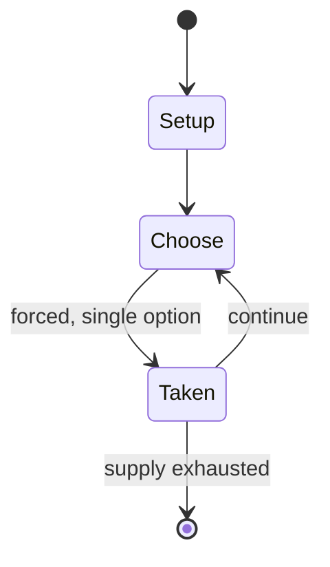

# MindMaze

*1993 game from Microsoft Encarta*

`mindmaze` &nbsp; state: **DEEPENED** &nbsp; method: **heuristic**

## Found layer (recorded, not trusted)

| field | value |
| --- | --- |
| wikidata | Q112323529 |
| wikipedia | Encarta MindMaze |
| genres (source) | trivia video game |
| instance of (source) | video game |
| country of origin | United States |

## Declared layer (orders bench work)

| field | value |
| --- | --- |
| year created | 1993 |
| epoch | DIGITAL |
| region | NORTH_AMERICA |
| media | VIDEO |
| players | -- |
| age band | -- |
| exogenous process | -- |
| loss shape | -- |
| live axes | TIMING |
| horizon | -- |
| scoring shape | -- |
| information | -- |
| interaction | -- |
| turn structure | -- |
| tractability | SAMPLING_ONLY |
| randomness | -- |
| luck factor | 0.35 |
| rules complexity | 2.01 |
| strategic depth | 2.25 |
| novelty | 0.0914 |
| solved status | -- |
| strategies | tempo |
| algorithms | -- |

## Object model

```
Episode
  players      : ?
  turn_structure: ?
  horizon       : ?
  scoring       : ?

WorldState     -- simulation state advanced by the engine
Avatar         -- player-controlled agent
Clock          -- frame or tick counter
Initiative     -- who acts, and when, relative to others
```

## State transition diagram



## Research item -- turn trace

```
# MindMaze -- simulated turn events
# generated from the DECLARED vector, not from a rulebook.
# structure: exo=None loss=None horizon=None scoring=None axes=TIMING

t=0    SETUP        players=2  pot=0  capacity=4
t=1    FORCED       p1 single legal option taken (pot_gain=+0.7)
t=2    FORCED       p1 single legal option taken (pot_gain=+1.4)
t=3    ENDTURN      turn passes to p2
t=4    FORCED       p2 single legal option taken (pot_gain=+1.2)
t=5    ENDTURN      turn passes to p1
t=6    FORCED       p1 single legal option taken (pot_gain=+1.6)
t=7    FORCED       p1 single legal option taken (pot_gain=+0.7)
t=8    FORCED       p1 single legal option taken (pot_gain=+1.3)
t=9    ENDTURN      turn passes to p2
t=10   FORCED       p2 single legal option taken (pot_gain=+1.6)
t=11   FORCED       p2 single legal option taken (pot_gain=+2.0)
t=12   FORCED       p2 single legal option taken (pot_gain=+1.2)
t=13   FORCED       p2 single legal option taken (pot_gain=+1.8)
t=14   FORCED       p2 single legal option taken (pot_gain=+0.5)
t=15   ENDTURN      turn passes to p1
t=16   FORCED       p1 single legal option taken (pot_gain=+0.8)
t=17   FORCED       p1 single legal option taken (pot_gain=+1.5)
t=18   ENDTURN      turn passes to p2
t=19   FORCED       p2 single legal option taken (pot_gain=+1.9)
t=20   FORCED       p2 single legal option taken (pot_gain=+1.8)
t=21   FORCED       p2 single legal option taken (pot_gain=+1.1)
t=22   FORCED       p2 single legal option taken (pot_gain=+1.9)
t=23   FORCED       p2 single legal option taken (pot_gain=+1.3)
t=24   FORCED       p2 single legal option taken (pot_gain=+1.3)
t=25   ENDTURN      turn passes to p1
t=26   FORCED       p1 single legal option taken (pot_gain=+1.6)

terminal: VARIABLE
```

## Source extract

Encarta MindMaze is a quiz video game and minigame included in various versions of the digital
multimedia encyclopedia Encarta. The game was first included in the initial 1993 edition of
Encarta, and its 1995 version was bundled with some new Windows PCs. In it, players, navigating
from a first-person perspective, must find their way through a maze-styled medieval fantasy
castle by answering trivia questions about various subjects. While contemporaneous reviews rated
MindMaze as part and parcel with Encarta itself; it was, retrospectively, and independently
praised as an unexpectedly fun minigame and a successful example of edutainment.   == Gameplay
== After entering a username, players click on objects on screen to interact with them. In order
to access another room, they will need to correctly answer a trivia question. Players can choose
the level of difficulty and subject matter of the trivia questions. If they answer the trivia
question quickly, they gain more points than if they take a longer time to answer it. Players
can also click on other objects and people in the scene. There are five match buttons. Clicking
one will exhaust it and temporarily show the path through the m

<sub>Wikipedia, CC BY-SA. Retained as evidence for the structural
classification above. Every rule inferred from it is HYPOTHESIZED
until audited against a rulebook.</sub>
