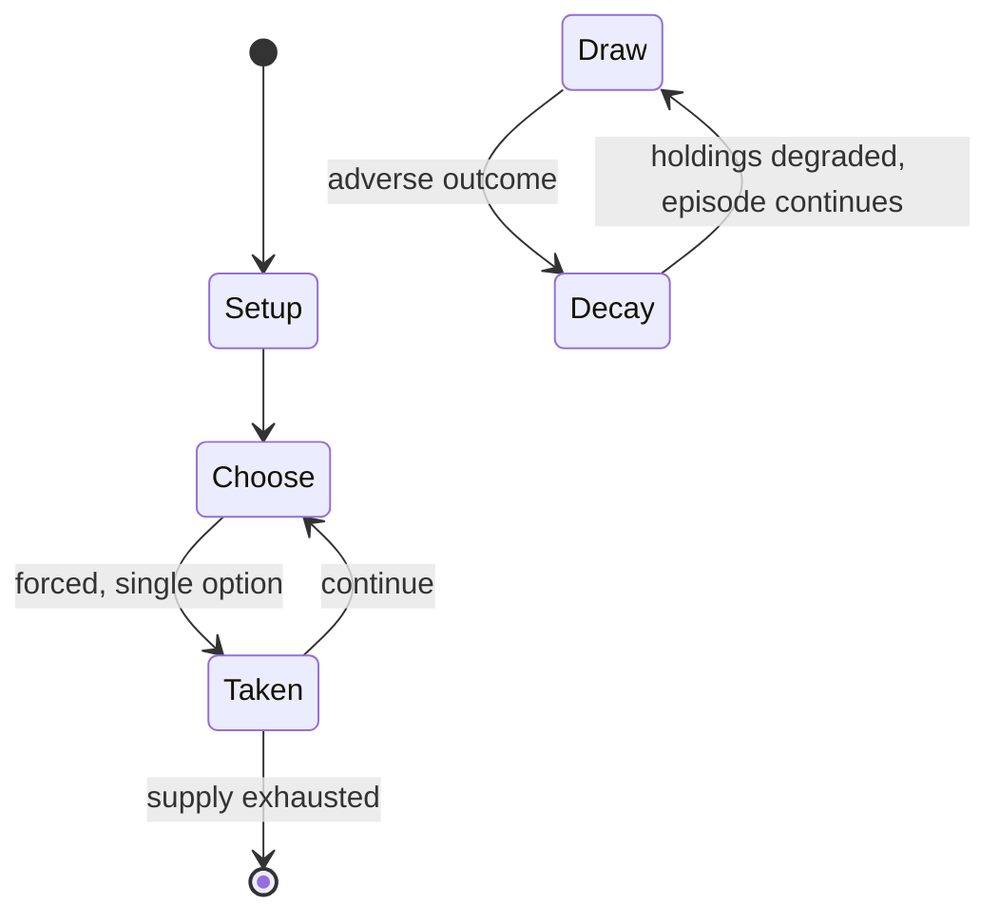

# Minishōgi

*5×5 shogi variant*

`minish_gi` &nbsp; state: **DEEPENED** &nbsp; method: **heuristic**

## Found layer (recorded, not trusted)

| field | value |
| --- | --- |
| wikidata | Q1007746 |
| wikipedia | Minishogi |
| genres (source) | -- |
| instance of (source) | shogi variant |
| country of origin | -- |

## Declared layer (orders bench work)

| field | value |
| --- | --- |
| year created | 1970 |
| epoch | DIGITAL |
| region | -- |
| media | DEXTERITY |
| players | 2 |
| age band | -- |
| exogenous process | -- |
| loss shape | PARTIAL_DECAY |
| live axes | SPATIAL |
| horizon | -- |
| scoring shape | WINNER_TAKE_ALL |
| information | -- |
| interaction | COMPETITIVE |
| turn structure | -- |
| tractability | SAMPLING_ONLY |
| randomness | -- |
| luck factor | 0.35 |
| rules complexity | 2.11 |
| strategic depth | 2.25 |
| novelty | 0.6321 |
| solved status | -- |
| strategies | set_collection |
| algorithms | -- |

## Object model

```
Episode
  players      : 2
  turn_structure: ?
  horizon       : ?
  scoring       : WINNER_TAKE_ALL

Placement      -- position subject to geometric legality
```

## State transition diagram



## Research item -- turn trace

```
# Minishōgi -- simulated turn events
# generated from the DECLARED vector, not from a rulebook.
# structure: exo=None loss=PARTIAL_DECAY horizon=None scoring=WINNER_TAKE_ALL axes=SPATIAL

t=0    SETUP        players=2  pot=0  capacity=8
t=1    FORCED       p1 single legal option taken (pot_gain=+1.0)
t=2    SPATIAL      p1 places at (0,7); adjacency legal
t=3    FORCED       p1 single legal option taken (pot_gain=+1.2)
t=4    FORCED       p1 single legal option taken (pot_gain=+1.0)
t=5    SPATIAL      p1 places at (4,2); adjacency legal
t=6    ENDTURN      turn passes to p2
t=7    FORCED       p2 single legal option taken (pot_gain=+1.4)
t=8    SPATIAL      p2 places at (1,0); adjacency legal
t=9    FORCED       p2 single legal option taken (pot_gain=+1.1)
t=10   SPATIAL      p2 places at (3,2); adjacency legal
t=11   FORCED       p2 single legal option taken (pot_gain=+1.6)
t=12   FORCED       p2 single legal option taken (pot_gain=+0.8)
t=13   SPATIAL      p2 places at (4,7); adjacency legal
t=14   FORCED       p2 single legal option taken (pot_gain=+1.2)
t=15   SPATIAL      p2 places at (5,3); adjacency legal
t=16   FORCED       p2 single legal option taken (pot_gain=+2.0)
t=17   SPATIAL      p2 places at (0,2); adjacency legal
t=18   FORCED       p2 single legal option taken (pot_gain=+1.5)
t=19   FORCED       p2 single legal option taken (pot_gain=+1.5)
t=20   ENDTURN      turn passes to p1
t=21   FORCED       p1 single legal option taken (pot_gain=+0.7)
t=22   SPATIAL      p1 places at (0,7); adjacency legal
t=23   FORCED       p1 single legal option taken (pot_gain=+0.6)
t=24   SPATIAL      p1 places at (4,3); adjacency legal
t=25   ENDTURN      turn passes to p2
t=26   FORCED       p2 single legal option taken (pot_gain=+0.5)
t=27   SPATIAL      p2 places at (2,3); adjacency legal

terminal: VARIABLE
```

## Conditions

| kind | threshold | effect | trigger |
| --- | --- | --- | --- |
| LOSE | 1 player | -- | The only exception to this rule is when one player perpetually checks the opponent; in that case the checking side loses the game. |
| TERMINATE | -- | -- | If the same position (with the same side to move and same pieces in hand) occurs for the fourth time, the game ends and the final result is a loss for the player that made the very first move in the game (this is differe |

## Source extract

Minishogi (5五将棋 gogo shōgi "5V chess" or "5×5 chess") is a modern variant of shogi (Japanese
chess). The game was invented (or rediscovered) around 1970 by Shigenobu Kusumoto of Osaka,
Japan. The rules are nearly identical to those of standard shogi, with the exception that it is
played on a 5x5 board and a reduced number of pieces, and each player's promotion zone consists
only of the rank furthest from the player.   == Rules of the game ==   === Objective === Like in
standard shogi, each player aims to checkmate the opponent's king.   === Game equipment === Two
players play on a board ruled into a grid of five ranks (rows) by five files (columns). The
squares are undifferentiated by marking or color. Each player begins with a set of 6 wedge-
shaped pieces; these are:  1 king 1 rook 1 bishop 1 gold general 1 silver general 1 pawn Their
movements are identical to those of their namesakes in standard shogi.    === Setup ===  Each
player places their pieces in the positions shown below, pointing towards the opponent. In the
rank nearest to the player:   The king is placed in the leftmost file; The gold general is
placed in the adjacent file to the king; The silver general is placed ad

<sub>Wikipedia, CC BY-SA. Retained as evidence for the structural
classification above. Every rule inferred from it is HYPOTHESIZED
until audited against a rulebook.</sub>
