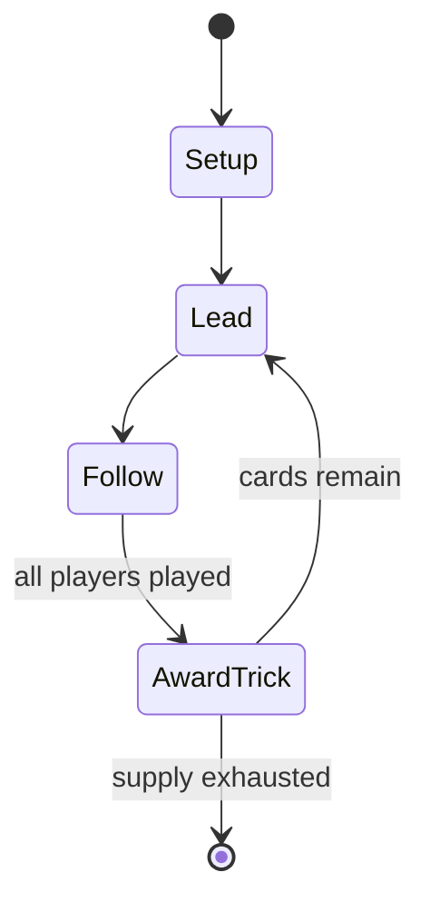

# Minnesota whist

*card game*

`minnesota_whist` &nbsp; state: **DEEPENED** &nbsp; method: **heuristic**

## Found layer (recorded, not trusted)

| field | value |
| --- | --- |
| wikidata | Q14540495 |
| wikipedia | Minnesota whist |
| genres (source) | -- |
| instance of (source) | card game, trick-taking game |
| country of origin | -- |

## Declared layer (orders bench work)

| field | value |
| --- | --- |
| year created | -- |
| epoch | -- |
| region | -- |
| media | CARD, TRICK_TAKING |
| players | 4 |
| age band | -- |
| exogenous process | -- |
| loss shape | -- |
| live axes | SELECT |
| horizon | -- |
| scoring shape | -- |
| information | -- |
| interaction | TEAM |
| turn structure | TRICK_ROUND |
| tractability | SAMPLING_ONLY |
| randomness | -- |
| luck factor | 0.35 |
| rules complexity | 1.81 |
| strategic depth | 2.0 |
| novelty | 0.4732 |
| solved status | -- |
| strategies | -- |
| algorithms | -- |

## Object model

```
Episode
  players      : 4
  turn_structure: TRICK_ROUND
  horizon       : ?
  scoring       : ?

Deck           -- ordered multiset, drawn without replacement
Hand           -- private multiset held by one player
DiscardPile    -- public accumulation of spent cards
Trick          -- one card per player; a winner is determined
Trump          -- suit that dominates the ordering
OptionSet      -- the choices available after an exogenous draw
```

## State transition diagram



## Research item -- turn trace

```
# Minnesota whist -- simulated turn events
# generated from the DECLARED vector, not from a rulebook.
# structure: exo=None loss=None horizon=None scoring=None axes=SELECT

t=0    SETUP        players=4  pot=0  capacity=8
t=1    SELECT       p1 2 options; take #1  (pot_gain=+2.6, capacity=-2)
t=2    ENDTURN      turn passes to p2
t=3    SELECT       p2 1 options; take #1  (pot_gain=+2.0, capacity=-1)
t=4    ENDTURN      turn passes to p3
t=5    SELECT       p3 4 options; take #1  (pot_gain=+2.4, capacity=-0)
t=6    SELECT       p3 1 options; take #1  (pot_gain=+1.3, capacity=-2)
t=7    SELECT       p3 2 options; take #1  (pot_gain=+2.4, capacity=-2)
t=8    SELECT       p3 2 options; take #1  (pot_gain=+2.6, capacity=-0)
t=9    SELECT       p3 3 options; take #2  (pot_gain=+2.3, capacity=-2)
t=10   SELECT       p3 1 options; take #1  (pot_gain=+1.7, capacity=-2)
t=11   SELECT       p3 1 options; take #1  (pot_gain=+0.6, capacity=-2)
t=12   SELECT       p3 2 options; take #1  (pot_gain=+3.5, capacity=-1)
t=13   ENDTURN      turn passes to p4
t=14   SELECT       p4 4 options; take #2  (pot_gain=+3.3, capacity=-2)
t=15   SELECT       p4 3 options; take #1  (pot_gain=+1.3, capacity=-1)
t=16   SELECT       p4 4 options; take #1  (pot_gain=+3.2, capacity=-0)
t=17   ENDTURN      turn passes to p1
t=18   SELECT       p1 4 options; take #2  (pot_gain=+1.0, capacity=-1)
t=19   SELECT       p1 3 options; take #1  (pot_gain=+1.2, capacity=-0)
t=20   SELECT       p1 4 options; take #4  (pot_gain=+0.8, capacity=-0)
t=21   SELECT       p1 1 options; take #1  (pot_gain=+0.9, capacity=-2)
t=22   SELECT       p1 3 options; take #3  (pot_gain=+1.5, capacity=-1)
t=23   ENDTURN      turn passes to p2
t=24   SELECT       p2 2 options; take #2  (pot_gain=+3.4, capacity=-2)
t=25   SELECT       p2 1 options; take #1  (pot_gain=+1.3, capacity=-1)
t=26   SELECT       p2 3 options; take #2  (pot_gain=+1.7, capacity=-0)

terminal: VARIABLE
```

## Conditions

| kind | threshold | effect | trigger |
| --- | --- | --- | --- |
| BOUNDARY | -- | -- | If any cards are black (called a "Grand Hand"), the goal is to take as many tricks (at least 7) as possible. |
| PENALTY | -- | -- | If a player wants to "grand" (play high), he lays down an undistinguished black card; otherwise, he lays a red card. |

## Source extract

Minnesota whist is a simplified version of whist in which there are no trumps, and the goal is
to take seven or more tricks. Four-handed whist is played with two teams. The players of each
team sit opposite each other at the table. One person is elected to keep score. Typically, the
scorer's team is labeled as "Us" and the other team labeled as "Them". In this game, the ace is
high. Minnesota whist is also known as Norwegian whist, as it was brought to the Upper Midwest
by Norwegian immigrants.   == Order of play == Everyone cuts the deck and high card is dealer.
Cards are dealt one at a time starting with the person to the left of the dealer and moving
clockwise until all cards are dealt. Each person should have 13 cards. Each person analyzes
his/her hand and determines whether to "pass" or "grand". If a player wants to "grand" (play
high), he lays down an undistinguished black card; otherwise, he lays a red card. After all 4
players have laid down their cards, players flip up their cards in turn, starting with the
person just left of the dealer. As soon as a black card is flipped up, nobody else has to flip
their card up. If any cards are black (called a "Grand Hand"), the goal i

<sub>Wikipedia, CC BY-SA. Retained as evidence for the structural
classification above. Every rule inferred from it is HYPOTHESIZED
until audited against a rulebook.</sub>
