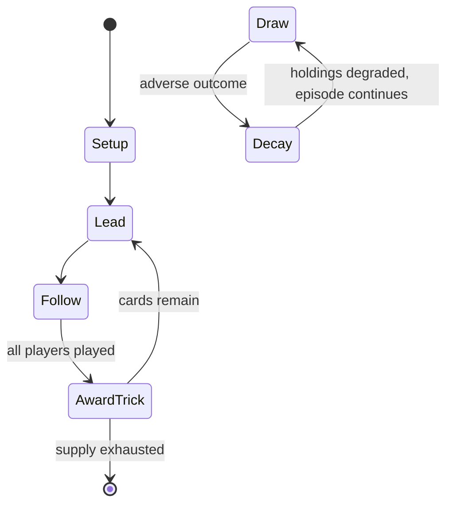

# Mistigri (card game)

`mistigri_card_game` &nbsp; state: **DEEPENED** &nbsp; method: **heuristic**

## Found layer (recorded, not trusted)

| field | value |
| --- | --- |
| wikidata | Q57195178 |
| wikipedia | Mistigri (card game) |
| genres (source) | -- |
| instance of (source) | -- |
| country of origin | -- |

## Declared layer (orders bench work)

| field | value |
| --- | --- |
| year created | -- |
| epoch | -- |
| region | -- |
| media | CARD, TRICK_TAKING |
| players | -- |
| age band | -- |
| exogenous process | -- |
| loss shape | PARTIAL_DECAY |
| live axes | - |
| horizon | -- |
| scoring shape | -- |
| information | -- |
| interaction | -- |
| turn structure | TRICK_ROUND |
| tractability | SAMPLING_ONLY |
| randomness | -- |
| luck factor | 0.35 |
| rules complexity | 1.73 |
| strategic depth | 2.25 |
| novelty | 0.5996 |
| solved status | -- |
| strategies | spatial_packing |
| algorithms | -- |

## Object model

```
Episode
  players      : ?
  turn_structure: TRICK_ROUND
  horizon       : ?
  scoring       : ?

Deck           -- ordered multiset, drawn without replacement
Hand           -- private multiset held by one player
DiscardPile    -- public accumulation of spent cards
Trick          -- one card per player; a winner is determined
Trump          -- suit that dominates the ordering
```

## State transition diagram



## Research item -- turn trace

```
# Mistigri (card game) -- simulated turn events
# generated from the DECLARED vector, not from a rulebook.
# structure: exo=None loss=PARTIAL_DECAY horizon=None scoring=None axes=-

t=0    SETUP        players=2  pot=0  capacity=7
t=1    FORCED       p1 single legal option taken (pot_gain=+1.8)
t=2    FORCED       p1 single legal option taken (pot_gain=+0.7)
t=3    ENDTURN      turn passes to p2
t=4    FORCED       p2 single legal option taken (pot_gain=+0.9)
t=5    FORCED       p2 single legal option taken (pot_gain=+0.7)
t=6    FORCED       p2 single legal option taken (pot_gain=+1.2)
t=7    FORCED       p2 single legal option taken (pot_gain=+0.6)
t=8    FORCED       p2 single legal option taken (pot_gain=+1.4)
t=9    FORCED       p2 single legal option taken (pot_gain=+1.0)
t=10   ENDTURN      turn passes to p1
t=11   FORCED       p1 single legal option taken (pot_gain=+1.2)
t=12   ENDTURN      turn passes to p2
t=13   FORCED       p2 single legal option taken (pot_gain=+0.8)
t=14   FORCED       p2 single legal option taken (pot_gain=+1.2)
t=15   ENDTURN      turn passes to p1
t=16   FORCED       p1 single legal option taken (pot_gain=+1.3)
t=17   FORCED       p1 single legal option taken (pot_gain=+0.6)
t=18   FORCED       p1 single legal option taken (pot_gain=+1.8)
t=19   FORCED       p1 single legal option taken (pot_gain=+1.0)
t=20   FORCED       p1 single legal option taken (pot_gain=+0.9)
t=21   FORCED       p1 single legal option taken (pot_gain=+1.2)
t=22   ENDTURN      turn passes to p2
t=23   FORCED       p2 single legal option taken (pot_gain=+1.8)
t=24   FORCED       p2 single legal option taken (pot_gain=+1.4)
t=25   FORCED       p2 single legal option taken (pot_gain=+2.0)
t=26   FORCED       p2 single legal option taken (pot_gain=+0.6)

terminal: VARIABLE
```

## Conditions

| kind | threshold | effect | trigger |
| --- | --- | --- | --- |
| BOUNDARY | 4 cards | -- | Exchanging is limited to 4 cards maximum and there is provision for the discards to be shuffled and used for further exchanging if the talon is exhausted. |
| BOUNDARY | 40 chips | -- | The pot has a limit of 40 chips, any excess going into a side pot which tops up the main pot when it drops below 40. |
| PENALTY | 2 players | -- | In the event of two players having a flush, the player with the lower flush does not have to pay a penalty nor does the player with the Mönch. |
| WIN | -- | -- | A player who succeeds in getting a five-card flush, a so-called mouche or Fliege ("fly"), wins immediately and takes the entire contents of the pot. |
| PENALTY | -- | -- | If a player takes no tricks, they must pay the basic stake as a penalty. |

## Source extract

Mistigri, historically Pamphile, is an old, French, trick-taking card game for three or four
players that has elements reminiscent of poker. It is a member of the Rams family of games and,
although it is a gambling game, often played for small stakes, it is also suitable as a party
game or as a family game with children from the age of 12 upwards.   == Name == Mistigri is a
variant of Mouche or Lenterlu and a cousin of the English Lanterloo. It is known in Germany as
Mönch ("monk"), possibly a corruption of the French Mouche as Monche was the old German for
monk. Meyer certainly equates it to Mouche, Lenturla and Pamphile, while Grupp also states that
it is known as trente et un ("thirty-one") in French, but Méry's research shows that Mistigri
was derived from Mouche (which was also called Lenturlu) and was first named Pamphile. It is
related to the historical card game of Tippen. The game is named after the "mistigri" (French
for "pussy cat" or "kitten"); both it and  "Mönch" ("monk") are nicknames for the jack of clubs
or Unter of acorns, which may be used as the highest trump and as a wild card.   == History ==
Mistigri is a card game that has been known and documented over seve

<sub>Wikipedia, CC BY-SA. Retained as evidence for the structural
classification above. Every rule inferred from it is HYPOTHESIZED
until audited against a rulebook.</sub>
