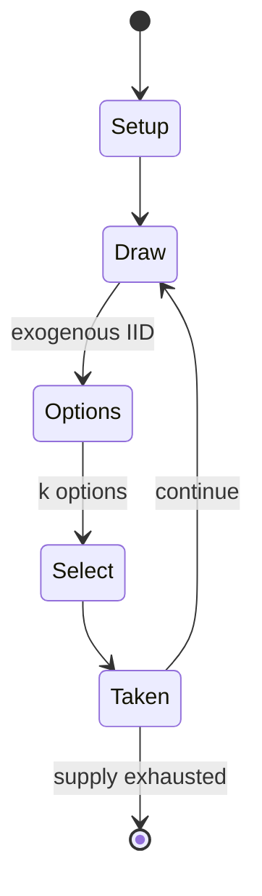

# Monopoly

*economics-themed board game*

`monopoly` &nbsp; state: **DEEPENED** &nbsp; method: **heuristic**

## Found layer (recorded, not trusted)

| field | value |
| --- | --- |
| wikidata | Q17243 |
| wikipedia | Monopoly (game) |
| genres (source) | roll-and-move game |
| instance of (source) | board game, economic simulation board game |
| country of origin | United States |

## Declared layer (orders bench work)

| field | value |
| --- | --- |
| year created | 1903 |
| epoch | MODERN |
| region | NORTH_AMERICA |
| media | BOARD, DICE |
| players | 2-8 |
| age band | -- |
| exogenous process | IID |
| loss shape | -- |
| live axes | SELECT, TRADE |
| horizon | -- |
| scoring shape | SET_COLLECTION_CONVEX |
| information | -- |
| interaction | NEGOTIATION |
| turn structure | -- |
| tractability | INTRACTABLE |
| randomness | DICE |
| luck factor | 0.58 |
| rules complexity | 3.07 |
| strategic depth | 2.12 |
| novelty | 0.8307 |
| solved status | -- |
| strategies | set_collection |
| algorithms | -- |

## Object model

```
Episode
  players      : 2-8
  turn_structure: ?
  horizon       : ?
  scoring       : SET_COLLECTION_CONVEX

Board          -- spatial substrate; cells carry position and occupancy
Piece          -- movable token owned by a player
DicePool       -- n dice, each an iid categorical draw
Roll           -- realised outcome of a pool
OptionSet      -- the choices available after an exogenous draw
Offer          -- proposed exchange between two agents
```

## State transition diagram



## Research item -- turn trace

```
# Monopoly -- simulated turn events
# generated from the DECLARED vector, not from a rulebook.
# structure: exo=IID loss=None horizon=None scoring=SET_COLLECTION_CONVEX axes=SELECT,TRADE

t=0    SETUP        players=2  pot=0  capacity=6
t=1    DRAW         p1 roll from d6 pool -> outcome #5  (p=0.126)
t=2    SELECT       p1 4 options; take #4  (pot_gain=+2.2, capacity=-0)
t=3    TRADE        p1 offers 2:1 exchange to p2
t=4    DRAW         p1 roll from d6 pool -> outcome #6  (p=0.294)
t=5    SELECT       p1 1 options; take #1  (pot_gain=+2.0, capacity=-0)
t=6    DRAW         p1 roll from d6 pool -> outcome #6  (p=0.089)
t=7    SELECT       p1 3 options; take #1  (pot_gain=+1.7, capacity=-0)
t=8    ENDTURN      turn passes to p2
t=9    DRAW         p2 roll from d6 pool -> outcome #5  (p=0.058)
t=10   SELECT       p2 4 options; take #3  (pot_gain=+0.7, capacity=-0)
t=11   DRAW         p2 roll from d6 pool -> outcome #1  (p=0.068)
t=12   SELECT       p2 2 options; take #2  (pot_gain=+3.2, capacity=-0)
t=13   DRAW         p2 roll from d6 pool -> outcome #5  (p=0.054)
t=14   SELECT       p2 1 options; take #1  (pot_gain=+2.9, capacity=-0)
t=15   DRAW         p2 roll from d6 pool -> outcome #2  (p=0.098)
t=16   SELECT       p2 3 options; take #2  (pot_gain=+1.8, capacity=-0)
t=17   ENDTURN      turn passes to p1
t=18   DRAW         p1 roll from d6 pool -> outcome #2  (p=0.282)
t=19   SELECT       p1 1 options; take #1  (pot_gain=+1.5, capacity=-2)
t=20   TRADE        p1 offers 2:1 exchange to p2
t=21   ENDTURN      turn passes to p2
t=22   DRAW         p2 roll from d6 pool -> outcome #2  (p=0.216)
t=23   SELECT       p2 3 options; take #1  (pot_gain=+1.6, capacity=-0)
t=24   ENDTURN      turn passes to p1
t=25   DRAW         p1 roll from d6 pool -> outcome #1  (p=0.297)
t=26   SELECT       p1 2 options; take #1  (pot_gain=+3.4, capacity=-1)

terminal: VARIABLE
```

## Conditions

| kind | threshold | effect | trigger |
| --- | --- | --- | --- |
| BOUNDARY | -- | -- | Hasbro released a World edition with the top voted cities from all around the world, as well as at least a Here and Now edition with the voted-on U.S. cities. |
| BOUNDARY | -- | -- | It can also be used as a derisive term to refer to money not really worth anything, or at least not being used as if it is worth anything. |
| PENALTY | -- | -- | If an ordinary dice roll (not one of the above events) ends with the player's token on the Jail corner, they are "Just Visiting", and can move ahead on their next turn without penalty. |

## Source extract

Monopoly is a multiplayer economics-themed board game. In the game, players roll two standard
dice (or one extra special red die depending on the game) to move their token clockwise around
the board, buying and trading properties and railroads and developing them with houses and
hotels. Players collect rent from their opponents and aim to drive them into bankruptcy. Money
can also be gained or lost through Chance and Community Chest cards and tax squares. Players
receive a salary every time they pass "Go" and can end up in jail, from which they cannot move
until they have met one of three conditions. House rules, hundreds of different editions, many
spin-offs, and related media exist. Monopoly has become a part of international popular culture,
having been licensed locally in more than 113 countries and printed in more than 46 languages.
As of 2015, it was estimated that the game had sold 275 million copies worldwide. The properties
on the original game board were named after locations in and around Atlantic City, New Jersey.
The game is named after the economic concept of a monopoly—the domination of a market by a
single entity. A core strategy is to buy up (or trade for) every pr

<sub>Wikipedia, CC BY-SA. Retained as evidence for the structural
classification above. Every rule inferred from it is HYPOTHESIZED
until audited against a rulebook.</sub>
