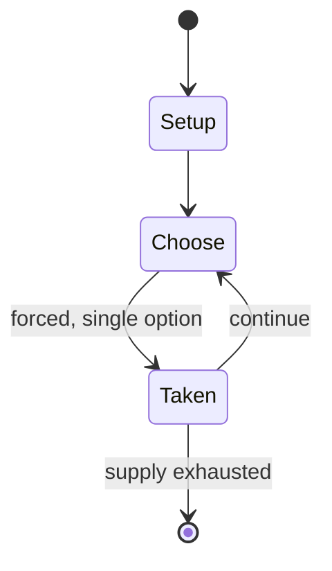

# Monster Collection

*collectible card game*

`monster_collection` &nbsp; state: **DEEPENED** &nbsp; method: **heuristic**

## Found layer (recorded, not trusted)

| field | value |
| --- | --- |
| wikidata | Q1945301 |
| wikipedia | Monster Collection |
| genres (source) | -- |
| instance of (source) | collectible card game |
| country of origin | -- |

## Declared layer (orders bench work)

| field | value |
| --- | --- |
| year created | 1997 |
| epoch | DIGITAL |
| region | -- |
| media | CARD, COLLECTIBLE |
| players | -- |
| age band | -- |
| exogenous process | -- |
| loss shape | -- |
| live axes | SPATIAL, TRADE |
| horizon | -- |
| scoring shape | -- |
| information | -- |
| interaction | COMPETITIVE |
| turn structure | -- |
| tractability | SAMPLING_ONLY |
| randomness | -- |
| luck factor | 0.35 |
| rules complexity | 2.28 |
| strategic depth | 2.0 |
| novelty | 0.3499 |
| solved status | -- |
| strategies | -- |
| algorithms | -- |

## Object model

```
Episode
  players      : ?
  turn_structure: ?
  horizon       : ?
  scoring       : ?

Deck           -- ordered multiset, drawn without replacement
Hand           -- private multiset held by one player
DiscardPile    -- public accumulation of spent cards
Placement      -- position subject to geometric legality
Offer          -- proposed exchange between two agents
```

## State transition diagram



## Research item -- turn trace

```
# Monster Collection -- simulated turn events
# generated from the DECLARED vector, not from a rulebook.
# structure: exo=None loss=None horizon=None scoring=None axes=SPATIAL,TRADE

t=0    SETUP        players=2  pot=0  capacity=4
t=1    FORCED       p1 single legal option taken (pot_gain=+1.4)
t=2    TRADE        p1 offers 2:1 exchange to p2
t=3    ENDTURN      turn passes to p2
t=4    FORCED       p2 single legal option taken (pot_gain=+2.0)
t=5    TRADE        p2 offers 2:1 exchange to p1
t=6    FORCED       p2 single legal option taken (pot_gain=+1.0)
t=7    TRADE        p2 offers 2:1 exchange to p1
t=8    FORCED       p2 single legal option taken (pot_gain=+0.9)
t=9    ENDTURN      turn passes to p1
t=10   FORCED       p1 single legal option taken (pot_gain=+1.3)
t=11   TRADE        p1 offers 2:1 exchange to p2
t=12   FORCED       p1 single legal option taken (pot_gain=+0.8)
t=13   FORCED       p1 single legal option taken (pot_gain=+1.0)
t=14   FORCED       p1 single legal option taken (pot_gain=+1.4)
t=15   SPATIAL      p1 places at (6,5); adjacency legal
t=16   ENDTURN      turn passes to p2
t=17   FORCED       p2 single legal option taken (pot_gain=+0.6)
t=18   ENDTURN      turn passes to p1
t=19   FORCED       p1 single legal option taken (pot_gain=+1.8)
t=20   TRADE        p1 offers 2:1 exchange to p2
t=21   FORCED       p1 single legal option taken (pot_gain=+1.0)
t=22   FORCED       p1 single legal option taken (pot_gain=+1.5)
t=23   TRADE        p1 offers 2:1 exchange to p2
t=24   ENDTURN      turn passes to p2
t=25   FORCED       p2 single legal option taken (pot_gain=+1.3)
t=26   FORCED       p2 single legal option taken (pot_gain=+0.7)
t=27   ENDTURN      turn passes to p1

terminal: VARIABLE
```

## Source extract

Monster Collection (モンスター・コレクション. otherwise known as Mon-Colle (モンコレ)) is an out-of-print
trading card game developed by Group SNE. Monster Collection was first published in 1997 by
Fujimi Shobo. In 2000, Monster Collection 2 was released. It was acquired by Bushiroad in August
2011. Monster Collection was later expanded to a roleplaying game and was the basis for the
anime series Mon Colle Knights. The Monster Collection game universe is a world connected to six
gates of fire, water, earth, wind, good, and evil, representing East, South, West, North, Heaven
and Earth.  Player acts as a summoner, which engages in combat using summoned monsters.   ==
Rules == The game is a one-on-one card game, set in a 3×4 grid. One side declared as winner by
capturing opponent's headquarter. Each monster has fire, water, earth, wind, good, or evil
element. A monster's ability is decided by battle spell, unit's equipment, combat items, and
terrain.   == Adaptations ==   === Comic === Monster Collection (by Sei Itoh) Monster Collection
Demon heart Mon-Colle Monster   === Video game === Monster Collection: Sorcerer's Mask
(PlayStation)  Monster Collection Board Game (PC)  Monster Collection Trading c

<sub>Wikipedia, CC BY-SA. Retained as evidence for the structural
classification above. Every rule inferred from it is HYPOTHESIZED
until audited against a rulebook.</sub>
