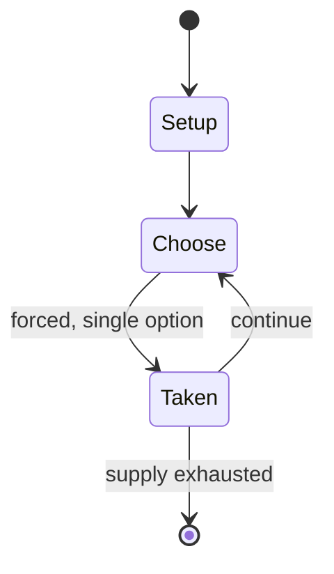

# Moria

*free Rogue-like video game*

`moria` &nbsp; state: **DEEPENED** &nbsp; method: **heuristic**

## Found layer (recorded, not trusted)

| field | value |
| --- | --- |
| wikidata | Q244187 |
| wikipedia | Moria (1983 video game) |
| genres (source) | roguelike |
| instance of (source) | source-available software, video game |
| country of origin | United States |

## Declared layer (orders bench work)

| field | value |
| --- | --- |
| year created | 1986 |
| epoch | DIGITAL |
| region | NORTH_AMERICA |
| media | VIDEO |
| players | -- |
| age band | -- |
| exogenous process | -- |
| loss shape | -- |
| live axes | - |
| horizon | -- |
| scoring shape | RACE_POSITION |
| information | -- |
| interaction | -- |
| turn structure | -- |
| tractability | SAMPLING_ONLY |
| randomness | PROCEDURAL_GENERATION |
| luck factor | 0.3 |
| rules complexity | 1.88 |
| strategic depth | 2.0 |
| novelty | 0.492 |
| solved status | -- |
| strategies | -- |
| algorithms | -- |

## Object model

```
Episode
  players      : ?
  turn_structure: ?
  horizon       : ?
  scoring       : RACE_POSITION

WorldState     -- simulation state advanced by the engine
Avatar         -- player-controlled agent
Clock          -- frame or tick counter
```

## State transition diagram



## Research item -- turn trace

```
# Moria -- simulated turn events
# generated from the DECLARED vector, not from a rulebook.
# structure: exo=None loss=None horizon=None scoring=RACE_POSITION axes=-

t=0    SETUP        players=2  pot=0  capacity=7
t=1    FORCED       p1 single legal option taken (pot_gain=+1.5)
t=2    FORCED       p1 single legal option taken (pot_gain=+1.0)
t=3    ENDTURN      turn passes to p2
t=4    FORCED       p2 single legal option taken (pot_gain=+1.7)
t=5    ENDTURN      turn passes to p1
t=6    FORCED       p1 single legal option taken (pot_gain=+1.4)
t=7    FORCED       p1 single legal option taken (pot_gain=+1.7)
t=8    FORCED       p1 single legal option taken (pot_gain=+1.7)
t=9    FORCED       p1 single legal option taken (pot_gain=+0.6)
t=10   FORCED       p1 single legal option taken (pot_gain=+1.4)
t=11   FORCED       p1 single legal option taken (pot_gain=+1.5)
t=12   ENDTURN      turn passes to p2
t=13   FORCED       p2 single legal option taken (pot_gain=+1.3)
t=14   FORCED       p2 single legal option taken (pot_gain=+1.6)
t=15   ENDTURN      turn passes to p1
t=16   FORCED       p1 single legal option taken (pot_gain=+1.6)
t=17   FORCED       p1 single legal option taken (pot_gain=+1.4)
t=18   FORCED       p1 single legal option taken (pot_gain=+1.2)
t=19   FORCED       p1 single legal option taken (pot_gain=+1.0)
t=20   ENDTURN      turn passes to p2
t=21   FORCED       p2 single legal option taken (pot_gain=+1.5)
t=22   ENDTURN      turn passes to p1
t=23   FORCED       p1 single legal option taken (pot_gain=+1.6)
t=24   FORCED       p1 single legal option taken (pot_gain=+0.7)
t=25   FORCED       p1 single legal option taken (pot_gain=+1.2)
t=26   FORCED       p1 single legal option taken (pot_gain=+0.6)

terminal: VARIABLE
```

## Source extract

The Dungeons of Moria, usually referred to as simply Moria, is a 1983 computer game, originally
developed by Robert Alan Koeneke. Inspired by J. R. R. Tolkien's novel The Lord of the Rings,
the objective of the game is to dive deep into the Mines of Moria and kill the Balrog. Moria,
along with Hack (1984) and Larn (1986), is considered to be one of the first roguelike games,
and the first to include a town level. Moria was the basis of the better known Angband roguelike
game, and influenced the preliminary design of Blizzard Entertainment's Diablo.   == Gameplay ==
The player's goal is to descend to the depths of Moria to defeat the Balrog, akin to a boss
battle. As with Rogue, levels are not persistent: when the player leaves the level and then
tries to return, a new level is procedurally generated. Among other improvements to Rogue, there
is a persistent town at the highest level where players can buy and sell equipment. Moria begins
with creation of a character. The player first chooses a "race" from the following: Human, Half-
Elf, Elf, Halfling, Gnome, Dwarf, Half-Orc, or Half-Troll. Racial selection determines base
statistics and class availability. One then selects the charac

<sub>Wikipedia, CC BY-SA. Retained as evidence for the structural
classification above. Every rule inferred from it is HYPOTHESIZED
until audited against a rulebook.</sub>
