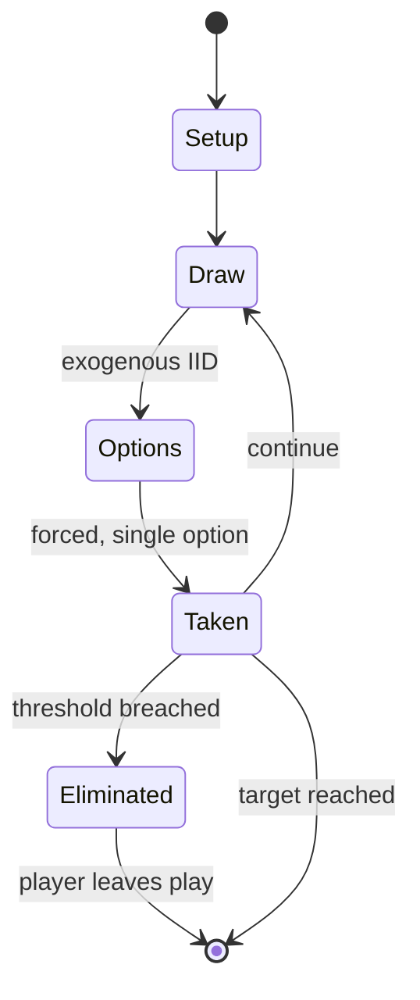

# Mouse Trap

*board game*

`mouse_trap` &nbsp; state: **DEEPENED** &nbsp; method: **heuristic**

## Found layer (recorded, not trusted)

| field | value |
| --- | --- |
| wikidata | Q6926039 |
| wikipedia | Mouse Trap (board game) |
| genres (source) | -- |
| instance of (source) | board game |
| country of origin | -- |

## Declared layer (orders bench work)

| field | value |
| --- | --- |
| year created | 1963 |
| epoch | MODERN |
| region | -- |
| media | BOARD |
| players | 2-4 |
| age band | -- |
| exogenous process | IID |
| loss shape | ELIMINATION |
| live axes | TRADE |
| horizon | RACE_TO_TARGET |
| scoring shape | RACE_POSITION |
| information | -- |
| interaction | SOLITAIRE |
| turn structure | STRICT_TURN |
| tractability | EXACT_WITH_CUT |
| randomness | DICE |
| luck factor | 0.58 |
| rules complexity | 2.48 |
| strategic depth | 2.12 |
| novelty | 0.771 |
| solved status | -- |
| strategies | spatial_packing |
| algorithms | -- |

## Object model

```
Episode
  players      : 2-4
  turn_structure: STRICT_TURN
  horizon       : RACE_TO_TARGET
  scoring       : RACE_POSITION

Board          -- spatial substrate; cells carry position and occupancy
Piece          -- movable token owned by a player
Offer          -- proposed exchange between two agents
```

## State transition diagram



## Research item -- turn trace

```
# Mouse Trap -- simulated turn events
# generated from the DECLARED vector, not from a rulebook.
# structure: exo=IID loss=ELIMINATION horizon=RACE_TO_TARGET scoring=RACE_POSITION axes=TRADE

t=0    SETUP        players=2  pot=0  capacity=3
t=1    DRAW         p1 roll from d6 pool -> outcome #2  (p=0.268)
t=2    FORCED       p1 single legal option taken (pot_gain=+0.6)
t=3    TRADE        p1 offers 2:1 exchange to p2
t=4    ENDTURN      turn passes to p2
t=5    DRAW         p2 roll from d6 pool -> outcome #6  (p=0.135)
t=6    FORCED       p2 single legal option taken (pot_gain=+0.6)
t=7    DRAW         p2 roll from d6 pool -> outcome #2  (p=0.175)
t=8    FORCED       p2 single legal option taken (pot_gain=+1.6)
t=9    ENDTURN      turn passes to p1
t=10   DRAW         p1 roll from d6 pool -> outcome #6  (p=0.055)
t=11   FORCED       p1 single legal option taken (pot_gain=+0.5)
t=12   ENDTURN      turn passes to p2
t=13   DRAW         p2 roll from d6 pool -> outcome #3  (p=0.106)
t=14   FORCED       p2 single legal option taken (pot_gain=+0.7)
t=15   DRAW         p2 roll from d6 pool -> outcome #6  (p=0.276)
t=16   FORCED       p2 single legal option taken (pot_gain=+0.9)
t=17   DRAW         p2 roll from d6 pool -> outcome #4  (p=0.193)
t=18   FORCED       p2 single legal option taken (pot_gain=+1.7)
t=19   TRADE        p2 offers 2:1 exchange to p1
t=20   DRAW         p2 roll from d6 pool -> outcome #5  (p=0.133)
t=21   FORCED       p2 single legal option taken (pot_gain=+1.5)
t=22   DRAW         p2 roll from d6 pool -> outcome #4  (p=0.022)
t=23   FORCED       p2 single legal option taken (pot_gain=+0.6)
t=24   TRADE        p2 offers 2:1 exchange to p1
t=25   DRAW         p2 roll from d6 pool -> outcome #3  (p=0.059)
t=26   FORCED       p2 single legal option taken (pot_gain=+1.5)
t=27   ENDTURN      turn passes to p1

terminal: RACE_TO_TARGET
```

## Conditions

| kind | threshold | effect | trigger |
| --- | --- | --- | --- |
| ELIMINATE | -- | eliminated | If a player lands on the "turn crank" space when an opponent is on the cheese space, the crank can be turned on the machine to launch it; if the machine works properly and the cage falls on the cheese space, that opponen |
| ELIMINATE | -- | -- | Instead of being eliminated from the game when caught by the trap, a player only forfeits cheese pieces to the opponent. |
| ELIMINATE | -- | -- | The trap machine was modified, such as with the elimination of crank gears in favor of launching the trap by directly pulling the lever with the plastic stop sign. |
| ELIMINATE | -- | out of the game | Once caught, the player is out of the game (although if the trap fails, the one getting caught and the one catching the fish have to switch places until there is a successful catch) and the game continues; the winner is  |

## Source extract

Mouse Trap, originally Mouse Trap Game, is a board game first published by Ideal in 1963 for two
to four players. It is one of the first mass-produced three-dimensional board games. Players at
first cooperate to build a working mouse trap in the style of a Rube Goldberg machine. Then,
players turn against each other to trap opponents' mouse-shaped game pieces.   == Gameplay ==
=== Original version === The basic premise of Mouse Trap has been consistent over time, but the
turn-based gameplay has changed. Its concept was first invented by Marvin Glass and designer
Gordon Barlow from Marvin's company, Marvin Glass and Associates, who were later granted a US
patent in 1967. The original published version of the game in 1963 was then designed by Hank
Kramer of Ideal Toy Company, filling in the details Glass had left open, and allows the players
almost no decision-making, in keeping with other games for very young children such as Candyland
or Chutes and Ladders (Snakes and Ladders). Players take turns rolling a die to advance their
mouse piece along a path around the game board, from the start space to a continuous loop at the
end. The Rube Goldberg-like mouse trap is assembled in the

<sub>Wikipedia, CC BY-SA. Retained as evidence for the structural
classification above. Every rule inferred from it is HYPOTHESIZED
until audited against a rulebook.</sub>
