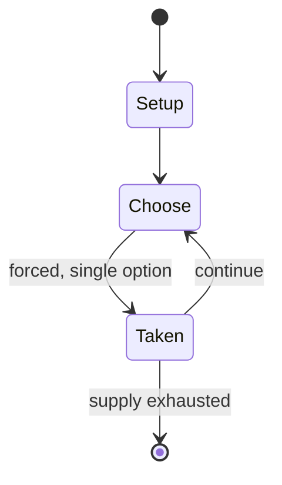

# Mu Torere

`mu_torere` &nbsp; state: **DEEPENED** &nbsp; method: **heuristic**

## Found layer (recorded, not trusted)

| field | value |
| --- | --- |
| wikidata | -- |
| wikipedia | Mu Torere |
| genres (source) | -- |
| instance of (source) | -- |
| country of origin | -- |

## Declared layer (orders bench work)

| field | value |
| --- | --- |
| year created | -- |
| epoch | -- |
| region | -- |
| media | BOARD |
| players | -- |
| age band | -- |
| exogenous process | -- |
| loss shape | -- |
| live axes | SPATIAL |
| horizon | -- |
| scoring shape | -- |
| information | -- |
| interaction | COMPETITIVE |
| turn structure | -- |
| tractability | SAMPLING_ONLY |
| randomness | -- |
| luck factor | 0.35 |
| rules complexity | 2.02 |
| strategic depth | 2.0 |
| novelty | 0.3553 |
| solved status | -- |
| strategies | -- |
| algorithms | -- |

## Object model

```
Episode
  players      : ?
  turn_structure: ?
  horizon       : ?
  scoring       : ?

Board          -- spatial substrate; cells carry position and occupancy
Piece          -- movable token owned by a player
Placement      -- position subject to geometric legality
```

## State transition diagram



## Research item -- turn trace

```
# Mu Torere -- simulated turn events
# generated from the DECLARED vector, not from a rulebook.
# structure: exo=None loss=None horizon=None scoring=None axes=SPATIAL

t=0    SETUP        players=2  pot=0  capacity=4
t=1    FORCED       p1 single legal option taken (pot_gain=+1.9)
t=2    FORCED       p1 single legal option taken (pot_gain=+1.1)
t=3    FORCED       p1 single legal option taken (pot_gain=+1.4)
t=4    ENDTURN      turn passes to p2
t=5    FORCED       p2 single legal option taken (pot_gain=+0.6)
t=6    SPATIAL      p2 places at (2,0); adjacency legal
t=7    FORCED       p2 single legal option taken (pot_gain=+1.3)
t=8    FORCED       p2 single legal option taken (pot_gain=+1.4)
t=9    SPATIAL      p2 places at (3,2); adjacency legal
t=10   FORCED       p2 single legal option taken (pot_gain=+0.8)
t=11   SPATIAL      p2 places at (3,5); adjacency legal
t=12   FORCED       p2 single legal option taken (pot_gain=+1.9)
t=13   ENDTURN      turn passes to p1
t=14   FORCED       p1 single legal option taken (pot_gain=+0.5)
t=15   ENDTURN      turn passes to p2
t=16   FORCED       p2 single legal option taken (pot_gain=+1.4)
t=17   SPATIAL      p2 places at (2,6); adjacency legal
t=18   ENDTURN      turn passes to p1
t=19   FORCED       p1 single legal option taken (pot_gain=+1.1)
t=20   SPATIAL      p1 places at (0,6); adjacency legal
t=21   FORCED       p1 single legal option taken (pot_gain=+1.9)
t=22   FORCED       p1 single legal option taken (pot_gain=+1.9)
t=23   SPATIAL      p1 places at (7,1); adjacency legal
t=24   ENDTURN      turn passes to p2
t=25   FORCED       p2 single legal option taken (pot_gain=+0.9)
t=26   FORCED       p2 single legal option taken (pot_gain=+1.8)

terminal: VARIABLE
```

## Conditions

| kind | threshold | effect | trigger |
| --- | --- | --- | --- |
| WIN | -- | -- | The player who blocks all the opponent's counters from moving is the winner. |

## Source extract

Mū tōrere is a two-player board game played mainly by Māori people from New Zealand's North
Island. Players have four counters each. The game has a simple premise but expert players are
able to see up to 40 moves ahead. It is played on a gameboard (papa tākaro) and is tightly
interwoven with stories and histories. The Ngāti Hauā chief Wiremu Tamihana Te Waharoa reputedly
offered a game to Governor George Grey with the whole country going to the winner, but Grey
declined, possibly because Māori players of mū tōrere had been known to win large sums from
pākehā visitors to New Zealand who were new to the game.   == Setup == Each player controls four
counters (perepere), all eight placed pieces should form an octagon as endpoints or "tentacles"
(kewai or kawai) encircling the center point (pūtahi) equidistant at an orientation of 45
degrees; this can be guided with an eight-pointed star drawn on the gameboard (papa tākaro) or
inscribed into clay or sand. The pūtahi is kept empty at the beginning of the game (see
illustration).   === Rules === Players move one of their counters per turn to an empty point.
Players can move only to an adjacent kewai, and can move to the pūtahi only when t

<sub>Wikipedia, CC BY-SA. Retained as evidence for the structural
classification above. Every rule inferred from it is HYPOTHESIZED
until audited against a rulebook.</sub>
