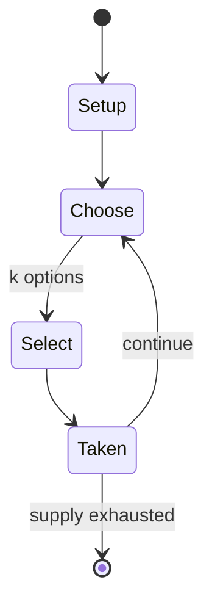

# Multi Theft Auto

*modification for the Grand Theft Auto series of video games*

`multi_theft_auto` &nbsp; state: **DEEPENED** &nbsp; method: **heuristic**

## Found layer (recorded, not trusted)

| field | value |
| --- | --- |
| wikidata | Q265656 |
| wikipedia | Multi Theft Auto |
| genres (source) | third-person shooter |
| instance of (source) | multiplayer mod |
| country of origin | -- |

## Declared layer (orders bench work)

| field | value |
| --- | --- |
| year created | 2006 |
| epoch | CONTEMPORARY |
| region | -- |
| media | VIDEO |
| players | -- |
| age band | -- |
| exogenous process | -- |
| loss shape | -- |
| live axes | SELECT |
| horizon | -- |
| scoring shape | RACE_POSITION |
| information | -- |
| interaction | COMPETITIVE |
| turn structure | -- |
| tractability | SAMPLING_ONLY |
| randomness | -- |
| luck factor | 0.35 |
| rules complexity | 2.06 |
| strategic depth | 2.0 |
| novelty | 0.5324 |
| solved status | -- |
| strategies | -- |
| algorithms | -- |

## Object model

```
Episode
  players      : ?
  turn_structure: ?
  horizon       : ?
  scoring       : RACE_POSITION

WorldState     -- simulation state advanced by the engine
Avatar         -- player-controlled agent
Clock          -- frame or tick counter
OptionSet      -- the choices available after an exogenous draw
```

## State transition diagram



## Research item -- turn trace

```
# Multi Theft Auto -- simulated turn events
# generated from the DECLARED vector, not from a rulebook.
# structure: exo=None loss=None horizon=None scoring=RACE_POSITION axes=SELECT

t=0    SETUP        players=2  pot=0  capacity=6
t=1    SELECT       p1 1 options; take #1  (pot_gain=+1.6, capacity=-1)
t=2    ENDTURN      turn passes to p2
t=3    SELECT       p2 2 options; take #2  (pot_gain=+1.6, capacity=-0)
t=4    SELECT       p2 1 options; take #1  (pot_gain=+0.5, capacity=-0)
t=5    SELECT       p2 2 options; take #2  (pot_gain=+1.5, capacity=-0)
t=6    SELECT       p2 4 options; take #2  (pot_gain=+1.1, capacity=-2)
t=7    ENDTURN      turn passes to p1
t=8    SELECT       p1 1 options; take #1  (pot_gain=+1.4, capacity=-1)
t=9    SELECT       p1 3 options; take #2  (pot_gain=+2.3, capacity=-0)
t=10   SELECT       p1 3 options; take #2  (pot_gain=+2.6, capacity=-2)
t=11   SELECT       p1 3 options; take #3  (pot_gain=+3.5, capacity=-0)
t=12   ENDTURN      turn passes to p2
t=13   SELECT       p2 4 options; take #3  (pot_gain=+3.2, capacity=-1)
t=14   SELECT       p2 1 options; take #1  (pot_gain=+1.5, capacity=-1)
t=15   SELECT       p2 4 options; take #4  (pot_gain=+2.7, capacity=-2)
t=16   ENDTURN      turn passes to p1
t=17   SELECT       p1 4 options; take #3  (pot_gain=+2.0, capacity=-1)
t=18   SELECT       p1 2 options; take #1  (pot_gain=+1.0, capacity=-1)
t=19   SELECT       p1 2 options; take #1  (pot_gain=+3.3, capacity=-0)
t=20   SELECT       p1 4 options; take #1  (pot_gain=+1.1, capacity=-1)
t=21   SELECT       p1 3 options; take #2  (pot_gain=+1.8, capacity=-0)
t=22   ENDTURN      turn passes to p2
t=23   SELECT       p2 2 options; take #2  (pot_gain=+1.1, capacity=-1)
t=24   SELECT       p2 2 options; take #1  (pot_gain=+2.9, capacity=-1)
t=25   SELECT       p2 1 options; take #1  (pot_gain=+2.6, capacity=-0)
t=26   ENDTURN      turn passes to p1

terminal: VARIABLE
```

## Source extract

Multi Theft Auto (MTA) is a multiplayer modification for the Microsoft Windows version of
Rockstar North games Grand Theft Auto III, Grand Theft Auto: Vice City and Grand Theft Auto: San
Andreas that adds online multiplayer functionality. For Grand Theft Auto: San Andreas, the mod
also serves as a derivative engine to Rockstar's interpretation of RenderWare.   == History ==
=== Background === The release of Grand Theft Auto III, a critically acclaimed sandbox-style
action-adventure computer and video game developed by DMA Design (now Rockstar North)
represented the first 3D title in the Grand Theft Auto (GTA) series. Despite its success, it was
the first Grand Theft Auto game to ship without the network multiplayer gameplay features that
were present in earlier titles, which allowed players to connect through a computer network and
play the game with others. The first version of Multi Theft Auto, dubbed Grand Theft Auto III:
Alternative Multiplayer, attempted to fill in this gap by extending an already existing cheating
tool with functionality that allowed the game to be played with a very crude form of two-player
racing over a computer network purely as a proof of concept, simil

<sub>Wikipedia, CC BY-SA. Retained as evidence for the structural
classification above. Every rule inferred from it is HYPOTHESIZED
until audited against a rulebook.</sub>
