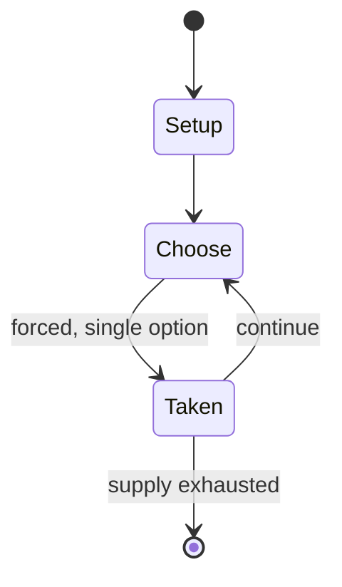

# Murder Mystery of the Dead

*Japanese party game*

`murder_mystery_of_the_dead` &nbsp; state: **DEEPENED** &nbsp; method: **heuristic**

## Found layer (recorded, not trusted)

| field | value |
| --- | --- |
| wikidata | Q130330763 |
| wikipedia | Murder Mystery of the Dead |
| genres (source) | -- |
| instance of (source) | party game |
| country of origin | -- |

## Declared layer (orders bench work)

| field | value |
| --- | --- |
| year created | 2021 |
| epoch | CONTEMPORARY |
| region | -- |
| media | BOARD, PARTY |
| players | -- |
| age band | -- |
| exogenous process | -- |
| loss shape | -- |
| live axes | - |
| horizon | -- |
| scoring shape | -- |
| information | -- |
| interaction | -- |
| turn structure | -- |
| tractability | SAMPLING_ONLY |
| randomness | -- |
| luck factor | 0.35 |
| rules complexity | 1.7 |
| strategic depth | 2.0 |
| novelty | 0.0876 |
| solved status | -- |
| strategies | route_optimisation |
| algorithms | -- |

## Object model

```
Episode
  players      : ?
  turn_structure: ?
  horizon       : ?
  scoring       : ?

Board          -- spatial substrate; cells carry position and occupancy
Piece          -- movable token owned by a player
```

## State transition diagram



## Research item -- turn trace

```
# Murder Mystery of the Dead -- simulated turn events
# generated from the DECLARED vector, not from a rulebook.
# structure: exo=None loss=None horizon=None scoring=None axes=-

t=0    SETUP        players=2  pot=0  capacity=4
t=1    FORCED       p1 single legal option taken (pot_gain=+1.2)
t=2    ENDTURN      turn passes to p2
t=3    FORCED       p2 single legal option taken (pot_gain=+1.7)
t=4    FORCED       p2 single legal option taken (pot_gain=+1.3)
t=5    ENDTURN      turn passes to p1
t=6    FORCED       p1 single legal option taken (pot_gain=+1.8)
t=7    FORCED       p1 single legal option taken (pot_gain=+1.0)
t=8    FORCED       p1 single legal option taken (pot_gain=+1.7)
t=9    FORCED       p1 single legal option taken (pot_gain=+1.1)
t=10   FORCED       p1 single legal option taken (pot_gain=+0.9)
t=11   FORCED       p1 single legal option taken (pot_gain=+1.4)
t=12   FORCED       p1 single legal option taken (pot_gain=+0.7)
t=13   ENDTURN      turn passes to p2
t=14   FORCED       p2 single legal option taken (pot_gain=+1.1)
t=15   ENDTURN      turn passes to p1
t=16   FORCED       p1 single legal option taken (pot_gain=+0.7)
t=17   FORCED       p1 single legal option taken (pot_gain=+1.5)
t=18   FORCED       p1 single legal option taken (pot_gain=+1.5)
t=19   ENDTURN      turn passes to p2
t=20   FORCED       p2 single legal option taken (pot_gain=+0.5)
t=21   FORCED       p2 single legal option taken (pot_gain=+0.8)
t=22   FORCED       p2 single legal option taken (pot_gain=+1.7)
t=23   ENDTURN      turn passes to p1
t=24   FORCED       p1 single legal option taken (pot_gain=+1.1)
t=25   ENDTURN      turn passes to p2
t=26   FORCED       p2 single legal option taken (pot_gain=+1.9)

terminal: VARIABLE
```

## Source extract

Murder Mystery of the Dead (マーダーミステリー・オブ・ザ・デッド, Mādā Misuterī obu za Deddo) is a Japanese murder
mystery party board game developed by Cosaic and Group SNE and released in April 2021. An anime
television series based on the game aired from November to December 2024.   == Characters ==
Mikoto Amano (天野 ミコト, Amano Mikoto) Voiced by: Moe Kahara Ranna Kuze (久世 蘭奈, Kuze Ranna) Voiced
by: Lynn Yū Kodama (児玉 夕, Kodama Yū) Voiced by: Kiyono Yasuno Fumika Shinohara (篠原 史香, Shinohara
Fumika) Voiced by: Maki Kawase Riri Aramaki (荒牧 莉莉, Aramaki Riri) Voiced by: Tsubaki Makino
Murumuru (ムルムル) Voiced by: Hikaru Tono Rumina (るみな) Voiced by: Madoka Asahina   == Anime == An
anime television series adaptation produced by ABC Animation and Balus aired on ABC TV and Tokyo
MX from November 14 to December 26, 2024. The series is animated by Ziine Studio and directed by
Tomohiro Ishii, and its scripts are handled by Giggle Akiguchi and Teren Mikami, while the music
is composed by Mayuko Kubota. The opening theme song is "Kyozō" (False Image) performed by
VTuber idol project Mixstgirls, while the ending theme song is "MAKE YOU CHANCE" performed by
Virtual Athlete Gaming.   == References ==   == External l

<sub>Wikipedia, CC BY-SA. Retained as evidence for the structural
classification above. Every rule inferred from it is HYPOTHESIZED
until audited against a rulebook.</sub>
