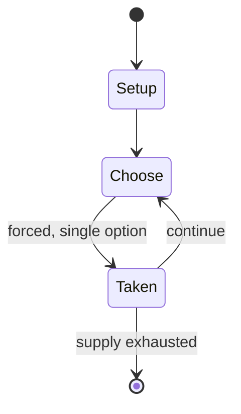

# Murus Gallicus

*abstract strategy game*

`murus_gallicus` &nbsp; state: **DEEPENED** &nbsp; method: **heuristic**

## Found layer (recorded, not trusted)

| field | value |
| --- | --- |
| wikidata | Q105742568 |
| wikipedia | Murus Gallicus (game) |
| genres (source) | -- |
| instance of (source) | abstract strategy game |
| country of origin | -- |

## Declared layer (orders bench work)

| field | value |
| --- | --- |
| year created | 2009 |
| epoch | CONTEMPORARY |
| region | -- |
| media | ABSTRACT, MANCALA |
| players | -- |
| age band | -- |
| exogenous process | -- |
| loss shape | -- |
| live axes | SPATIAL |
| horizon | -- |
| scoring shape | -- |
| information | -- |
| interaction | SOLITAIRE |
| turn structure | -- |
| tractability | SAMPLING_ONLY |
| randomness | -- |
| luck factor | 0.35 |
| rules complexity | 2.08 |
| strategic depth | 2.25 |
| novelty | 0.3965 |
| solved status | -- |
| strategies | sacrifice |
| algorithms | -- |

## Object model

```
Episode
  players      : ?
  turn_structure: ?
  horizon       : ?
  scoring       : ?

Pits           -- cyclic array of counts
Store          -- player's banked seeds
Placement      -- position subject to geometric legality
```

## State transition diagram



## Research item -- turn trace

```
# Murus Gallicus -- simulated turn events
# generated from the DECLARED vector, not from a rulebook.
# structure: exo=None loss=None horizon=None scoring=None axes=SPATIAL

t=0    SETUP        players=2  pot=0  capacity=4
t=1    FORCED       p1 single legal option taken (pot_gain=+1.3)
t=2    FORCED       p1 single legal option taken (pot_gain=+1.1)
t=3    FORCED       p1 single legal option taken (pot_gain=+2.0)
t=4    SPATIAL      p1 places at (3,2); adjacency legal
t=5    FORCED       p1 single legal option taken (pot_gain=+1.4)
t=6    SPATIAL      p1 places at (7,6); adjacency legal
t=7    FORCED       p1 single legal option taken (pot_gain=+1.1)
t=8    FORCED       p1 single legal option taken (pot_gain=+1.2)
t=9    SPATIAL      p1 places at (5,7); adjacency legal
t=10   FORCED       p1 single legal option taken (pot_gain=+1.5)
t=11   SPATIAL      p1 places at (5,7); adjacency legal
t=12   FORCED       p1 single legal option taken (pot_gain=+1.6)
t=13   ENDTURN      turn passes to p2
t=14   FORCED       p2 single legal option taken (pot_gain=+1.9)
t=15   ENDTURN      turn passes to p1
t=16   FORCED       p1 single legal option taken (pot_gain=+1.2)
t=17   FORCED       p1 single legal option taken (pot_gain=+1.8)
t=18   SPATIAL      p1 places at (6,6); adjacency legal
t=19   FORCED       p1 single legal option taken (pot_gain=+0.5)
t=20   ENDTURN      turn passes to p2
t=21   FORCED       p2 single legal option taken (pot_gain=+1.2)
t=22   SPATIAL      p2 places at (0,0); adjacency legal
t=23   ENDTURN      turn passes to p1
t=24   FORCED       p1 single legal option taken (pot_gain=+1.3)
t=25   SPATIAL      p1 places at (3,4); adjacency legal
t=26   ENDTURN      turn passes to p2

terminal: VARIABLE
```

## Conditions

| kind | threshold | effect | trigger |
| --- | --- | --- | --- |
| WIN | -- | -- | The player who reaches the other side of the board first, or stalemates their opponent so that they can't make a legal move, wins the game. |

## Source extract

Murus Gallicus (Latin for "Gallic Wall") is an abstract strategy game created in 2009 by Phil
Leduc. The name "Murus Gallicus" is a reference to the stone walls used in the Gallic wars that
took place in Gaul, now modern day France. The game has two win conditions that mimic Julius
Caesar's strategy of surrounding the Gauls. The first is breakthrough — reaching the other side
of the board — and the second is stalemate — putting the opponent in a position where they
cannot make a legal move.   == Rules == Murus Gallicus is played on an 8x7 or 8x8 board. One
player plays white ("Romans"); the other black ("Gauls"). Initially, each player's first rank is
completely filled with towers in their color. The Romans move first.   === Movement and capture
=== There are two types of pieces in Murus Gallicus: walls (stacks of one stone) and towers
(stacks of two). No stack may ever exceed two in height, nor contain pieces of both colors at
once. A wall consists of a single stone, and cannot move or capture. It can, however, block the
movement of an enemy tower. A tower consists of two stones stacked on top of each other. A tower
can "move" in any direction (orthogonal or diagonal) in a style s

<sub>Wikipedia, CC BY-SA. Retained as evidence for the structural
classification above. Every rule inferred from it is HYPOTHESIZED
until audited against a rulebook.</sub>
