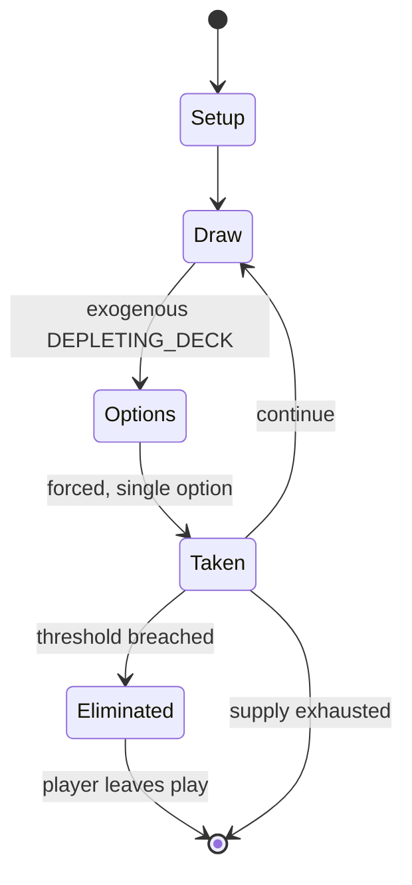

# musical chairs

*elimination genre party game*

`musical_chairs` &nbsp; state: **DEEPENED** &nbsp; method: **heuristic**

## Found layer (recorded, not trusted)

| field | value |
| --- | --- |
| wikidata | Q656850 |
| wikipedia | Musical chairs |
| genres (source) | -- |
| instance of (source) | children's game, party game |
| country of origin | -- |

## Declared layer (orders bench work)

| field | value |
| --- | --- |
| year created | -- |
| epoch | -- |
| region | -- |
| media | PARTY |
| players | -- |
| age band | CHILD |
| exogenous process | DEPLETING_DECK |
| loss shape | ELIMINATION |
| live axes | ORDER |
| horizon | -- |
| scoring shape | SET_COLLECTION_CONVEX |
| information | -- |
| interaction | SOLITAIRE |
| turn structure | -- |
| tractability | EXACT_WITH_CUT |
| randomness | DECK_SHUFFLE |
| luck factor | 0.48 |
| rules complexity | 1.72 |
| strategic depth | 2.25 |
| novelty | 0.7296 |
| solved status | -- |
| strategies | set_collection |
| algorithms | -- |

## Object model

```
Episode
  players      : ?
  turn_structure: ?
  horizon       : ?
  scoring       : SET_COLLECTION_CONVEX

Sequence       -- the permutation under the player's control
```

## State transition diagram



## Research item -- turn trace

```
# musical chairs -- simulated turn events
# generated from the DECLARED vector, not from a rulebook.
# structure: exo=DEPLETING_DECK loss=ELIMINATION horizon=None scoring=SET_COLLECTION_CONVEX axes=ORDER

t=0    SETUP        players=2  pot=0  capacity=8
t=1    DRAW         p1 draw from deck -> outcome #2  (p=0.131)
t=2    FORCED       p1 single legal option taken (pot_gain=+1.2)
t=3    ENDTURN      turn passes to p2
t=4    DRAW         p2 draw from deck -> outcome #5  (p=0.277)
t=5    FORCED       p2 single legal option taken (pot_gain=+0.9)
t=6    DRAW         p2 draw from deck -> outcome #2  (p=0.136)
t=7    FORCED       p2 single legal option taken (pot_gain=+1.5)
t=8    ENDTURN      turn passes to p1
t=9    DRAW         p1 draw from deck -> outcome #6  (p=0.024)
t=10   FORCED       p1 single legal option taken (pot_gain=+1.0)
t=11   DRAW         p1 draw from deck -> outcome #6  (p=0.126)
t=12   FORCED       p1 single legal option taken (pot_gain=+0.8)
t=13   DRAW         p1 draw from deck -> outcome #2  (p=0.189)
t=14   FORCED       p1 single legal option taken (pot_gain=+0.6)
t=15   DRAW         p1 draw from deck -> outcome #5  (p=0.059)
t=16   FORCED       p1 single legal option taken (pot_gain=+0.6)
t=17   DRAW         p1 draw from deck -> outcome #5  (p=0.213)
t=18   FORCED       p1 single legal option taken (pot_gain=+0.7)
t=19   DRAW         p1 draw from deck -> outcome #5  (p=0.064)
t=20   FORCED       p1 single legal option taken (pot_gain=+1.5)
t=21   DRAW         p1 draw from deck -> outcome #3  (p=0.293)
t=22   FORCED       p1 single legal option taken (pot_gain=+0.6)
t=23   DRAW         p1 draw from deck -> outcome #4  (p=0.053)
t=24   FORCED       p1 single legal option taken (pot_gain=+1.3)
t=25   DRAW         p1 draw from deck -> outcome #3  (p=0.151)
t=26   FORCED       p1 single legal option taken (pot_gain=+0.8)

terminal: VARIABLE
```

## Conditions

| kind | threshold | effect | trigger |
| --- | --- | --- | --- |
| ELIMINATE | -- | -- | Musical chairs is a game of elimination involving players, chairs, and music. |
| ELIMINATE | -- | eliminated | The player who fails to sit on a chair is eliminated. |

## Source extract

Musical chairs is a game of elimination involving players, chairs, and music. It is a staple of
many parties worldwide.   == Gameplay == A set of chairs is arranged in a circle with one fewer
chair than the number of players (i.e. nine players would use eight chairs). While music plays,
the contestants walk around the set of chairs. When the music stops abruptly, all players must
find their own individual chair to sit on. The player who fails to sit on a chair is eliminated.
One chair is then removed for the next round, and the process repeats until only one player
remains and is declared the winner. Sometimes, speeding up the music during musical chairs is a
way to build suspense and excitement when there are a few players remaining and the process
repeats until only one player remains and is declared the winner.   == History of the name ==
The origins of the game's name as "Trip to Jerusalem" is disputed. However, it is known to come
from its German name Reise nach Jerusalem ("Journey to Jerusalem"). One theory suggests that the
name was inspired by the Crusades, wherein several heavy losses were incurred. Another theory
suggests that it was inspired by the immigration of Jews fr

<sub>Wikipedia, CC BY-SA. Retained as evidence for the structural
classification above. Every rule inferred from it is HYPOTHESIZED
until audited against a rulebook.</sub>
