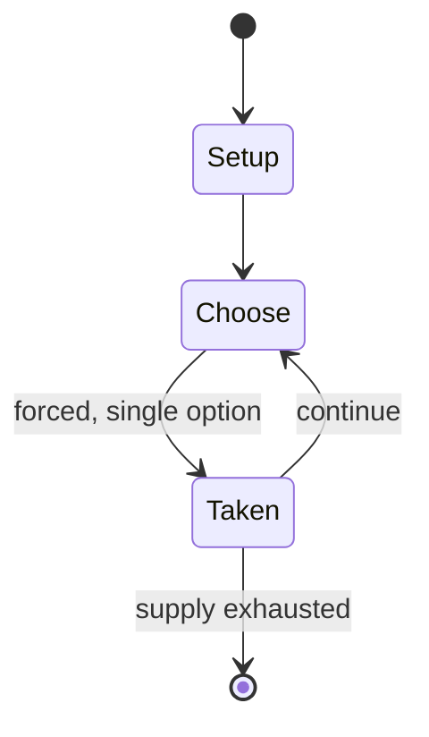

# Mutant Chronicles

*tabletop role-playing game*

`mutant_chronicles` &nbsp; state: **DEEPENED** &nbsp; method: **heuristic**

## Found layer (recorded, not trusted)

| field | value |
| --- | --- |
| wikidata | Q1042331 |
| wikipedia | Mutant Chronicles |
| genres (source) | tabletop role-playing game |
| instance of (source) | tabletop role-playing game |
| country of origin | Sweden |

## Declared layer (orders bench work)

| field | value |
| --- | --- |
| year created | 1993 |
| epoch | DIGITAL |
| region | EUROPE_NORTH |
| media | RPG |
| players | -- |
| age band | -- |
| exogenous process | -- |
| loss shape | -- |
| live axes | - |
| horizon | -- |
| scoring shape | -- |
| information | -- |
| interaction | -- |
| turn structure | -- |
| tractability | SAMPLING_ONLY |
| randomness | HIDDEN_INFO |
| luck factor | 0.35 |
| rules complexity | 3.12 |
| strategic depth | 2.0 |
| novelty | 0.0938 |
| solved status | -- |
| strategies | -- |
| algorithms | -- |

## Object model

```
Episode
  players      : ?
  turn_structure: ?
  horizon       : ?
  scoring       : ?

Character      -- persistent stat block owned by a player
GameMaster     -- adjudicating agent outside the scoring loop
Scenario       -- authored state the players traverse
```

## State transition diagram



## Research item -- turn trace

```
# Mutant Chronicles -- simulated turn events
# generated from the DECLARED vector, not from a rulebook.
# structure: exo=None loss=None horizon=None scoring=None axes=-

t=0    SETUP        players=2  pot=0  capacity=8
t=1    FORCED       p1 single legal option taken (pot_gain=+0.8)
t=2    ENDTURN      turn passes to p2
t=3    FORCED       p2 single legal option taken (pot_gain=+1.2)
t=4    ENDTURN      turn passes to p1
t=5    FORCED       p1 single legal option taken (pot_gain=+1.6)
t=6    FORCED       p1 single legal option taken (pot_gain=+1.5)
t=7    FORCED       p1 single legal option taken (pot_gain=+2.0)
t=8    ENDTURN      turn passes to p2
t=9    FORCED       p2 single legal option taken (pot_gain=+1.4)
t=10   ENDTURN      turn passes to p1
t=11   FORCED       p1 single legal option taken (pot_gain=+0.7)
t=12   FORCED       p1 single legal option taken (pot_gain=+2.0)
t=13   FORCED       p1 single legal option taken (pot_gain=+1.0)
t=14   FORCED       p1 single legal option taken (pot_gain=+1.0)
t=15   ENDTURN      turn passes to p2
t=16   FORCED       p2 single legal option taken (pot_gain=+1.5)
t=17   FORCED       p2 single legal option taken (pot_gain=+1.2)
t=18   FORCED       p2 single legal option taken (pot_gain=+1.9)
t=19   FORCED       p2 single legal option taken (pot_gain=+1.5)
t=20   ENDTURN      turn passes to p1
t=21   FORCED       p1 single legal option taken (pot_gain=+1.2)
t=22   FORCED       p1 single legal option taken (pot_gain=+2.0)
t=23   FORCED       p1 single legal option taken (pot_gain=+1.2)
t=24   ENDTURN      turn passes to p2
t=25   FORCED       p2 single legal option taken (pot_gain=+1.6)
t=26   ENDTURN      turn passes to p1

terminal: VARIABLE
```

## Source extract

Mutant Chronicles is a pen-and-paper role-playing game set in a post-apocalyptic world,
originally published in 1993. It has spawned a franchise of collectible card games, miniature
wargames, video games, novels, comic books, and a film of the same title based on the game
world. Mutant Chronicles was developed by the Swedish company Target Games as an independent
spinoff to their Mutant RPG series, specifically Mutant RYMD released the year before. Unlike
previous Swedish role-playing games, Mutant Chronicles was released in English, and focused on
reaching an international audience. The rights to the game are now owned by Paradox
Entertainment. In 2015, Cabinet Holdings acquired Paradox Entertainment Inc. and all
subsidiaries and their properties, including Mutant Chronicles.   == Story == The game takes
place in a distant future where the Earth has long since been depleted of natural resources and
abandoned. Humanity has spread to the worlds of Venus, Mars, Mercury, Luna (the Moon, the first
settlement following the exodus from Earth), and the Asteroid belt. Since the exodus from Earth
the traditional nation-states of the world have merged into five huge megacorporations: Bauhaus

<sub>Wikipedia, CC BY-SA. Retained as evidence for the structural
classification above. Every rule inferred from it is HYPOTHESIZED
until audited against a rulebook.</sub>
