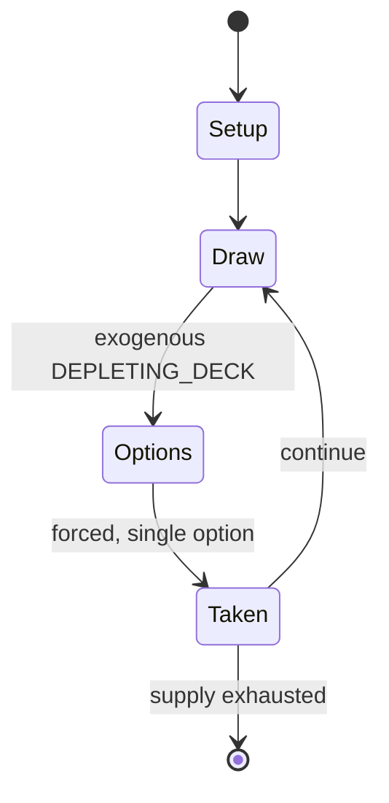

# My Little Pony Collectible Card Game

*collectible card game*

`my_little_pony_collectible_card_game` &nbsp; state: **DEEPENED** &nbsp; method: **heuristic**

## Found layer (recorded, not trusted)

| field | value |
| --- | --- |
| wikidata | Q18152837 |
| wikipedia | My Little Pony Collectible Card Game |
| genres (source) | -- |
| instance of (source) | collectible card game |
| country of origin | -- |

## Declared layer (orders bench work)

| field | value |
| --- | --- |
| year created | -- |
| epoch | -- |
| region | -- |
| media | CARD, COLLECTIBLE |
| players | -- |
| age band | -- |
| exogenous process | DEPLETING_DECK |
| loss shape | -- |
| live axes | TRADE |
| horizon | -- |
| scoring shape | SET_COLLECTION_CONVEX |
| information | -- |
| interaction | COMPETITIVE |
| turn structure | -- |
| tractability | EXACT_WITH_CUT |
| randomness | DECK_SHUFFLE |
| luck factor | 0.48 |
| rules complexity | 2.69 |
| strategic depth | 2.5 |
| novelty | 0.6899 |
| solved status | -- |
| strategies | set_collection, spatial_packing |
| algorithms | -- |

## Object model

```
Episode
  players      : ?
  turn_structure: ?
  horizon       : ?
  scoring       : SET_COLLECTION_CONVEX

Deck           -- ordered multiset, drawn without replacement
Hand           -- private multiset held by one player
DiscardPile    -- public accumulation of spent cards
Offer          -- proposed exchange between two agents
```

## State transition diagram



## Research item -- turn trace

```
# My Little Pony Collectible Card Game -- simulated turn events
# generated from the DECLARED vector, not from a rulebook.
# structure: exo=DEPLETING_DECK loss=None horizon=None scoring=SET_COLLECTION_CONVEX axes=TRADE

t=0    SETUP        players=2  pot=0  capacity=3
t=1    DRAW         p1 draw from deck -> outcome #1  (p=0.136)
t=2    FORCED       p1 single legal option taken (pot_gain=+2.0)
t=3    ENDTURN      turn passes to p2
t=4    DRAW         p2 draw from deck -> outcome #3  (p=0.210)
t=5    FORCED       p2 single legal option taken (pot_gain=+0.7)
t=6    TRADE        p2 offers 2:1 exchange to p1
t=7    DRAW         p2 draw from deck -> outcome #3  (p=0.142)
t=8    FORCED       p2 single legal option taken (pot_gain=+1.0)
t=9    DRAW         p2 draw from deck -> outcome #3  (p=0.084)
t=10   FORCED       p2 single legal option taken (pot_gain=+0.8)
t=11   DRAW         p2 draw from deck -> outcome #2  (p=0.148)
t=12   FORCED       p2 single legal option taken (pot_gain=+2.0)
t=13   DRAW         p2 draw from deck -> outcome #1  (p=0.140)
t=14   FORCED       p2 single legal option taken (pot_gain=+0.8)
t=15   DRAW         p2 draw from deck -> outcome #2  (p=0.205)
t=16   FORCED       p2 single legal option taken (pot_gain=+1.8)
t=17   DRAW         p2 draw from deck -> outcome #2  (p=0.172)
t=18   FORCED       p2 single legal option taken (pot_gain=+1.4)
t=19   ENDTURN      turn passes to p1
t=20   DRAW         p1 draw from deck -> outcome #2  (p=0.268)
t=21   FORCED       p1 single legal option taken (pot_gain=+1.4)
t=22   DRAW         p1 draw from deck -> outcome #6  (p=0.227)
t=23   FORCED       p1 single legal option taken (pot_gain=+1.9)
t=24   DRAW         p1 draw from deck -> outcome #2  (p=0.140)
t=25   FORCED       p1 single legal option taken (pot_gain=+1.5)
t=26   ENDTURN      turn passes to p2

terminal: VARIABLE
```

## Conditions

| kind | threshold | effect | trigger |
| --- | --- | --- | --- |
| WIN | 15 points | -- | The first player to earn 15 points is the winner. |
| BOUNDARY | -- | -- | On each turn, players earn a number of action tokens (at least 2) based on their current score. |

## Source extract

The My Little Pony Collectible Card Game (abbreviated as MLPCCG) is a two-player collectible
card game based on the animated television series My Little Pony: Friendship Is Magic. It is
produced by Enterplay LLC under license from Hasbro, and follows from Enterplay's previous work
to produce a trading card series based on the same show. The game requires each player to form a
deck with one "Mane" character, 10 Problem cards that earn the players points when solved, and
many other cards representing Friends, Resources, and other concepts; these cards are based on
characters and other elements from the series. The goal is to play cards from one's hand to face
off against any Problems put forth by either player, scoring points for doing so. The player to
score a set number of points first is declared the winner. The game is distributed in pre-made
one- or two-deck starter packs, and booster packs to expand a player's library. Since its
release, the game has received seven major expansions and several themed decks. The game has
generally been well-received, providing an easy-to-learn experience for both the younger
demographic of the show as well as the older players including the adul

<sub>Wikipedia, CC BY-SA. Retained as evidence for the structural
classification above. Every rule inferred from it is HYPOTHESIZED
until audited against a rulebook.</sub>
