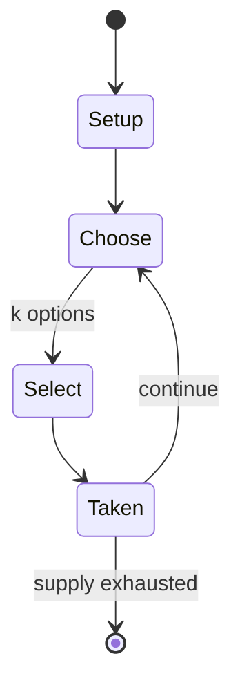

# MyCoke

*Online chat game*

`mycoke` &nbsp; state: **DEEPENED** &nbsp; method: **heuristic**

## Found layer (recorded, not trusted)

| field | value |
| --- | --- |
| wikidata | Q11855433 |
| wikipedia | MyCoke |
| genres (source) | advergame |
| instance of (source) | video game |
| country of origin | -- |

## Declared layer (orders bench work)

| field | value |
| --- | --- |
| year created | 2002 |
| epoch | CONTEMPORARY |
| region | -- |
| media | MEMORY, TILE, VIDEO |
| players | -- |
| age band | -- |
| exogenous process | NONE |
| loss shape | OPPORTUNITY_ONLY |
| live axes | SELECT |
| horizon | -- |
| scoring shape | RACE_POSITION |
| information | PERFECT |
| interaction | SOLITAIRE |
| turn structure | -- |
| tractability | SAMPLING_ONLY |
| randomness | NONE |
| luck factor | 0.02 |
| rules complexity | 2.53 |
| strategic depth | 2.65 |
| novelty | 0.6979 |
| solved status | -- |
| strategies | memory_recall |
| algorithms | -- |

## Object model

```
Episode
  players      : ?
  turn_structure: ?
  horizon       : ?
  scoring       : RACE_POSITION

TileBag        -- unordered draw source
Layout         -- placed tiles and their adjacencies
WorldState     -- simulation state advanced by the engine
Avatar         -- player-controlled agent
Clock          -- frame or tick counter
OptionSet      -- the choices available after an exogenous draw
```

## State transition diagram



## Research item -- turn trace

```
# MyCoke -- simulated turn events
# generated from the DECLARED vector, not from a rulebook.
# structure: exo=NONE loss=OPPORTUNITY_ONLY horizon=None scoring=RACE_POSITION axes=SELECT

t=0    SETUP        players=2  pot=0  capacity=3
t=1    SELECT       p1 4 options; take #2  (pot_gain=+1.8, capacity=-0)
t=2    SELECT       p1 2 options; take #1  (pot_gain=+2.6, capacity=-2)
t=3    ENDTURN      turn passes to p2
t=4    SELECT       p2 3 options; take #2  (pot_gain=+2.5, capacity=-1)
t=5    SELECT       p2 4 options; take #2  (pot_gain=+1.3, capacity=-0)
t=6    SELECT       p2 4 options; take #2  (pot_gain=+2.9, capacity=-2)
t=7    SELECT       p2 1 options; take #1  (pot_gain=+2.8, capacity=-2)
t=8    ENDTURN      turn passes to p1
t=9    SELECT       p1 3 options; take #2  (pot_gain=+0.5, capacity=-0)
t=10   SELECT       p1 2 options; take #1  (pot_gain=+0.9, capacity=-1)
t=11   ENDTURN      turn passes to p2
t=12   SELECT       p2 3 options; take #3  (pot_gain=+2.5, capacity=-1)
t=13   SELECT       p2 2 options; take #2  (pot_gain=+2.5, capacity=-0)
t=14   SELECT       p2 2 options; take #2  (pot_gain=+3.4, capacity=-0)
t=15   SELECT       p2 3 options; take #3  (pot_gain=+1.4, capacity=-1)
t=16   SELECT       p2 4 options; take #3  (pot_gain=+2.2, capacity=-0)
t=17   SELECT       p2 3 options; take #2  (pot_gain=+1.7, capacity=-0)
t=18   ENDTURN      turn passes to p1
t=19   SELECT       p1 4 options; take #2  (pot_gain=+0.9, capacity=-1)
t=20   SELECT       p1 4 options; take #2  (pot_gain=+3.0, capacity=-2)
t=21   SELECT       p1 3 options; take #1  (pot_gain=+3.4, capacity=-1)
t=22   SELECT       p1 1 options; take #1  (pot_gain=+2.2, capacity=-1)
t=23   SELECT       p1 4 options; take #3  (pot_gain=+2.3, capacity=-2)
t=24   SELECT       p1 4 options; take #1  (pot_gain=+2.8, capacity=-1)
t=25   SELECT       p1 3 options; take #2  (pot_gain=+2.5, capacity=-1)
t=26   SELECT       p1 3 options; take #1  (pot_gain=+0.7, capacity=-1)

terminal: VARIABLE
```

## Conditions

| kind | threshold | effect | trigger |
| --- | --- | --- | --- |
| WIN | -- | -- | The team that completed each round and got to the top of the incline first would win the game and be awarded decibels. |

## Source extract

MyCoke (formerly known as Coke Music) was a website used for marketing the Coca-Cola brand and
products. It was created in January 2002 by Studiocom (Now VML Inc), an Atlanta-based digital
agency using core technology from Sulake Corporation, the video game company responsible for a
similar popular online game called Habbo Hotel. The site hosted multiple games, sweepstakes,
music downloads, and Coke-related media. However, Coke Studios was the main feature of the
website. On December 6, 2007 Coke Studios closed, and encouraged users to join CC Metro, which
was part of There. There was closed on March 9, 2010. The MyCoke website remained open for
multiple years to host minigames and Coke-related media.   == Coke Studios == The main focus of
the game was to socialize, mix music, and decorate various interiors. The in-game currency was
decibels (or DB) and they were rewarded for any of the following activities:   Receiving 'Thumbs
Up' votes from other users whilst performing music Drinking Virtual Coca-Colas found in crates,
vending machines, and refrigerators Playing other games on the Coke Studios website Filling out
surveys on the website. There are various public studio locations

<sub>Wikipedia, CC BY-SA. Retained as evidence for the structural
classification above. Every rule inferred from it is HYPOTHESIZED
until audited against a rulebook.</sub>
