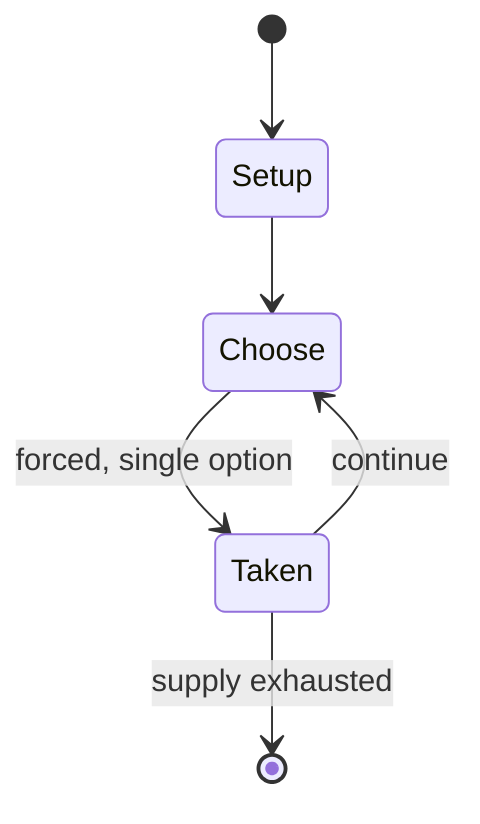

# Ô ăn quan

`n_quan` &nbsp; state: **DEEPENED** &nbsp; method: **heuristic**

## Found layer (recorded, not trusted)

| field | value |
| --- | --- |
| wikidata | Q8078898 |
| wikipedia | Ô ăn quan |
| genres (source) | -- |
| instance of (source) | -- |
| country of origin | -- |

## Declared layer (orders bench work)

| field | value |
| --- | --- |
| year created | -- |
| epoch | -- |
| region | -- |
| media | BOARD, MANCALA |
| players | -- |
| age band | -- |
| exogenous process | -- |
| loss shape | -- |
| live axes | - |
| horizon | VARIABLE |
| scoring shape | -- |
| information | -- |
| interaction | -- |
| turn structure | -- |
| tractability | SAMPLING_ONLY |
| randomness | -- |
| luck factor | 0.35 |
| rules complexity | 1.73 |
| strategic depth | 2.0 |
| novelty | 0.4114 |
| solved status | -- |
| strategies | -- |
| algorithms | -- |

## Object model

```
Episode
  players      : ?
  turn_structure: ?
  horizon       : VARIABLE
  scoring       : ?

Board          -- spatial substrate; cells carry position and occupancy
Piece          -- movable token owned by a player
Pits           -- cyclic array of counts
Store          -- player's banked seeds
```

## State transition diagram



## Research item -- turn trace

```
# Ô ăn quan -- simulated turn events
# generated from the DECLARED vector, not from a rulebook.
# structure: exo=None loss=None horizon=VARIABLE scoring=None axes=-

t=0    SETUP        players=2  pot=0  capacity=6
t=1    FORCED       p1 single legal option taken (pot_gain=+1.8)
t=2    FORCED       p1 single legal option taken (pot_gain=+1.1)
t=3    ENDTURN      turn passes to p2
t=4    FORCED       p2 single legal option taken (pot_gain=+1.0)
t=5    FORCED       p2 single legal option taken (pot_gain=+0.6)
t=6    FORCED       p2 single legal option taken (pot_gain=+1.0)
t=7    ENDTURN      turn passes to p1
t=8    FORCED       p1 single legal option taken (pot_gain=+1.4)
t=9    FORCED       p1 single legal option taken (pot_gain=+1.9)
t=10   FORCED       p1 single legal option taken (pot_gain=+0.7)
t=11   FORCED       p1 single legal option taken (pot_gain=+1.8)
t=12   FORCED       p1 single legal option taken (pot_gain=+0.7)
t=13   FORCED       p1 single legal option taken (pot_gain=+1.9)
t=14   ENDTURN      turn passes to p2
t=15   FORCED       p2 single legal option taken (pot_gain=+1.8)
t=16   FORCED       p2 single legal option taken (pot_gain=+0.9)
t=17   FORCED       p2 single legal option taken (pot_gain=+1.7)
t=18   ENDTURN      turn passes to p1
t=19   FORCED       p1 single legal option taken (pot_gain=+1.6)
t=20   FORCED       p1 single legal option taken (pot_gain=+1.3)
t=21   ENDTURN      turn passes to p2
t=22   FORCED       p2 single legal option taken (pot_gain=+1.9)
t=23   ENDTURN      turn passes to p1
t=24   FORCED       p1 single legal option taken (pot_gain=+1.3)
t=25   FORCED       p1 single legal option taken (pot_gain=+0.9)
t=26   FORCED       p1 single legal option taken (pot_gain=+1.7)

terminal: VARIABLE
```

## Conditions

| kind | threshold | effect | trigger |
| --- | --- | --- | --- |
| WIN | -- | -- | Whichever player has more pieces is the winner (a Mandarin piece is equal to ten or five citizen pieces). |
| TERMINATE | -- | -- | The game ends when all the pieces are captured. |

## Source extract

Ô ăn quan (Vietnamese Traditional Stone Game, Quan Capture Game, or Vietnamese Mancala) is a
traditional Vietnamese children's board game. This game is valuable for enhancing calculating
and strategic ability.   == Board, pieces, and players ==  A rectangle which is divided into ten
squares (5x2) with two semicircles at each end is drawn on the floor or the yard.  The ten
squares are called "rice field square", "fish pond square" or "citizen square" and the two
semicircles are called "Mandarin squares". Pieces may be stones, fruit seeds or any other small
things. Two players or two teams sit in two sides of the board. Each controls one side of the
board.   == History == The game's origin is unknown, as it has been played for many years. Many
people say that Vietnamese ancestors were inspired by green rice fields to invent a game that
could be played in those huge fields. At first, the game had become quite popular throughout the
country. However, as time passed Vietnamese children no longer had the same passion for the game
like those in the past. For this reason, the Vietnam Museum of Ethnology is exhibiting the game
with fully explained instructions with the aim of keeping the ga

<sub>Wikipedia, CC BY-SA. Retained as evidence for the structural
classification above. Every rule inferred from it is HYPOTHESIZED
until audited against a rulebook.</sub>
