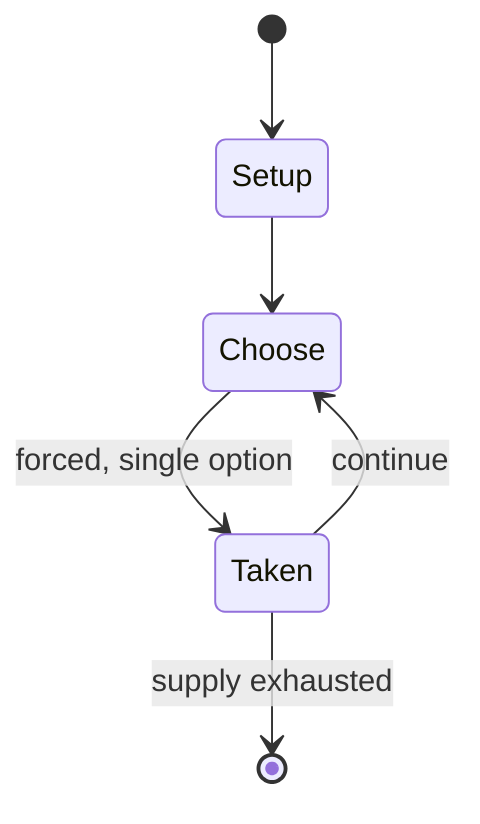

# Nakahara castle

`nakahara_castle` &nbsp; state: **DEEPENED** &nbsp; method: **heuristic**

## Found layer (recorded, not trusted)

| field | value |
| --- | --- |
| wikidata | Q11363128 |
| wikipedia | Nakahara castle |
| genres (source) | -- |
| instance of (source) | castle |
| country of origin | -- |

## Declared layer (orders bench work)

| field | value |
| --- | --- |
| year created | -- |
| epoch | -- |
| region | -- |
| media | - |
| players | -- |
| age band | -- |
| exogenous process | NONE |
| loss shape | OPPORTUNITY_ONLY |
| live axes | TRADE |
| horizon | -- |
| scoring shape | -- |
| information | PERFECT |
| interaction | -- |
| turn structure | -- |
| tractability | EXACT_WITH_CUT |
| randomness | NONE |
| luck factor | 0.02 |
| rules complexity | 2.18 |
| strategic depth | 2.65 |
| novelty | 0.7787 |
| solved status | -- |
| strategies | route_optimisation |
| algorithms | -- |

## Object model

```
Episode
  players      : ?
  turn_structure: ?
  horizon       : ?
  scoring       : ?

Offer          -- proposed exchange between two agents
```

## State transition diagram



## Research item -- turn trace

```
# Nakahara castle -- simulated turn events
# generated from the DECLARED vector, not from a rulebook.
# structure: exo=NONE loss=OPPORTUNITY_ONLY horizon=None scoring=None axes=TRADE

t=0    SETUP        players=2  pot=0  capacity=3
t=1    FORCED       p1 single legal option taken (pot_gain=+1.4)
t=2    TRADE        p1 offers 2:1 exchange to p2
t=3    FORCED       p1 single legal option taken (pot_gain=+2.0)
t=4    FORCED       p1 single legal option taken (pot_gain=+1.2)
t=5    ENDTURN      turn passes to p2
t=6    FORCED       p2 single legal option taken (pot_gain=+1.5)
t=7    FORCED       p2 single legal option taken (pot_gain=+0.7)
t=8    ENDTURN      turn passes to p1
t=9    FORCED       p1 single legal option taken (pot_gain=+1.9)
t=10   FORCED       p1 single legal option taken (pot_gain=+1.5)
t=11   ENDTURN      turn passes to p2
t=12   FORCED       p2 single legal option taken (pot_gain=+1.9)
t=13   FORCED       p2 single legal option taken (pot_gain=+0.8)
t=14   FORCED       p2 single legal option taken (pot_gain=+1.0)
t=15   TRADE        p2 offers 2:1 exchange to p1
t=16   FORCED       p2 single legal option taken (pot_gain=+1.9)
t=17   FORCED       p2 single legal option taken (pot_gain=+1.3)
t=18   FORCED       p2 single legal option taken (pot_gain=+1.4)
t=19   TRADE        p2 offers 2:1 exchange to p1
t=20   FORCED       p2 single legal option taken (pot_gain=+0.7)
t=21   TRADE        p2 offers 2:1 exchange to p1
t=22   FORCED       p2 single legal option taken (pot_gain=+0.6)
t=23   FORCED       p2 single legal option taken (pot_gain=+1.3)
t=24   FORCED       p2 single legal option taken (pot_gain=+0.9)
t=25   TRADE        p2 offers 2:1 exchange to p1
t=26   FORCED       p2 single legal option taken (pot_gain=+1.8)
t=27   ENDTURN      turn passes to p1

terminal: VARIABLE
```

## Source extract

The Nakahara castle (Japanese: 中原囲い, romanized: Nakahara gakoi) is a type of shogi castle. Its
application to modern shogi was made by professional player Makoto Nakahara. Nakahara won the
Masuda Award  in 1996 for his development of this strategy. The Nakahara castle is characterized
by the close positioning of golds and silvers around the king. In particular, the castle
involves the left gold at 78, the right silver at 48, and the right gold at the bottom rank, at
59, protecting the king at 69.   == Conception and evolution == The Nakahara castle was
originally a castle in Nakahara Double Wing Attack. The original castle itself was a simple one
in which the silver was pushed one square directly above from its initial position. The first
game where this castle was played is said to have been the one between Nakahara and Teruichi
Aono in April 1992, but Nakahara himself said that he had already used it in 1990.
Nevertheless, the G-59 and K-69 positions themselves had already appeared in the old style of
Double Wing Attack, and Nakahara had learned them from Yasujirō Kon, the master of his own
master (Toshio Takayanagi). Nakahara applied this technique to modern era playing. At tha

<sub>Wikipedia, CC BY-SA. Retained as evidence for the structural
classification above. Every rule inferred from it is HYPOTHESIZED
until audited against a rulebook.</sub>
