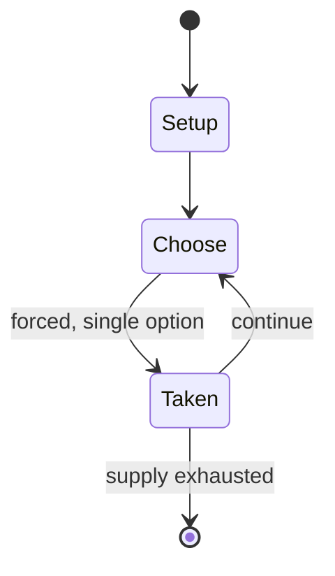

# NATO Division Commander

*board wargame published by Simulations Publications Inc. in 1980*

`nato_division_commander` &nbsp; state: **DEEPENED** &nbsp; method: **heuristic**

## Found layer (recorded, not trusted)

| field | value |
| --- | --- |
| wikidata | Q110536037 |
| wikipedia | NATO Division Commander |
| genres (source) | -- |
| instance of (source) | board wargame |
| country of origin | -- |

## Declared layer (orders bench work)

| field | value |
| --- | --- |
| year created | -- |
| epoch | -- |
| region | -- |
| media | WARGAME |
| players | -- |
| age band | -- |
| exogenous process | -- |
| loss shape | -- |
| live axes | ALLOCATE, ORDER, SPATIAL |
| horizon | -- |
| scoring shape | SET_COLLECTION_CONVEX |
| information | -- |
| interaction | COMPETITIVE |
| turn structure | PHASE_STRUCTURED |
| tractability | SAMPLING_ONLY |
| randomness | -- |
| luck factor | -- |
| rules complexity | 4.6 |
| strategic depth | 2.5 |
| novelty | 0.5814 |
| solved status | -- |
| strategies | set_collection, signalling |
| algorithms | -- |

## Object model

```
Episode
  players      : ?
  turn_structure: PHASE_STRUCTURED
  horizon       : ?
  scoring       : SET_COLLECTION_CONVEX

ResourcePool   -- divisible capacity committed across slots
Sequence       -- the permutation under the player's control
Placement      -- position subject to geometric legality
```

## State transition diagram



## Research item -- turn trace

```
# NATO Division Commander -- simulated turn events
# generated from the DECLARED vector, not from a rulebook.
# structure: exo=None loss=None horizon=None scoring=SET_COLLECTION_CONVEX axes=ALLOCATE,ORDER,SPATIAL

t=0    SETUP        players=2  pot=0  capacity=7
t=1    FORCED       p1 single legal option taken (pot_gain=+0.6)
t=2    FORCED       p1 single legal option taken (pot_gain=+1.6)
t=3    FORCED       p1 single legal option taken (pot_gain=+0.9)
t=4    ALLOCATE     p1 commits 1 of 5 capacity across 2 slots
t=5    FORCED       p1 single legal option taken (pot_gain=+2.0)
t=6    ALLOCATE     p1 commits 3 of 5 capacity across 4 slots
t=7    FORCED       p1 single legal option taken (pot_gain=+1.8)
t=8    ALLOCATE     p1 commits 3 of 5 capacity across 3 slots
t=9    SPATIAL      p1 places at (2,2); adjacency legal
t=10   FORCED       p1 single legal option taken (pot_gain=+1.4)
t=11   ALLOCATE     p1 commits 1 of 5 capacity across 4 slots
t=12   SPATIAL      p1 places at (5,2); adjacency legal
t=13   FORCED       p1 single legal option taken (pot_gain=+1.3)
t=14   SPATIAL      p1 places at (2,3); adjacency legal
t=15   FORCED       p1 single legal option taken (pot_gain=+0.9)
t=16   ALLOCATE     p1 commits 2 of 5 capacity across 3 slots
t=17   SPATIAL      p1 places at (5,2); adjacency legal
t=18   ENDTURN      turn passes to p2
t=19   FORCED       p2 single legal option taken (pot_gain=+0.6)
t=20   SPATIAL      p2 places at (3,0); adjacency legal
t=21   FORCED       p2 single legal option taken (pot_gain=+0.6)
t=22   ALLOCATE     p2 commits 2 of 5 capacity across 3 slots
t=23   SPATIAL      p2 places at (6,4); adjacency legal
t=24   ENDTURN      turn passes to p1
t=25   FORCED       p1 single legal option taken (pot_gain=+0.7)
t=26   SPATIAL      p1 places at (6,4); adjacency legal

terminal: VARIABLE
```

## Source extract

NATO Division Commander, subtitled "Leadership Under Fire", is a board wargame published by
Simulations Publications Inc. (SPI) in 1980 that simulates hypothetical World War III ground
combat scenarios in Europe between NATO and Warsaw Pact forces using armaments of the 1970s.
== Description == NATO Division Commander is a 2-player board wargame in which one player
controls the invading forces of the Warsaw Pact, and the other player controls the NATO
defensive forces. The game scenarios posit that the Warsaw Pact has already penetrated into the
West Germany countryside; the setting is the Fulda Gap north of Frankfurt.   === Components ===
The game box contains:  two identical 22" x 35" paper hex grid maps scaled at 1 mi (1.6 km) per
hex two identical sets of 600 counters each 25-page rule book (contains opening scenario) 8-page
booklet of 30 game charts and tables 15-page Scenario book with Designer's and Playtesters'
Notes 8-page booklet of charts required for scenarios 11-page essay, "NATO Division Commander:
Command and Control in the Modern Battlefield Environment" by Stephen B. Patrick   === Gameplay
=== Each game turn represents 8 hours. In addition to an introductory scen

<sub>Wikipedia, CC BY-SA. Retained as evidence for the structural
classification above. Every rule inferred from it is HYPOTHESIZED
until audited against a rulebook.</sub>
