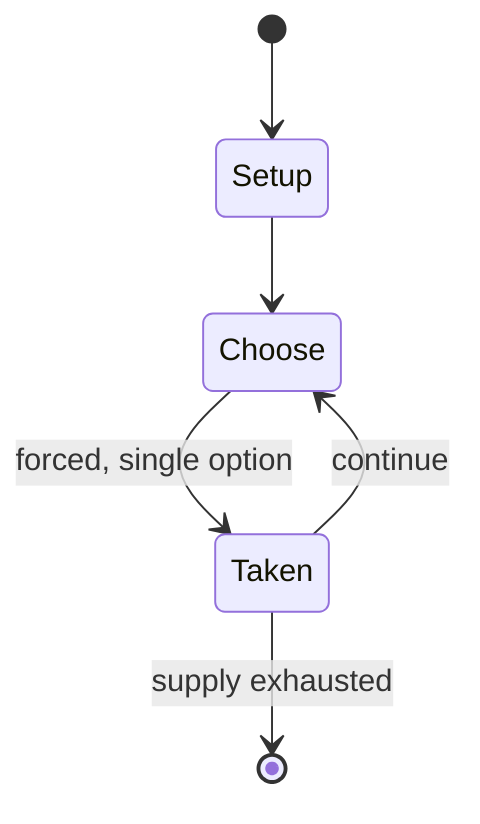

# NATO: Operational Combat in Europe in the 1970s

*board game*

`nato_operational_combat_in_europe_in_the_1970s` &nbsp; state: **DEEPENED** &nbsp; method: **heuristic**

## Found layer (recorded, not trusted)

| field | value |
| --- | --- |
| wikidata | Q106856040 |
| wikipedia | NATO: Operational Combat in Europe in the 1970s |
| genres (source) | -- |
| instance of (source) | board wargame |
| country of origin | -- |

## Declared layer (orders bench work)

| field | value |
| --- | --- |
| year created | 1973 |
| epoch | DIGITAL |
| region | -- |
| media | BOARD, WARGAME |
| players | 2 |
| age band | -- |
| exogenous process | -- |
| loss shape | -- |
| live axes | SPATIAL |
| horizon | -- |
| scoring shape | -- |
| information | -- |
| interaction | -- |
| turn structure | -- |
| tractability | SAMPLING_ONLY |
| randomness | DICE |
| luck factor | 0.58 |
| rules complexity | 3.21 |
| strategic depth | 1.87 |
| novelty | 0.0938 |
| solved status | -- |
| strategies | -- |
| algorithms | -- |

## Object model

```
Episode
  players      : 2
  turn_structure: ?
  horizon       : ?
  scoring       : ?

Board          -- spatial substrate; cells carry position and occupancy
Piece          -- movable token owned by a player
Placement      -- position subject to geometric legality
```

## State transition diagram



## Research item -- turn trace

```
# NATO: Operational Combat in Europe in the 1970s -- simulated turn events
# generated from the DECLARED vector, not from a rulebook.
# structure: exo=None loss=None horizon=None scoring=None axes=SPATIAL

t=0    SETUP        players=2  pot=0  capacity=4
t=1    FORCED       p1 single legal option taken (pot_gain=+1.7)
t=2    FORCED       p1 single legal option taken (pot_gain=+0.7)
t=3    SPATIAL      p1 places at (3,7); adjacency legal
t=4    FORCED       p1 single legal option taken (pot_gain=+1.9)
t=5    FORCED       p1 single legal option taken (pot_gain=+1.8)
t=6    SPATIAL      p1 places at (7,1); adjacency legal
t=7    ENDTURN      turn passes to p2
t=8    FORCED       p2 single legal option taken (pot_gain=+1.5)
t=9    FORCED       p2 single legal option taken (pot_gain=+1.4)
t=10   FORCED       p2 single legal option taken (pot_gain=+0.6)
t=11   SPATIAL      p2 places at (0,1); adjacency legal
t=12   FORCED       p2 single legal option taken (pot_gain=+1.3)
t=13   SPATIAL      p2 places at (3,5); adjacency legal
t=14   FORCED       p2 single legal option taken (pot_gain=+0.9)
t=15   FORCED       p2 single legal option taken (pot_gain=+1.0)
t=16   FORCED       p2 single legal option taken (pot_gain=+1.2)
t=17   SPATIAL      p2 places at (7,7); adjacency legal
t=18   ENDTURN      turn passes to p1
t=19   FORCED       p1 single legal option taken (pot_gain=+1.8)
t=20   ENDTURN      turn passes to p2
t=21   FORCED       p2 single legal option taken (pot_gain=+1.6)
t=22   ENDTURN      turn passes to p1
t=23   FORCED       p1 single legal option taken (pot_gain=+1.8)
t=24   ENDTURN      turn passes to p2
t=25   FORCED       p2 single legal option taken (pot_gain=+0.7)
t=26   SPATIAL      p2 places at (1,0); adjacency legal

terminal: VARIABLE
```

## Conditions

| kind | threshold | effect | trigger |
| --- | --- | --- | --- |
| WIN | -- | -- | The player with the most Victory Points at the end of the scenario wins the game. |

## Source extract

NATO: Operational Combat in Europe in the 1970s is a board wargame published by Simulations
Publications Inc. (SPI) in 1973 that simulates an invasion of Western Europe by the Warsaw Pact.
== Description == NATO is a tactical wargame at the divisional level for two players that
simulates a surprise attack by Warsaw Pact forces against NATO forces defending Western Europe
in the 1970s.   === Components === The game comes with:   hex grid map of Central Europe with a
north–south axis of Denmark to Switzerland and an east–west axis of Poland to Belgium. The scale
of the map is 15 miles per hex. 36-page rulebook 3 pages of rules errata die-cut counters   ===
Gameplay === The game comes with four scenarios:   "M + 1": Both sides are at peacetime
mobilization. The Warsaw Pact player is not obligated to immediately invade, and can delay as
both sides prepare for an attack. After the fifth turn, the NATO player can also initiate
combat. "M + 31": The scenario begins with both sides at peak readiness "M + 1 + Nukes": The
same as #1, but with the addition of tactical nuclear weapons "M + 31" + Nukes": The same as #2,
with the addition of tactical nuclear weapons   === Victory conditions ==

<sub>Wikipedia, CC BY-SA. Retained as evidence for the structural
classification above. Every rule inferred from it is HYPOTHESIZED
until audited against a rulebook.</sub>
