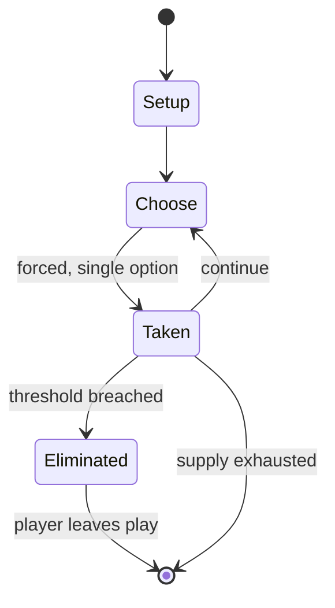

# Nemesis

*2018 board game*

`nemesis` &nbsp; state: **DEEPENED** &nbsp; method: **heuristic**

## Found layer (recorded, not trusted)

| field | value |
| --- | --- |
| wikidata | Q113331477 |
| wikipedia | Nemesis (board game) |
| genres (source) | social deduction game |
| instance of (source) | board game |
| country of origin | Poland |

## Declared layer (orders bench work)

| field | value |
| --- | --- |
| year created | 2018 |
| epoch | CONTEMPORARY |
| region | EUROPE_EAST |
| media | BOARD |
| players | 1-5 |
| age band | -- |
| exogenous process | -- |
| loss shape | ELIMINATION |
| live axes | BLUFF, TIMING |
| horizon | -- |
| scoring shape | SURVIVAL |
| information | IMPERFECT |
| interaction | COOPERATIVE |
| turn structure | -- |
| tractability | SAMPLING_ONLY |
| randomness | HIDDEN_INFO |
| luck factor | 0.35 |
| rules complexity | 2.72 |
| strategic depth | 2.75 |
| novelty | 0.7267 |
| solved status | -- |
| strategies | bluffing, deduction, tempo |
| algorithms | -- |

## Object model

```
Episode
  players      : 1-5
  turn_structure: ?
  horizon       : ?
  scoring       : SURVIVAL

Board          -- spatial substrate; cells carry position and occupancy
Piece          -- movable token owned by a player
Belief         -- what an observer is induced to think is true
Initiative     -- who acts, and when, relative to others
```

## State transition diagram



## Research item -- turn trace

```
# Nemesis -- simulated turn events
# generated from the DECLARED vector, not from a rulebook.
# structure: exo=None loss=ELIMINATION horizon=None scoring=SURVIVAL axes=BLUFF,TIMING

t=0    SETUP        players=1  pot=0  capacity=6
t=1    FORCED       p1 single legal option taken (pot_gain=+1.1)
t=2    BLUFF        p1 represents a holding it does not have
t=3    FORCED       p1 single legal option taken (pot_gain=+0.6)
t=4    BLUFF        p1 represents a holding it does not have
t=5    FORCED       p1 single legal option taken (pot_gain=+1.1)
t=6    FORCED       p1 single legal option taken (pot_gain=+0.8)
t=7    FORCED       p1 single legal option taken (pot_gain=+1.2)
t=8    FORCED       p1 single legal option taken (pot_gain=+1.5)
t=9    FORCED       p1 single legal option taken (pot_gain=+1.6)
t=10   ENDTURN      turn passes to p1
t=11   FORCED       p1 single legal option taken (pot_gain=+1.3)
t=12   FORCED       p1 single legal option taken (pot_gain=+1.8)
t=13   FORCED       p1 single legal option taken (pot_gain=+0.6)
t=14   FORCED       p1 single legal option taken (pot_gain=+1.7)
t=15   FORCED       p1 single legal option taken (pot_gain=+0.5)
t=16   FORCED       p1 single legal option taken (pot_gain=+1.9)
t=17   FORCED       p1 single legal option taken (pot_gain=+1.7)
t=18   BLUFF        p1 represents a holding it does not have
t=19   FORCED       p1 single legal option taken (pot_gain=+1.3)
t=20   BLUFF        p1 represents a holding it does not have
t=21   FORCED       p1 single legal option taken (pot_gain=+0.9)
t=22   BLUFF        p1 represents a holding it does not have
t=23   FORCED       p1 single legal option taken (pot_gain=+1.8)
t=24   FORCED       p1 single legal option taken (pot_gain=+1.5)
t=25   FORCED       p1 single legal option taken (pot_gain=+1.8)
t=26   BLUFF        p1 represents a holding it does not have
t=27   ENDTURN      turn passes to p1

terminal: VARIABLE
```

## Conditions

| kind | threshold | effect | trigger |
| --- | --- | --- | --- |
| ELIMINATE | -- | -- | To win the game, they must not be eliminated at the end of the game, reach Earth and achieve their chosen objectives using asymmetrical characters. |
| ELIMINATE | -- | -- | Dan Thuort from Ars Technica complimented its engagement, replayability, theme, and the player elimination mechanism. |
| ELIMINATE | -- | -- | Writing for Tabletop Gaming, Dan Jolin also considered it to be similar to Alien franchise, praising its engagement, solo mode, components, and the combination of co-operative and confrontational elements, but criticised |

## Source extract

Nemesis is a semi-cooperative science fiction Polish board game for 1-5 players, designed by
Adam Kwapiński and published by Awaken Realms in 2018. The game is set in the spaceship Nemesis,
and includes co-operative mechanisms with other confrontational mechanisms and conflicting
objectives.  Upon its release, Nemesis was positively received for its replayability, tension,
and components, but its high complexity was met with criticism. A base-game expansion,
Aftermath, was released in 2021, followed by the stand-alone expansions Lockdown and Retaliation
in 2022 and 2025, respectively.    == Gameplay == In Nemesis, players take on the roles of crew
members of the spaceship Nemesis, having been woken from hibernation by the ship's computer due
to an infestation of alien creatures dubbed Intruders. Suffering from temporary amnesia, they
must explore the ship and try to get back to Earth while dealing with the alien threat, and also
have hidden objectives, which may conflict with other players' goals. The game also combines co-
operation mechanisms with bluffing, backstabbing, and other elements of a science-fiction
survival horror adventure, and is played in 15 turns. To win the game,

<sub>Wikipedia, CC BY-SA. Retained as evidence for the structural
classification above. Every rule inferred from it is HYPOTHESIZED
until audited against a rulebook.</sub>
